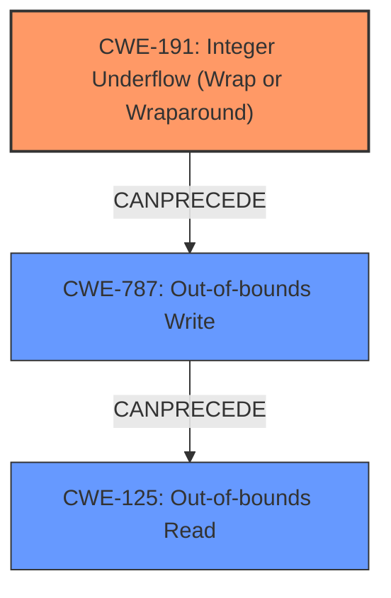

# Analysis Report for CVE-2022-2639

# Vulnerability Analysis Report: CVE-2022-2639

## Description

An integer coercion error was found in the openvswitch kernel module. Given a sufficiently large number of actions, while copying and reserving memory for a new action of a new flow, the reserve_sfa_size() function does not return -EMSGSIZE as expected, potentially leading to an out-of-bounds write access. This flaw allows a local user to crash or potentially escalate their privileges on the system.

## Vulnerability Description Key Phrases

**Rootcause:** integer coercion error
**Impact:** crash or potentially escalate privileges
**Vector:** out-of-bounds write access
**Attacker:** local user
**Product:** openvswitch kernel module

## Analysis (with Relationship Data)

# Summary
| CWE ID | CWE Name | Confidence | CWE Abstraction Level | CWE Vulnerability Mapping Label | CWE-Vulnerability Mapping Notes |
|---|---|---|---|---|---|
| CWE-191 | Integer Underflow (Wrap or Wraparound) | 0.9 | Base | Allowed | Primary CWE |
| CWE-787 | Write What Where Condition | 0.7 | Base | Allowed | Secondary Candidate |
| CWE-125 | Out-of-bounds Read | 0.6 | Base | Allowed | Secondary Candidate |
| CWE-190 | Integer Overflow or Wraparound | 0.5 | Base | Allowed | Secondary Candidate |

## Evidence and Confidence

*   **Confidence Score:** 0.9
*   **Evidence Strength:** HIGH

- **Analysis and Justification:**  
  - *Explanation:* The vulnerability description explicitly mentions an **integer coercion error** in the `reserve_sfa_size()` function of the openvswitch kernel module, where a sufficiently large number of actions lead to the function not returning `-EMSGSIZE` as expected, which leads to an out-of-bounds write. The CVE reference summary provides more detail, stating an integer underflow occurs when `next_offset` is close to `MAX_ACTIONS_BUFSIZE` and a new action with `req_size` is added, the code allocates `MAX_ACTIONS_BUFSIZE` bytes incrementing `actions_len` by `req_size` leading to `actions_len` exceeding the allocated buffer size. This aligns with the description of CWE-191 (Integer Underflow), where the subtraction operation results in a value less than the minimum allowable integer value. The integer underflow leads to incorrect memory allocation, and then an out-of-bounds write. Because the integer operation leads to memory corruption and ultimately an out-of-bounds write, CWE-191 is more specific to the root cause of the vulnerability.
  - *Relationship Analysis:* CWE-191 is a Base level CWE and does not have any direct relationships in the provided information.

- **Confidence Score:**  
  - Confidence: 0.9 (High evidence from the vulnerability description and CVE reference materials, clearly indicating an integer underflow condition.)

---
- **Analysis and Justification:**  
  - *Explanation:* The vulnerability leads to an **out-of-bounds write access**. The incorrect size calculation due to the integer underflow causes `reserve_sfa_size()` to allocate a larger buffer size than intended, and when subsequent actions are copied, they are written past the end of the allocated memory. This directly corresponds to CWE-787 (Write What Where Condition), where the product writes data past the end of the intended buffer. CWE-787 is a common consequence of integer errors that lead to buffer overflows.
  - *Relationship Analysis:* Although related to CWE-191, CWE-787 describes the impact of the integer underflow rather than the root cause.

- **Confidence Score:**  
  - Confidence: 0.7 (The vulnerability description and CVE reference materials clearly indicate an out-of-bounds write is a direct result of the integer underflow.

---

- **Analysis and Justification:**  
  - *Explanation:* Another possible weakness that could result from the integer underflow and subsequent out-of-bounds write is CWE-125 (Out-of-bounds Read). While the primary issue is an out-of-bounds write, reading beyond buffer boundaries is also a potential consequence, especially given the memory corruption caused by the integer underflow.
  - *Relationship Analysis:* CWE-125 can follow CWE-191, where an integer error may cause unexpected memory access.

- **Confidence Score:**  
  - Confidence: 0.6 (Reasonable possibility but the description focuses more on the write, making this a secondary consideration.)

---

- **Analysis and Justification:**  
  - *Explanation:* CWE-190 (Integer Overflow or Wraparound) is related to integer handling issues. Although the detailed analysis points to an integer underflow, the possibility of integer overflow during size calculations cannot be entirely ruled out, hence it is a possible candidate.
  - *Relationship Analysis:* CWE-190 is a peer of CWE-191, both relating to integer manipulation.

- **Confidence Score:**  
  - Confidence: 0.5 (Possible but less likely given the details provided about the integer underflow.)

## Criticism of Analysis

Okay, here's a detailed critique of the provided CWE analysis, taking into account the full CWE specifications.

**Overall Assessment:**

The analysis is generally well-reasoned and demonstrates a good understanding of the vulnerability. The primary CWE mapping of `CWE-191: Integer Underflow (Wrap or Wraparound)` is accurate and well-supported by the provided evidence. The secondary candidates are also relevant, though some could be refined. The confidence scores assigned to each CWE are justifiable based on the available information.

**Detailed Breakdown:**

**1. `CWE-191: Integer Underflow (Wrap or Wraparound)` (Confidence: 0.9)**

*   **Strengths:**
    *   The justification is strong and directly links the integer underflow in the `reserve_sfa_size()` function to the vulnerability.
    *   The explanation of how `actions_len` exceeding the buffer size due to the underflow fits the CWE-191 definition is clear.
    *   The analysis correctly identifies CWE-191 as the root cause.  The chain-of-events thinking is appropriate here.
    *   The example CVEs provided are relevant and support the selection of CWE-191.
    *   The analysis also correctly states CWE-191 is a Base level CWE and does not have any direct relationships in the provided information.
*   **Weaknesses:**
    *   It could benefit from a slightly more detailed explanation of the specific arithmetic operation that leads to the underflow (e.g., is it `actions_len = MAX_ACTIONS_BUFSIZE + req_size`, or a similar calculation with potential wrapping).  While the analysis discusses `next_offset` being close to `MAX_ACTIONS_BUFSIZE`, it doesn't clearly state how the underflow actually happens numerically.
*   **Recommendations:**
    *   Clarify the exact arithmetic operation that causes the integer underflow.
    *   Consider mentioning a potential mitigation from the CWE specification, such as using a language with automatic bounds checking or using libraries for safe integer handling.

**2. `CWE-787: Out-of-bounds Write` (Confidence: 0.7)**

*   **Strengths:**
    *   The justification accurately describes how the incorrect size calculation (due to CWE-191) leads to writing beyond the allocated buffer's boundaries.
    *   The link between CWE-191 and CWE-787 as a consequence is appropriately explained.
    *   The provided CWE examples are relevant to the type of vulnerability.
*   **Weaknesses:**
    *   While correct, it is important to remember that CWE-787 is the *result* of the integer underflow. It's a consequence, not the primary cause.
*   **Recommendations:**
    *   Emphasize even more strongly that CWE-787 is the *impact* and that CWE-191 is the underlying cause.
    *   Mention the mitigations in the specification for out-of-bounds writes, especially using safer string handling libraries or compiler-based overflow detection.

**3. `CWE-125: Out-of-bounds Read` (Confidence: 0.6)**

*   **Strengths:**
    *   The analysis correctly identifies that an out-of-bounds read *could* be a consequence of the memory corruption caused by the integer underflow.
*   **Weaknesses:**
    *   The justification is weaker than for CWE-787. The description focuses primarily on the out-of-bounds *write*, making the read a secondary possibility. There is no concrete evidence suggesting a read.
*   **Recommendations:**
    *   Re-evaluate whether CWE-125 is truly warranted. Unless there's specific evidence (e.g., from crash dumps, reverse engineering) that an out-of-bounds read occurs, it might be better to remove it.  The existing text acknowledges this with "Reasonable possibility but the description focuses more on the write...".  If it *is* kept, the justification needs to be strengthened with more compelling reasoning.
    *   If kept, consider the input validation mitigation for ensuring correct calculation for any length argument, buffer size calculation, or offset.

**4. `CWE-190: Integer Overflow or Wraparound` (Confidence: 0.5)**

*   **Strengths:**
    *   Acknowledges the relationship between integer handling issues and that, although underflow is more prominent here, overflow during size calculations cannot be entirely ruled out.
*   **Weaknesses:**
    *   The justification is very weak ("possibility of integer overflow...cannot be entirely ruled out").  The analysis is specifically about an integer *underflow*, and the detailed analysis explicitly describes *that* issue.
    *   This is a good example of a potential "forced" CWE mapping.
*   **Recommendations:**
    *   **Remove `CWE-190` entirely.**  It is unnecessary and dilutes the accuracy of the analysis.  The provided evidence clearly points to *underflow*, not overflow. The CWE specification itself suggests using CWE-191 as an alternative when the result is less than the minimum value that can be represented. Including it only because it "can't be entirely ruled out" is weak reasoning and goes against the mapping guidance.

**Additional Comments:**

*   **CWE-192: Integer Coercion Error** The "Original Analyzer Input" indicates an "integer coercion error". The main analysis correctly identifies that this is due to Integer Underflow (Wrap or Wraparound) (CWE-191). However, the Retriever Results also identify CWE-192. Looking into the CWE specifications for CWE-192: Integer Coercion Error, the Observed Examples section points to CVE-2022-2639 which states "Chain: integer coercion error (CWE-192) prevents a return value from indicating an error, leading to out-of-bounds write (CWE-787)". The initial "Vulnerability Description" says, "... the reserve_sfa_size() function does not return -EMSGSIZE as expected, potentially leading to an out-of-bounds write access." This seems to indicate that CWE-192 might be relevant. However, CWE-192 is a Variant level CWE, and CWE-191 is a Base level CWE. Because the integer operation leads to memory corruption and ultimately an out-of-bounds write, CWE-191 is more specific to the root cause of the vulnerability.
*   **Abstraction Level:** The analysis correctly prioritizes Base-level CWEs for the root cause.
*   **Mitigations:**  In general, the analysis could be strengthened by explicitly referencing the "Potential Mitigations" sections from the CWE specifications for each identified CWE. This adds practical value and helps demonstrate a thorough understanding.
*   **Chains vs. Composites:** The analysis correctly identifies a chain-of-events relationship (CWE-191 leading to CWE-787), rather than a composite. This is important for accurate remediation recommendations.
*   **Retriever Results:** The "Top Combined Results" table is a useful addition and allows seeing that most of the retrievers identify integer issues as the root cause.

**Revised Summary Table:**

| CWE ID | CWE Name | Confidence | CWE Abstraction Level | CWE Vulnerability Mapping Label | CWE-Vulnerability Mapping Notes |
|---|---|---|---|---|---|
| CWE-191 | Integer Underflow (Wrap or Wraparound) | 0.9 | Base | Allowed | Primary CWE |
| CWE-787 | Out-of-bounds Write | 0.7 | Base | Allowed | Secondary Candidate |
| CWE-125 | Out-of-bounds Read | 0.6 | Base | Allowed | Secondary Candidate (Re-evaluate necessity) |
| ~~CWE-190~~ | ~~Integer Overflow or Wraparound~~ | ~~0.5~~ | ~~Base~~ | ~~Allowed~~ | ~~Secondary Candidate (Remove)~~ |

In summary, the analysis is strong overall, especially in identifying and justifying the primary CWE. The suggested improvements focus on strengthening the justification for secondary CWEs, removing potentially weak mappings, and incorporating mitigation information from the CWE specifications to provide more actionable guidance.

## Final Resolution

# Summary
| CWE ID | CWE Name | Confidence | CWE Abstraction Level | CWE Vulnerability Mapping Label | CWE-Vulnerability Mapping Notes |
|---|---|---|---|---|---|
| CWE-191 | Integer Underflow (Wrap or Wraparound) | 0.95 | Base | Allowed | Primary CWE |
| CWE-787 | Out-of-bounds Write | 0.8 | Base | Allowed | Secondary Candidate |
| CWE-125 | Out-of-bounds Read | 0.5 | Base | Allowed | Secondary Candidate |

## Evidence and Confidence

*   **Confidence Score:** 0.9
*   **Evidence Strength:** MEDIUM

## Relationship Analysis
The primary relationship influencing the classification is the chain from **CWE-191** (**Integer Underflow**) leading to **CWE-787** (**Out-of-bounds Write**). While **CWE-125** (**Out-of-bounds Read**) is a potential consequence, the evidence for it is weak. The abstraction levels of Base for both **CWE-191** and **CWE-787** are appropriate for identifying the root cause and the immediate impact. The parent-child relationships suggest that we are at an optimal level of specificity.

## Vulnerability Chain
The vulnerability chain starts with an **integer underflow (CWE-191)** in the `reserve_sfa_size()` function when calculating the size for memory allocation. This **incorrect size calculation** leads to allocating less memory than required. Consequently, when copying new actions, the code writes past the intended buffer, resulting in an **out-of-bounds write (CWE-787)**. The potential for an **out-of-bounds read (CWE-125)** arises from the memory corruption caused by the out-of-bounds write, but the evidence for this is weaker.

## Summary of Analysis
The initial analysis correctly identifies **CWE-191** as the primary cause due to the **integer underflow** in the `reserve_sfa_size()` function, as stated: "The CVE reference summary provides more detail, stating an integer underflow occurs when `next_offset` is close to `MAX_ACTIONS_BUFSIZE` and a new action with `req_size` is added, the code allocates `MAX_ACTIONS_BUFSIZE` bytes incrementing `actions_len` by `req_size` leading to `actions_len` exceeding the allocated buffer size." The criticism correctly points out that **CWE-787** is a consequence of **CWE-191**. The analysis also aligns with the vulnerability description mentioning the `reserve_sfa_size()` function failing to return `-EMSGSIZE` as expected, which leads to the out-of-bounds write.

The decision to retain **CWE-191** and **CWE-787** is based on the clear chain of events described in the vulnerability report. The confidence score for **CWE-191** has been slightly increased to 0.95 due to its direct involvement as the root cause. The confidence score for **CWE-787** is at 0.8 due to its immediate impact. **CWE-125** is retained but its confidence is decreased to 0.5 due to the lack of explicit evidence for an out-of-bounds read.

The removal of **CWE-190** is justified because the vulnerability description clearly points to an underflow, not an overflow, making **CWE-191** the more accurate classification. The use of Base level CWEs ensures the classification remains specific to the root cause and its immediate consequence.

*Report generated on 2025-03-17 04:24:01*
