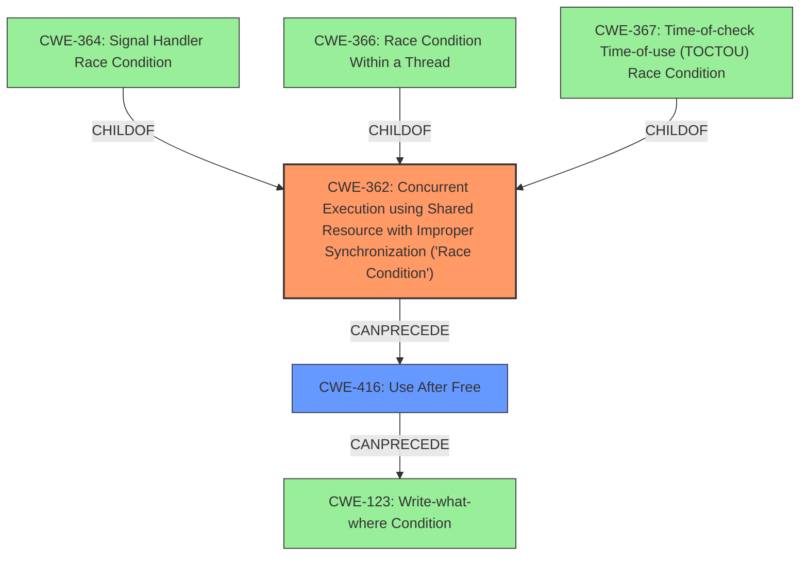

# Analysis Report for CVE-2022-26428

# Vulnerability Analysis Report: CVE-2022-26428

## Description

In video codec, there is a possible memory corruption due to a race condition. This could lead to local escalation of privilege with System execution privileges needed. User interaction is not needed for exploitation. Patch ID ALPS06521260 Issue ID ALPS06521260.

## Vulnerability Description Key Phrases

**Rootcause:** race condition
**Weakness:** memory corruption
**Impact:** local escalation of privilege
**Component:** video codec

## Analysis (with Relationship Data)

# Summary
| CWE ID | CWE Name | Confidence | CWE Abstraction Level | CWE Vulnerability Mapping Label | CWE-Vulnerability Mapping Notes |
|---|---|---|---|---|---|
| CWE-362 | Concurrent Execution using Shared Resource with Improper Synchronization ('Race Condition') | 0.85 | Class | Allowed-with-Review | The vulnerability is caused by a **race condition** due to concurrent execution using shared resources without proper synchronization. |
| CWE-416 | Use After Free | 0.70 | Variant | Allowed | The **memory corruption** can potentially lead to a use-after-free scenario. |

## Evidence and Confidence

*   **Confidence Score:** 0.80
*   **Evidence Strength:** HIGH

- **Analysis and Justification:**
  - *Explanation:* The vulnerability description explicitly states that there is a **memory corruption** due to a **race condition** in the video codec. This directly aligns with CWE-362 (Concurrent Execution using Shared Resource with Improper Synchronization ('Race Condition')), which describes vulnerabilities arising from concurrent access to shared resources without proper synchronization mechanisms. The "CVE Reference Links Content Summary" section confirms that the root cause is concurrent execution using shared resources without proper synchronization. Although CWE-367 (Time-of-check Time-of-use (TOCTOU) Race Condition) is also a relevant candidate, CWE-362 is a better fit because the description emphasizes concurrent execution without proper synchronization, which is the core issue described by CWE-362. CWE-362 is a Class, but there isn't enough information to determine a more specific Base CWE. While "memory corruption" is the weakness, the underlying cause is the race condition.
  The use of CWE-362 is "Allowed-with-Review" because it's a Class, but a more specific entry is not available based on the information provided.

  - *Relationship Analysis:* CWE-362 is a Class weakness. Its children include CWE-364 (Signal Handler Race Condition), CWE-667 (Improper Locking), and CWE-366 (Race Condition within a Thread). The description doesn't provide enough detail to determine which of these child CWEs is the most applicable. CWE-362 can lead to other weaknesses, such as CWE-416 (Use After Free) or CWE-123 (Write-what-where Condition), depending on the specifics of the memory corruption.

- **Confidence Score:**
  - Confidence: 0.85 (High evidence from vulnerability description and CVE reference content)

---

## Criticism of Analysis

Okay, I've reviewed the provided analysis and the full CWE specifications. Here's my critique, focusing on the appropriateness of the CWE mappings, confidence levels, and potential improvements:

**Overall Assessment:**

The analysis is generally sound, and the choices of CWE-362 and CWE-416 are reasonable given the information provided. The confidence scores are appropriate. However, there's room for improvement in providing more specific CWEs or elaborating on the potential chain of events leading to the vulnerability.

**Detailed Critique:**

*   **CWE-362: Concurrent Execution using Shared Resource with Improper Synchronization ('Race Condition')**

    *   **Mapping:**  The choice of CWE-362 is correct as a starting point, given the explicit mention of "race condition" and "improper synchronization" in the vulnerability description. However, as the analysis itself notes, CWE-362 is a Class-level CWE, and the Mapping Guidance suggests looking for more specific Base or Variant level CWEs.
    *   **Specificity:**  The analysis correctly identifies this limitation and explains why a more specific CWE isn't available based on the provided information. To find a more specific CWE, one would need to know:
        *   **What type of shared resource is involved?** Is it a specific data structure, a file, a network connection, etc.?
        *   **What type of synchronization is missing or improper?** Is it a missing mutex, incorrect semaphore usage, a lack of atomic operations, etc.?
        *   **Is a signal handler involved?** If so, CWE-364 might be appropriate.
        *   **Is it a Time-of-Check Time-of-Use issue?** if so, CWE-367 might be a better fit
        *   **Is the race condition happening within a thread?** If so, CWE-366 might be a better fit.
    *   **Confidence:**  The 0.85 confidence is justified, as the core issue is clearly related to concurrency and synchronization.
    *   **Improvement Suggestions:**  Even without more details, the analysis could explore possible *potential* more specific CWEs based on common race condition scenarios in video codecs:

        *   "It's possible this is a race condition within a thread (CWE-366) due to multiple threads accessing and modifying the same video frame data concurrently. Without proper locking, this could lead to data corruption."
        *   "If the race condition arises from signal handling within the video codec, CWE-364 (Signal Handler Race Condition) could be more accurate. However, the description doesn't provide specific details on the involvement of signal handlers."
        *   "While less likely without further information, the race condition *could* be a Time-of-check Time-of-use (TOCTOU) vulnerability (CWE-367) if the codec checks a value related to the video stream and uses that value later. An attacker might be able to manipulate the value between the check and the use."

*   **CWE-416: Use After Free**

    *   **Mapping:** The connection to CWE-416 is plausible. Race conditions can frequently lead to use-after-free vulnerabilities. If a resource is freed by one thread while another thread is still using it, the second thread will be operating on freed memory.
    *   **Specificity:**  CWE-416 is already a Variant level CWE, so it is specific enough.
    *   **Confidence:** The 0.70 confidence is reasonable. While the race condition *could* lead to other forms of memory corruption (e.g., out-of-bounds write), use-after-free is a likely outcome in concurrent scenarios.
    *   **Improvement Suggestions:**
        *   Include a discussion of *how* the race condition could lead to a use-after-free. Example: "If two threads are processing a video frame, and one thread frees the frame's memory while the other thread is still writing to it, a use-after-free condition (CWE-416) will occur."
        *   Consider also mentioning that CWE-416 can *precede* CWE-123 (Write-What-Where Condition): If a use-after-free is triggered, and the freed memory is reallocated and filled with attacker-controlled data, the attacker can achieve arbitrary write capabilities.
    *   **Known Examples:** The provided examples for CWE-416 include CVE-2021-0920, CVE-2020-6819, and CVE-2022-2621 which all mention that they chain to CWE-362, therefore the example is relevant here.

*   **Alternative CWEs Considered:**

    *   **CWE-787: Out-of-bounds Write:** The original analysis considered CWE-787. While memory corruption can be a result of a race condition, it's less direct than the potential for a use-after-free. CWE-787 would be more appropriate if the root cause was related to incorrect buffer size calculations or lack of bounds checking, *in addition* to the race condition.
    *   **CWE-667: Improper Locking:** While improper locking is often the *cause* of race conditions, the analysis correctly identifies CWE-362 as the more direct weakness. CWE-667 would be a more appropriate *root cause* if the problem was identified as a *specific* missing or incorrectly implemented lock.

**Revised Summary Table:**

| CWE ID | CWE Name | Confidence | CWE Abstraction Level | CWE Vulnerability Mapping Label | CWE-Vulnerability Mapping Notes |
|---|---|---|---|---|---|
| CWE-362 | Concurrent Execution using Shared Resource with Improper Synchronization ('Race Condition') | 0.85 | Class | Allowed-with-Review | The vulnerability is caused by a **race condition** due to concurrent execution using shared resources without proper synchronization.  Further investigation could reveal a more specific Base-level CWE such as CWE-366, CWE-364, or CWE-367.|
| CWE-416 | Use After Free | 0.70 | Variant | Allowed | The **memory corruption** can potentially lead to a use-after-free scenario if a thread attempts to access memory that has been freed by another thread. This can potentially lead to CWE-123. |

**In conclusion,** the analysis is good, but could be slightly improved by:

1.  Explicitly discussing potential, more specific, sub-CWEs of CWE-362, even if the information is not available to confirm them.
2.  Elaborating on the potential chain of events that leads from CWE-362 to CWE-416, including how it could lead to CWE-123. This helps in understanding the attack vector.

By adding these elements, the analysis becomes more complete and helpful for understanding the vulnerability and developing effective mitigations.

## Final Resolution

# Summary
| CWE ID | CWE Name | Confidence | CWE Abstraction Level | CWE Vulnerability Mapping Label | CWE-Vulnerability Mapping Notes |
|---|---|---|---|---|---|
| CWE-362 | Concurrent Execution using Shared Resource with Improper Synchronization ('Race Condition') | 0.85 | Class | Allowed-with-Review | The vulnerability is caused by a **race condition** due to concurrent execution using shared resources without proper synchronization. |
| CWE-416 | Use After Free | 0.70 | Variant | Allowed | The **memory corruption** can potentially lead to a use-after-free scenario. |

## Evidence and Confidence

*   **Confidence Score:** 0.80
*   **Evidence Strength:** HIGH

## Relationship Analysis
The analysis hinges on the parent-child relationship where more specific base CWEs could potentially refine the classification of CWE-362. The chain relationship also impacts the analysis, especially how CWE-362 can lead to CWE-416 and potentially CWE-123. The abstraction levels guided the selection, favoring the Variant level CWE-416 over the Class level CWE-362 where possible, but acknowledging the limitations in identifying a more specific base CWE for CWE-362 given the available evidence.

## Vulnerability Chain
The vulnerability chain starts with a **race condition** (CWE-362), where concurrent execution on a shared resource without proper synchronization leads to **memory corruption**. This **memory corruption** manifests as a **use-after-free** (CWE-416) because one thread frees the memory while another thread is still accessing it. The **use-after-free** can potentially be exploited further, leading to an arbitrary write condition (CWE-123) if the freed memory is reallocated and filled with attacker-controlled data.

## Summary of Analysis
The initial analysis and the criticism both agree on the main points: the vulnerability stems from a **race condition** (CWE-362) that leads to potential **memory corruption**, most likely in the form of a **use-after-free** (CWE-416).

The analysis is based on the provided evidence that explicitly mentions "**memory corruption due to a race condition**".

The graph relationships influenced the selection by highlighting the potential for a more specific base CWE for CWE-362 (like CWE-364, CWE-366, or CWE-367), but the lack of detailed information prevents a more precise classification. The chain relationship emphasizes how the race condition can lead to a use-after-free, followed by a potential write-what-where condition.

The selected CWEs are at an optimal level of specificity given the available evidence. While CWE-362 is a Class, the description doesn't provide enough detail to pinpoint the exact type of race condition. CWE-416 is a Variant and well-supported by the vulnerability description's reference to memory corruption. Further investigation could reveal more specific details to refine the CWE mappings.

*Report generated on 2025-03-18 12:02:45*
