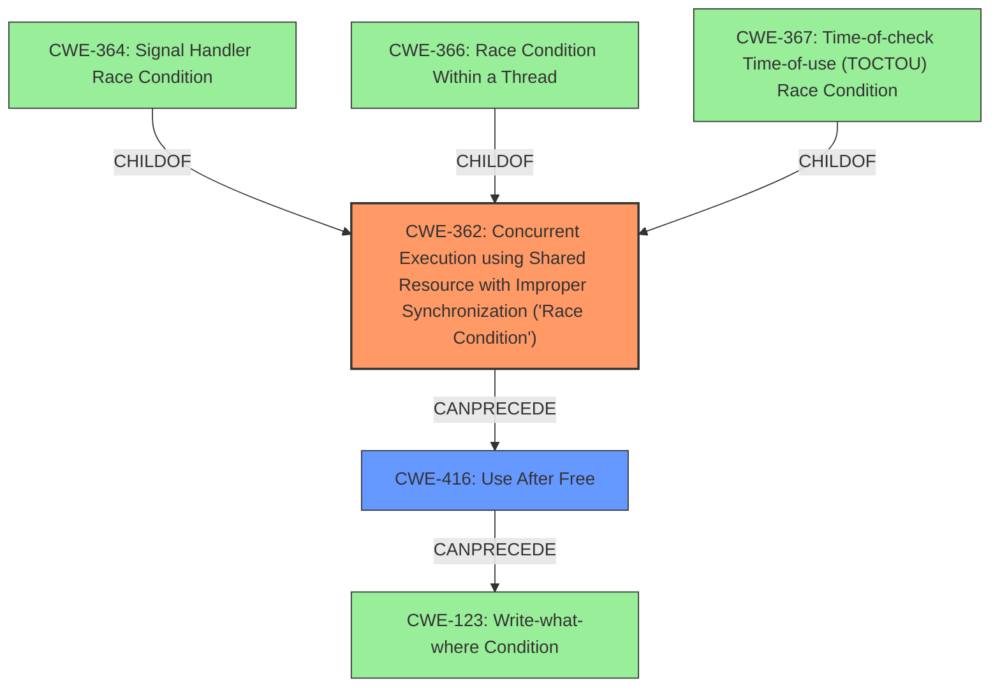

# Final Resolution for CVE-2022-26428

# Summary
| CWE ID | CWE Name | Confidence | CWE Abstraction Level | CWE Vulnerability Mapping Label | CWE-Vulnerability Mapping Notes |
|---|---|---|---|---|---|
| CWE-362 | Concurrent Execution using Shared Resource with Improper Synchronization ('Race Condition') | 0.85 | Class | Allowed-with-Review | The vulnerability is caused by a **race condition** due to concurrent execution using shared resources without proper synchronization. |
| CWE-416 | Use After Free | 0.70 | Variant | Allowed | The **memory corruption** can potentially lead to a use-after-free scenario. |

## Evidence and Confidence

*   **Confidence Score:** 0.80
*   **Evidence Strength:** HIGH

## Relationship Analysis
The analysis hinges on the parent-child relationship where more specific base CWEs could potentially refine the classification of CWE-362. The chain relationship also impacts the analysis, especially how CWE-362 can lead to CWE-416 and potentially CWE-123. The abstraction levels guided the selection, favoring the Variant level CWE-416 over the Class level CWE-362 where possible, but acknowledging the limitations in identifying a more specific base CWE for CWE-362 given the available evidence.

## Vulnerability Chain
The vulnerability chain starts with a **race condition** (CWE-362), where concurrent execution on a shared resource without proper synchronization leads to **memory corruption**. This **memory corruption** manifests as a **use-after-free** (CWE-416) because one thread frees the memory while another thread is still accessing it. The **use-after-free** can potentially be exploited further, leading to an arbitrary write condition (CWE-123) if the freed memory is reallocated and filled with attacker-controlled data.

## Summary of Analysis
The initial analysis and the criticism both agree on the main points: the vulnerability stems from a **race condition** (CWE-362) that leads to potential **memory corruption**, most likely in the form of a **use-after-free** (CWE-416).

The analysis is based on the provided evidence that explicitly mentions "**memory corruption due to a race condition**".

The graph relationships influenced the selection by highlighting the potential for a more specific base CWE for CWE-362 (like CWE-364, CWE-366, or CWE-367), but the lack of detailed information prevents a more precise classification. The chain relationship emphasizes how the race condition can lead to a use-after-free, followed by a potential write-what-where condition.

The selected CWEs are at an optimal level of specificity given the available evidence. While CWE-362 is a Class, the description doesn't provide enough detail to pinpoint the exact type of race condition. CWE-416 is a Variant and well-supported by the vulnerability description's reference to memory corruption. Further investigation could reveal more specific details to refine the CWE mappings.