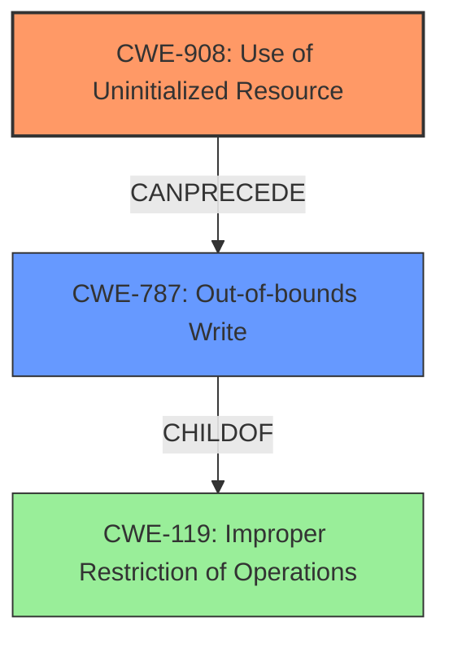

# Final Resolution for CVE-2022-26437

# Summary

| CWE ID | CWE Name | Confidence | CWE Abstraction Level | CWE Vulnerability Mapping Label | CWE-Vulnerability Mapping Notes |
|---|---|---|---|---|---|
| CWE-908 | Use of Uninitialized Resource | 0.95 | Base | Primary | Allowed |
| CWE-787 | Out-of-bounds Write | 0.9 | Base | Secondary | Allowed |

## Evidence and Confidence

*   **Confidence Score:** 0.9
*   **Evidence Strength:** HIGH

## Relationship Analysis
The primary relationship is a chain: the use of an uninitialized resource (CWE-908) leads directly to an out-of-bounds write (CWE-787). CWE-787 is a `CHILDOF` CWE-119 (Improper Restriction of Operations within the Bounds of a Memory Buffer), indicating that it's a specific type of memory safety violation. While CWE-824 (Access of Uninitialized Pointer) was considered, the description does not explicitly state that the uninitialized resource is a pointer.

## Vulnerability Chain
The vulnerability chain starts with the **ROOTCAUSE** being **CWE-908 (Use of Uninitialized Resource)**. This **WEAKNESS** then leads to **CWE-787 (Out-of-bounds Write)**. The consequence of the **out-of-bounds write** is remote escalation of privilege.

## Summary of Analysis
The initial analysis correctly identified CWE-908 and CWE-787 as the primary and secondary CWEs, respectively. The criticism suggested exploring potential chains and considering CWE-824 and CWE-131. While CWE-824 (Access of Uninitialized Pointer) is a valid consideration, the evidence doesn't explicitly state that the uninitialized resource is a pointer, making CWE-908 a more appropriate, albeit slightly less specific, choice. CWE-131 was also considered, but the vulnerability description doesn't provide any information that a buffer size was incorrectly calculated.

The vulnerability description states: "In httpclient, there is a possible **out of bounds write due to uninitialized data**. This could lead to remote escalation of privilege with no additional execution privileges needed."

This evidence directly supports the selection of CWE-908 as the root cause and CWE-787 as the resulting weakness. The chain relationship strengthens this assessment. The selected CWEs are at the optimal level of specificity, given the available information.