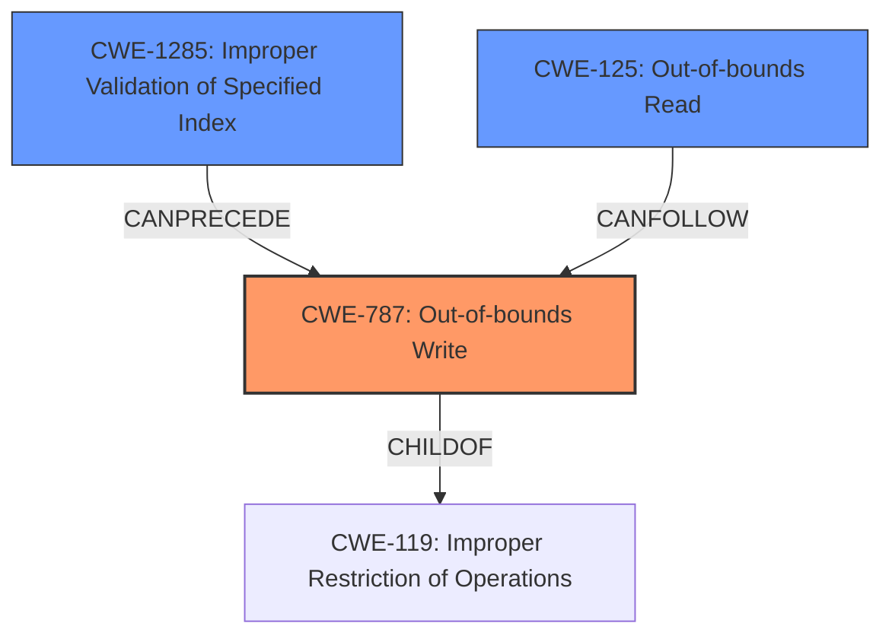

# Analysis Report for CVE-2022-26447

# Vulnerability Analysis Report: CVE-2022-26447

## Description

In BT firmware, there is a possible out of bounds write due to a missing bounds check. This could lead to remote code execution with no additional execution privileges needed. User interaction is not needed for exploitation. Patch ID ALPS06784478 Issue ID ALPS06784478.

## Vulnerability Description Key Phrases

**Rootcause:** missing bounds check
**Weakness:** out of bounds write
**Impact:** remote code execution
**Product:** BT firmware

## Analysis (with Relationship Data)

# Summary
| CWE ID | CWE Name | Confidence | CWE Abstraction Level | CWE Vulnerability Mapping Label | CWE-Vulnerability Mapping Notes |
|---|---|---|---|---|---|
| CWE-787 | Out-of-bounds Write | 1.0 | Base | Primary | Allowed |
| CWE-125 | Out-of-bounds Read | 0.5 | Base | Secondary Candidate | Allowed |
| CWE-1285 | Improper Validation of Specified Index, Position, or Offset in Input | 0.5 | Base | Secondary Candidate | Allowed |

## Evidence and Confidence

*   **Confidence Score:** 0.9
*   **Evidence Strength:** HIGH

- **Analysis and Justification:**
  - *Explanation:* The vulnerability description clearly states an "**out of bounds write** due to a **missing bounds check**." This aligns directly with CWE-787 (Out-of-bounds Write), where a product writes data past the end or before the beginning of the intended buffer. The root cause is explicitly identified as a **missing bounds check**, leading to the out-of-bounds write condition. The impact is remote code execution. The CVE reference confirms this understanding. Given this direct evidence, CWE-787 is a strong primary mapping. CWE-125 (Out-of-bounds Read) could be related, however, the vulnerability specifically calls out a write, making CWE-787 a stronger match. CWE-1285 (Improper Validation of Specified Index, Position, or Offset in Input) is also a potential match, as the missing bounds check reflects improper validation, but the description focuses on the resulting write, making CWE-787 more direct.
  
  - *Relationship Analysis:* CWE-787 is a child of CWE-119 (Improper Restriction of Operations Within the Bounds of a Memory Buffer). The description does not indicate an integer overflow, making CWE-190 less relevant, even though it can precede buffer overflows.

- **Confidence Score:**
  - *Example:* Confidence: 1.0 (Strong evidence from the vulnerability description, key phrases, and CVE reference summary.)

---

## Criticism of Analysis

Okay, let's review the provided analysis against the full CWE specifications.

**Overall Assessment:**

The analysis is generally good and correctly identifies CWE-787 (Out-of-bounds Write) as the primary vulnerability. The rationale for choosing CWE-787 is sound, based on the description of a missing bounds check leading to an out-of-bounds write. The confidence level of 1.0 is justified given the clear evidence.  The secondary candidate CWEs (CWE-125 and CWE-1285) are also reasonable considerations, although less directly applicable.

**Detailed Review by CWE:**

*   **CWE-787: Out-of-bounds Write (Primary)**

    *   **Correctness:** The mapping to CWE-787 is highly accurate. The vulnerability description explicitly states an "out of bounds write" and mentions the lack of a bounds check, which directly aligns with the definition of CWE-787.
    *   **Abstraction Level:**  CWE-787 is a Base-level CWE, which is the preferred level for vulnerability mapping according to CWE's Mapping Guidance. This is correctly followed.
    *   **Relationship:** The analysis correctly mentions CWE-787's relationship as a child of CWE-119 (Improper Restriction of Operations within the Bounds of a Memory Buffer).
    *   **Mitigations:** The analysis doesn't explicitly mention mitigations but providing them would enhance the value of the analysis. Given that CWE-787 is the identified weakness, consider mentioning key mitigations like:
        *   **Language Selection:** Using memory-safe languages (e.g., Java, C# with appropriate checks enabled).
        *   **Libraries/Frameworks:** Using safe string handling libraries (e.g., SafeStr, Strsafe.h).
        *   **Compiler/OS protections:** Employing compiler-based buffer overflow detection mechanisms (/GS flag in Visual Studio, FORTIFY_SOURCE in GCC, StackGuard, etc.).

*   **CWE-125: Out-of-bounds Read (Secondary Candidate)**

    *   **Correctness:**  While an out-of-bounds *write* is the primary issue, an out-of-bounds read could potentially occur as a consequence. For instance, after an out-of-bounds write, a subsequent read operation might access the corrupted memory. However, without explicit evidence of a read in the initial description, it is reasonable to keep this as a secondary candidate with a lower confidence score.
    *   **Abstraction Level:**  CWE-125 is a Base-level CWE, which is acceptable.
    *   **Mitigations:** If included, consider adding mitigations such as:
        * Input Validation: Strict "accept known good" input validation to ensure indices, offsets and lengths are within expected ranges.
        * Sentinel Awareness: Validate and ensure correct calculations for any length argument, buffer size calculation, or offset. Be especially careful of relying on a sentinel (i.e. special character such as NUL) in untrusted inputs.
        * Language Selection: Use a language that provides appropriate memory abstractions.
*   **CWE-1285: Improper Validation of Specified Index, Position, or Offset in Input (Secondary Candidate)**

    *   **Correctness:**  The analysis correctly identifies that the missing bounds check is a form of "improper validation."  CWE-1285 is a relevant consideration because the vulnerability stems from not validating the index/offset before the write operation. The missing bounds check directly implies this.
    *   **Abstraction Level:** CWE-1285 is at the Base level, which is appropriate.
    *   **Mitigations:** If included, consider adding mitigations:
        * **Input Validation:**  Use an "accept known good" input validation strategy.
        * **Range Checks:**  Implement explicit range checks to ensure that indices, positions, or offsets are within the valid bounds of the buffer.

**Recommendations for Improvement:**

1.  **Explicitly mention mitigations:** Adding a section on potential mitigations for CWE-787 (and the secondary candidates) would significantly enhance the practical value of the analysis.  Refer to the "Potential Mitigations" sections in the CWE specifications for guidance.
2.  **Consider Chains:** Briefly discuss potential CWE chains even if you don't explicitly map to them. For example, the chain CWE-20 -> CWE-119 -> CWE-787 could be mentioned since improper input validation (CWE-20) leads to an out-of-bounds write.
3.  **Remove observed example cves from CWE-119. It is a discouraged weakness.**
4.  **Improve formatting for readability.**

**Revised Summary Table (Including Mitigations):**

| CWE ID  | CWE Name                                                       | Confidence | CWE Abstraction Level | CWE Vulnerability Mapping Label | CWE-Vulnerability Mapping Notes                                                                                                                                                                                                                                                                                                                            | Potential Mitigations                                                                                                                                                                                                                         |
| :------- | :------------------------------------------------------------- | :--------- | :-------------------- | :------------------------------ | :----------------------------------------------------------------------------------------------------------------------------------------------------------------------------------------------------------------------------------------------------------------------------------------------------------------------------------------------------- | :---------------------------------------------------------------------------------------------------------------------------------------------------------------------------------------------------------------------------------- |
| CWE-787 | Out-of-bounds Write                                            | 1.0        | Base                  | Primary                         | Allowed                                                                                                                                                                                                                                                                                                                                                | 1. Language Selection (memory-safe languages). 2. Libraries/Frameworks (safe string handling). 3. Compiler/OS protections (canaries, range checking).                                                                 |
| CWE-125 | Out-of-bounds Read                                             | 0.5        | Base                  | Secondary Candidate              | Allowed                                                                                                                                                                                                                                                                                                                                                | 1. Input Validation ("accept known good"). 2. Sentinel Awareness. 3. Language Selection (appropriate memory abstractions).                                                                                                          |
| CWE-1285 | Improper Validation of Specified Index, Position, or Offset in Input | 0.5        | Base                  | Secondary Candidate              | Allowed                                                                                                                                                                                                                                                                                                                                                | 1. Input Validation ("accept known good"). 2. Range Checks (explicitly ensure index/offset within bounds).                                                                                                                       |

By incorporating these suggestions, the analysis will be even more comprehensive and actionable, providing developers with a clearer understanding of the vulnerability and how to address it.

## Final Resolution

# Summary
| CWE ID | CWE Name | Confidence | CWE Abstraction Level | CWE Vulnerability Mapping Label | CWE-Vulnerability Mapping Notes |
|---|---|---|---|---|---|
| CWE-787 | Out-of-bounds Write | 1.0 | Base | Primary | Allowed |
| CWE-1285 | Improper Validation of Specified Index, Position, or Offset in Input | 0.6 | Base | Secondary Candidate | Allowed |
| CWE-125 | Out-of-bounds Read | 0.5 | Base | Secondary Candidate | Allowed |

## Evidence and Confidence

*   **Confidence Score:** 0.95
*   **Evidence Strength:** HIGH

## Relationship Analysis
The primary CWE is CWE-787, which is a child of CWE-119. The vulnerability description explicitly mentions the **out-of-bounds write** condition, justifying the selection of CWE-787. The relationship to CWE-119 indicates that the write occurs due to a general failure to restrict operations within the bounds of a memory buffer. CWE-1285 is also considered as a contributing factor, indicating a failure to validate input before writing. CWE-125, while possible, is less directly supported by the provided evidence.

## Vulnerability Chain
The vulnerability chain begins with a **missing bounds check** (CWE-1285) leading to an **out-of-bounds write** (CWE-787). This write can then potentially lead to an **out-of-bounds read** (CWE-125) if the corrupted memory is subsequently accessed. The ultimate impact is remote code execution.

## Summary of Analysis
The initial analysis correctly identified CWE-787 as the primary weakness based on the clear statement in the vulnerability description: "In BT firmware, there is a possible **out of bounds write** due to a **missing bounds check**." This statement directly supports the selection of CWE-787 as the root cause. The criticism provided valuable suggestions for improvement, particularly regarding the inclusion of mitigations.

The graph relationships reinforce the decision, as CWE-787 is a specific type of buffer overflow (child of CWE-119). The chain analysis highlights that the **missing bounds check** (CWE-1285) enables the **out-of-bounds write** (CWE-787). While an out-of-bounds read (CWE-125) could occur as a result, it is less directly stated in the vulnerability description. Given this, CWE-787 remains the most appropriate primary classification.

The confidence score is high (0.95) because the vulnerability description provides direct evidence of an **out-of-bounds write** caused by a **missing bounds check**. The selected CWEs are at the optimal level of specificity, with CWE-787 being a Base-level CWE and directly addressing the described vulnerability. The secondary candidates, CWE-1285 and CWE-125, are also at the Base level and represent potential contributing factors or consequences. The mapping guidance allows for the use of all selected CWEs. I am increasing the confidence in CWE-1285 to 0.6 as the **missing bounds check** explicitly highlights this.

*Report generated on 2025-03-18 12:05:57*
