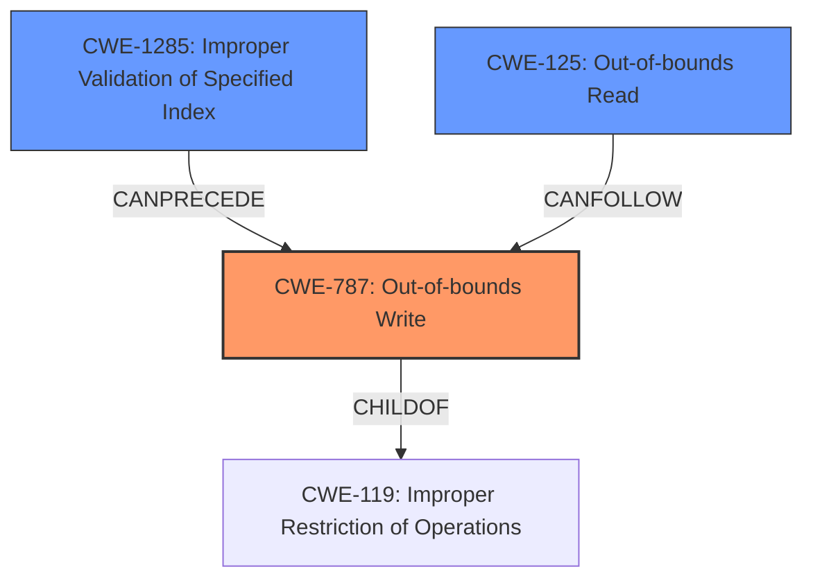

# Final Resolution for CVE-2022-26447

# Summary
| CWE ID | CWE Name | Confidence | CWE Abstraction Level | CWE Vulnerability Mapping Label | CWE-Vulnerability Mapping Notes |
|---|---|---|---|---|---|
| CWE-787 | Out-of-bounds Write | 1.0 | Base | Primary | Allowed |
| CWE-1285 | Improper Validation of Specified Index, Position, or Offset in Input | 0.6 | Base | Secondary Candidate | Allowed |
| CWE-125 | Out-of-bounds Read | 0.5 | Base | Secondary Candidate | Allowed |

## Evidence and Confidence

*   **Confidence Score:** 0.95
*   **Evidence Strength:** HIGH

## Relationship Analysis
The primary CWE is CWE-787, which is a child of CWE-119. The vulnerability description explicitly mentions the **out-of-bounds write** condition, justifying the selection of CWE-787. The relationship to CWE-119 indicates that the write occurs due to a general failure to restrict operations within the bounds of a memory buffer. CWE-1285 is also considered as a contributing factor, indicating a failure to validate input before writing. CWE-125, while possible, is less directly supported by the provided evidence.

## Vulnerability Chain
The vulnerability chain begins with a **missing bounds check** (CWE-1285) leading to an **out-of-bounds write** (CWE-787). This write can then potentially lead to an **out-of-bounds read** (CWE-125) if the corrupted memory is subsequently accessed. The ultimate impact is remote code execution.

## Summary of Analysis
The initial analysis correctly identified CWE-787 as the primary weakness based on the clear statement in the vulnerability description: "In BT firmware, there is a possible **out of bounds write** due to a **missing bounds check**." This statement directly supports the selection of CWE-787 as the root cause. The criticism provided valuable suggestions for improvement, particularly regarding the inclusion of mitigations.

The graph relationships reinforce the decision, as CWE-787 is a specific type of buffer overflow (child of CWE-119). The chain analysis highlights that the **missing bounds check** (CWE-1285) enables the **out-of-bounds write** (CWE-787). While an out-of-bounds read (CWE-125) could occur as a result, it is less directly stated in the vulnerability description. Given this, CWE-787 remains the most appropriate primary classification.

The confidence score is high (0.95) because the vulnerability description provides direct evidence of an **out-of-bounds write** caused by a **missing bounds check**. The selected CWEs are at the optimal level of specificity, with CWE-787 being a Base-level CWE and directly addressing the described vulnerability. The secondary candidates, CWE-1285 and CWE-125, are also at the Base level and represent potential contributing factors or consequences. The mapping guidance allows for the use of all selected CWEs. I am increasing the confidence in CWE-1285 to 0.6 as the **missing bounds check** explicitly highlights this.