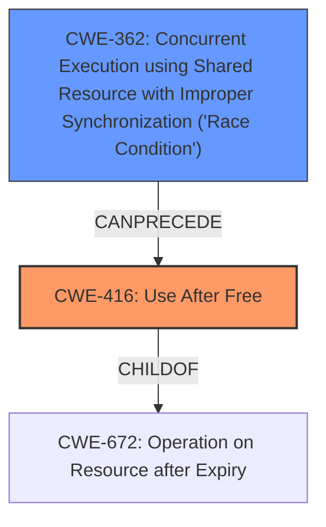

# Final Resolution for CVE-2022-26450

# Summary
| CWE ID | CWE Name | Confidence | CWE Abstraction Level | CWE Vulnerability Mapping Label | CWE-Vulnerability Mapping Notes |
|---|---|---|---|---|---|
| CWE-416 | Use After Free | 0.95 | Variant | Allowed | Primary CWE |
| CWE-362 | Concurrent Execution using Shared Resource with Improper Synchronization ('Race Condition') | 0.85 | Class | Allowed-with-Review | Secondary Candidate |

## Evidence and Confidence

*   **Confidence Score:** 0.92
*   **Evidence Strength:** HIGH

## Relationship Analysis
The primary relationship influencing the decision is the CANFOLLOW relationship between CWE-362 (Race Condition) and CWE-416 (Use After Free). This accurately reflects the vulnerability description where the race condition leads to the use-after-free. While CWE-362 is a Class-level CWE, its direct relevance to the described race condition warrants its inclusion. There are child relationships from CWE-672 to CWE-416. The abstraction levels were considered, opting for the Variant level (CWE-416) where possible for specificity.

## Vulnerability Chain
The vulnerability chain starts with:
1.  **ROOTCAUSE:** A **race condition** (CWE-362) exists due to improper synchronization when multiple threads concurrently access shared resources.
2.  **WEAKNESS:** This **race condition** leads to a situation where memory is accessed after it has been freed.
3.  **IMPACT:** This results in a **use-after-free** vulnerability (CWE-416), potentially allowing for escalation of privilege.

## Summary of Analysis
The initial analysis and the provided criticism both converge on the primary role of CWE-416 (Use After Free) and the contributing factor of CWE-362 (Race Condition). The vulnerability description explicitly states "use after free due to a race condition," providing strong evidence for these classifications.

The graph relationships, particularly the "CANFOLLOW" relationship between CWE-362 and CWE-416, reinforces the understanding that the race condition is a precursor to the use-after-free. The decision to include both CWEs reflects the need to capture both the high-level cause and the specific manifestation of the vulnerability.

The selected CWEs are at the optimal level of specificity. CWE-416 is a Variant-level CWE that accurately describes the "use after free" condition. While CWE-362 is a Class-level CWE, it directly corresponds to the "race condition" mentioned in the vulnerability description. While more specific base-level children of CWE-362 like CWE-366, CWE-367, CWE-413, or CWE-1223 exist, the available information does not enable a confident choice among them.