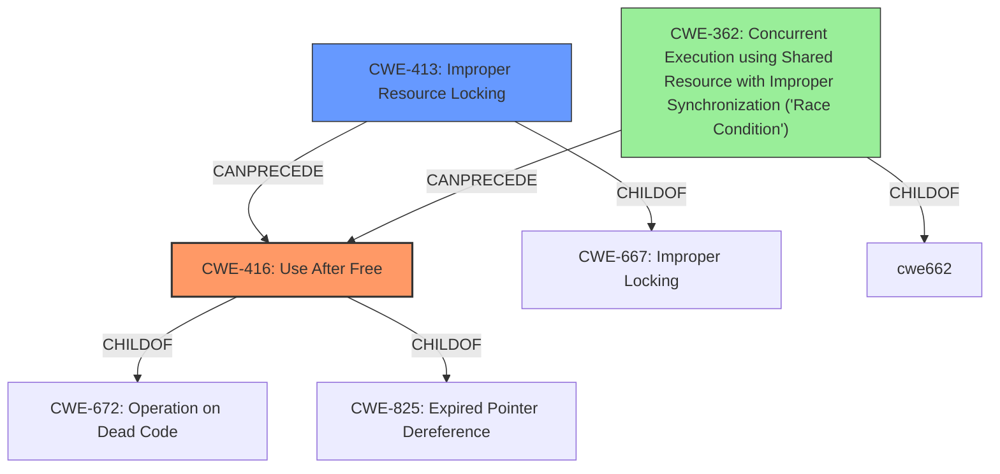

# Final Resolution for CVE-2022-26452

# Summary
| CWE ID | CWE Name | Confidence | CWE Abstraction Level | CWE Vulnerability Mapping Label | CWE-Vulnerability Mapping Notes |
|---|---|---|---|---|---|
| CWE-416 | Use After Free | 0.9 | Variant | Primary | Allowed |
| CWE-413 | Improper Resource Locking | 0.7 | Base | Secondary | Allowed |
| CWE-362 | Concurrent Execution using Shared Resource with Improper Synchronization ('Race Condition') | 0.5 | Class | Supporting | Allowed-with-Review |

## Evidence and Confidence

*   **Confidence Score:** 0.8
*   **Evidence Strength:** HIGH

## Relationship Analysis
The primary **WEAKNESS** is **CWE-416 (Use After Free)**, which is a variant of **CWE-672 (Operation on Dead Code)** and **CWE-825 (Expired Pointer Dereference)**. The secondary **WEAKNESS** is **CWE-413 (Improper Resource Locking)**, a base-level CWE that directly relates to the **IMPROPER LOCKING** mentioned in the vulnerability description. A supporting weakness is **CWE-362 (Concurrent Execution using Shared Resource with Improper Synchronization ('Race Condition'))**, which is a class level CWE related to **IMPROPER LOCKING** .

## Vulnerability Chain
The vulnerability chain starts with **CWE-413 (Improper Resource Locking)**, leading to **CWE-362 (Concurrent Execution using Shared Resource with Improper Synchronization ('Race Condition'))** and ultimately resulting in **CWE-416 (Use After Free)**.
- Improper locking allows concurrent access to a shared resource.
- A race condition occurs due to lack of synchronization.
- A thread frees the resource while another thread still holds a dangling pointer.
- The second thread attempts to access the freed resource, leading to a use-after-free condition.

## Summary of Analysis
The initial analysis correctly identified **CWE-416 (Use After Free)** as the primary **WEAKNESS**, given the explicit mention of "use after free" in the vulnerability description. The criticism highlighted the need to explore more specific children of **CWE-667 (Improper Locking)**. Based on the retriever results and the relationships between CWEs, **CWE-413 (Improper Resource Locking)** was selected as a more appropriate secondary **WEAKNESS** because it is a Base level CWE and accurately describes the **ROOTCAUSE** of the vulnerability. **CWE-362 (Concurrent Execution using Shared Resource with Improper Synchronization ('Race Condition'))** was added as supporting CWE to show the impact of the missing lock and its resulting race condition.

The vulnerability description states "In isp, there is a possible use after free due to **improper locking**." This statement is strong evidence for selecting both **CWE-416 (Use After Free)** and **CWE-413 (Improper Resource Locking)**.

The final classification provides a more specific and accurate representation of the vulnerability, with **CWE-416 (Use After Free)** as the primary **WEAKNESS** and **CWE-413 (Improper Resource Locking)** and **CWE-362 (Concurrent Execution using Shared Resource with Improper Synchronization ('Race Condition'))** as contributing factors. This reflects the optimal level of specificity based on the available evidence and the relationships between CWEs.