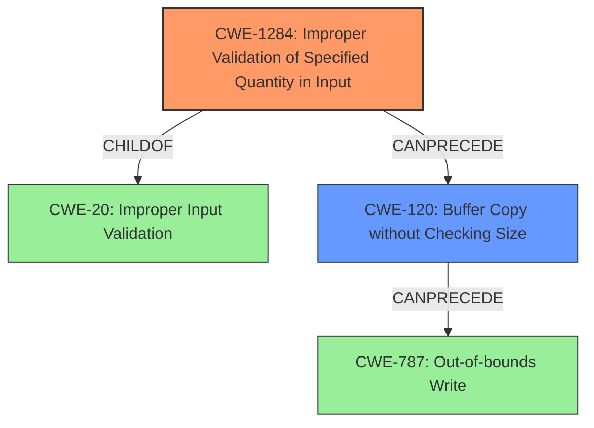

# Final Resolution for CVE-2022-26531

# Summary
| CWE ID | CWE Name | Confidence | CWE Abstraction Level | CWE Vulnerability Mapping Label | CWE-Vulnerability Mapping Notes |
|---|---|---|---|---|---|
| CWE-1284 | Improper Validation of Specified Quantity in Input | 0.7 | Base | Allowed | Primary CWE |
| CWE-120 | Buffer Copy without Checking Size of Input ('Classic Buffer Overflow') | 0.6 | Base | Allowed-with-Review | Secondary Candidate |

## Evidence and Confidence

*   **Confidence Score:** 0.7
*   **Evidence Strength:** MEDIUM

## Relationship Analysis
The decision was influenced by several CWE relationships:
  - **Parent-child:** `CWE-1284` is a child of `CWE-20` (Improper Input Validation), providing a more specific type of input validation issue. `CWE-120` is also a child of `CWE-119` (Improper Restriction of Operations within the Bounds of a Memory Buffer), indicating a memory buffer issue.
  - **Chain:** The chain `CWE-20 -> CWE-1284 -> CWE-120 -> CWE-787` represents a possible vulnerability chain where improper input validation (CWE-20) of a specified quantity (CWE-1284) leads to a buffer overflow (CWE-120), ultimately resulting in an out-of-bounds write (CWE-787).
  - **Peer:** `CWE-1284`, `CWE-1285`, and `CWE-1286` are peers, representing different types of improper input validation.
  - **Abstraction Levels:** Selecting `CWE-1284` (Base) over `CWE-20` (Class) provides a more specific classification. `CWE-120` is a base level weakness as well.

## Vulnerability Chain
The vulnerability chain starts with improper input validation, specifically the validation of a specified quantity.
  - **Root Cause:** `CWE-1284` (Improper Validation of Specified Quantity in Input)
  - **Weakness:** `CWE-120` (Buffer Copy without Checking Size of Input) resulting from the improper quantity validation.
  - **Impact:** The crafted payload causes a buffer overflow, potentially leading to a system crash or arbitrary code execution.

## Summary of Analysis
The initial analysis correctly identified the potential for a **buffer overflow** (`CWE-120`) due to **improper input validation** (`CWE-20`). However, the criticism correctly pointed out that `CWE-20` is a high-level class and that more specific CWEs related to input validation should be considered.

The vulnerability description states that "multiple improper input validation flaws were identified in some CLI commands...that could allow a local authenticated attacker to cause a **buffer overflow**...via a crafted payload." This indicates that the size or length of the input might not be properly validated, leading to the overflow.

Based on the suggestions in the criticism, I've selected `CWE-1284` (Improper Validation of Specified Quantity in Input) as the primary CWE. This is because the vulnerability involves CLI commands and a crafted payload, suggesting that the size or length of the input is a critical factor. If the input quantity (e.g., length of the string) is not properly validated, it can lead to a **buffer overflow**.

`CWE-120` is retained as a secondary CWE because the vulnerability description explicitly mentions a **buffer overflow**. This means that even if the quantity is not validated, the copy operation itself does not check for the buffer size.

The relationship analysis further supports this decision. `CWE-1284` is a child of `CWE-20`, making it a more specific classification.

The selection of `CWE-1284` and `CWE-120` provides a better understanding of the vulnerability and can guide more effective mitigation efforts. The focus on input validation and buffer handling can help developers implement appropriate checks and safeguards to prevent similar vulnerabilities in the future.