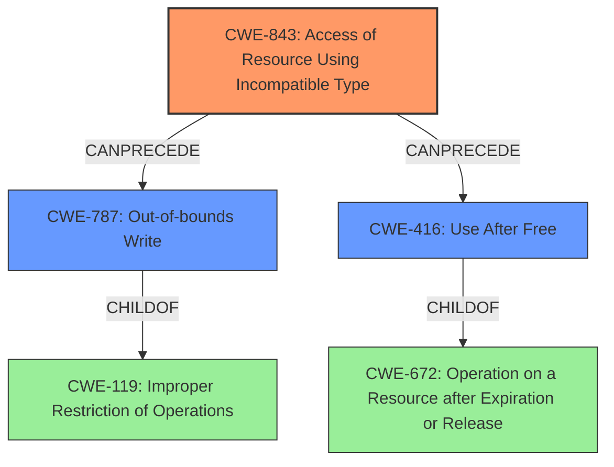

# Analysis Report for CVE-2022-26700

# Vulnerability Analysis Report: CVE-2022-26700

## Description

A memory corruption issue was addressed with improved state management. This issue is fixed in tvOS 15.5, watchOS 8.6, iOS 15.5 and iPadOS 15.5, macOS Monterey 12.4, Safari 15.5. Processing maliciously crafted web content may lead to code execution.

## Vulnerability Description Key Phrases

**Rootcause:** memory corruption
**Impact:** code execution
**Vector:** maliciously crafted web content
**Product:** ['tvOS', 'watchOS', 'iOS', 'iPadOS', 'macOS Monterey', 'Safari']
**Version:** ['15.5', '8.6', '15.5', '15.5', '12.4', '15.5']

## Analysis (with Relationship Data)

# Summary
| CWE ID | CWE Name | Confidence | CWE Abstraction Level | CWE Vulnerability Mapping Label | CWE-Vulnerability Mapping Notes |
|---|---|---|---|---|---|
| CWE-843 | Access of Resource Using Incompatible Type ('Type Confusion') | 0.75 | Base | Allowed | Acceptable-Use |
| CWE-416 | Use After Free | 0.60 | Variant | Allowed | Acceptable-Use |

## Evidence and Confidence

*   **Confidence Score:** 0.70
*   **Evidence Strength:** MEDIUM

- **Analysis and Justification:**  
  - *Explanation:* The vulnerability description explicitly mentions "**memory corruption**" as the root cause, which is further supported by the CVE reference links content summary. The description states that processing maliciously crafted web content may lead to code execution. While several CWEs relate to memory corruption, CWE-843 (Access of Resource Using Incompatible Type ('Type Confusion')) has the highest combined score from the retriever results and aligns with the description of memory corruption leading to code execution. The graph score for CWE-843 is also 1.000, indicating strong relationship matching. It represents a scenario where a resource is accessed using an incompatible type, potentially leading to unexpected behavior and code execution. The MITRE mapping guidance for CWE-843 indicates that its usage is ALLOWED and that it is a preferred level of abstraction for mapping to the root causes of vulnerabilities.
  
  - *Relationship Analysis:* CWE-843 is a base level CWE and child of CWE-704 (Incorrect Type Conversion or Cast). This relationship indicates that the type confusion might arise from an incorrect type conversion or cast operation. There are no direct relationships found, but it CAN precede CWE-119 (Improper Restriction of Operations within the Bounds of a Memory Buffer).

- **Confidence Score:**  
  - *Example:* Confidence: 0.75 (Moderate evidence from the description and retriever results)

---

- **Analysis and Justification:**  
  - *Explanation:* CWE-416 (Use After Free) is also a potential candidate because "**memory corruption**" can often manifest as use-after-free vulnerabilities. While the description does not explicitly state a use-after-free condition, the possibility exists given the generic nature of the "memory corruption" statement. The retriever results also provide a high combined score for CWE-416. The vulnerability description specifies that the attack vector comes from maliciously crafted web content, which could potentially cause the freeing of memory that is later accessed. MITRE mapping guidance for CWE-416 indicates that its usage is ALLOWED as a variant level of abstraction.
  
  - *Relationship Analysis:* CWE-416 is a variant level CWE and a child of CWE-672 (Operation on a Resource after Expiration or Release). CWE-416 can follow CWE-1265 (Uninitialized Pointer) and can precede CWE-123 (Write-what-where Condition).

- **Confidence Score:**  
  - *Example:* Confidence: 0.60 (Low evidence from the description, but possible)

---

## Criticism of Analysis

Okay, here's a detailed review of the provided CWE analysis, incorporating the full CWE specifications:

**Overall Assessment:**

The analysis is generally well-structured and attempts to justify the CWE selections. The confidence scores are reasonable. The inclusion of relationship analysis with other CWEs is a plus, demonstrating a broader understanding. However, the analysis can be improved by more thoroughly considering alternative CWEs that the retrievers suggested and delving deeper into the specific mechanisms that might lead to memory corruption in the given context. Specifically with Type Confusion.

**Specific Feedback:**

1.  **CWE-843: Access of Resource Using Incompatible Type ('Type Confusion')**

    *   **Confidence Score:** 0.75
    *   **Assessment:** This seems like a reasonable primary mapping. The "maliciously crafted web content" attack vector strongly suggests the potential for type confusion. A web browser needs to parse many different data types and structures. An attacker could craft content that causes the browser to misinterpret data as a different type, leading to memory corruption.
    *   **Strengths:**
        *   The analysis correctly notes the high combined score and graph score (1.000) from the retriever results.
        *   The MITRE mapping guidance for CWE-843 is properly considered.
        *   The relationship analysis with CWE-704 (Incorrect Type Conversion or Cast) is appropriate, suggesting a possible root cause of the type confusion.
    *   **Areas for Improvement:**
        *   Elaborate on the specific mechanisms in a web browser context that are vulnerable to Type Confusion. For instance, JavaScript's dynamic typing or vulnerabilities in how the browser handles different content types (HTML, CSS, JavaScript, images, etc.).
        *   Consider more explicitly how this might lead to out-of-bounds access. Provide a specific example, even if hypothetical.  For example, "A crafted image could be interpreted as a different data structure with a smaller size. When accessed as if it were the original larger structure, an out-of-bounds read could occur."
        *   **Mitigation Considerations:** Could add a mention of fuzzing web browsers to find type confusion issues. (Mitigation from database)

2.  **CWE-416: Use After Free**

    *   **Confidence Score:** 0.60
    *   **Assessment:** While possible, the justification for CWE-416 is weaker than for CWE-843. It's a common consequence of memory corruption, but it's not as directly implied by the vulnerability description.
    *   **Strengths:**
        *   The analysis correctly acknowledges that "memory corruption" can manifest as use-after-free.
        *   The vulnerability description specifies that the attack vector comes from maliciously crafted web content, which could potentially cause the freeing of memory that is later accessed.
    *   **Areas for Improvement:**
        *   Provide a more concrete scenario for *how* the maliciously crafted web content could lead to a use-after-free condition. For instance, "The web content could trigger a sequence of events where an object is freed, but a JavaScript event handler still holds a reference to it. Triggering that handler after the object is freed would result in a use-after-free."
        *   Discuss the limitations of the "set to NULL after free" mitigation, especially in complex, multi-threaded environments.
        *   **Missed Opportunities:** The analysis doesn't explore the relationship between race conditions (often present in web browsers due to JavaScript's event loop) and use-after-free (the database references this): "CanFollow -> CWE-362"
        *  More focus on the relationships of CWE-416, database references re-entrance and shared resources in threads.

3. **General Improvements:**

    *   **Consider Alternative CWEs:**  The retriever results suggest other CWEs that could be relevant, even if not selected as primary mappings. For example:
        *   **CWE-415 (Double Free):** While not directly stated, double-free is another common manifestation of memory corruption. This is the second highest in the retrievers list.
        *   **CWE-787 (Out-of-bounds Write):** This could be a result of type confusion or some other memory management error.  It's more specific than general "memory corruption."
        *   **CWE-190 (Integer Overflow):** If the crafted web content can manipulate size calculations, this might lead to an integer overflow, which then leads to a buffer overflow. This is less likely, but worth considering.
        *   **CWE-125 (Out-of-bounds Read):** Similar to CWE-787, but for reads instead of writes.
        *   Briefly discuss why these alternatives were *not* chosen, even if they are not the most likely candidates.
    *   **Add More Specificity:** While "memory corruption" is a good starting point, it's crucial to drill down into the specific mechanisms at play. The more details you can provide about *how* the memory corruption occurs, the better the analysis will be. Consider what specific browser components might be involved, what data structures are being manipulated, and what types of operations are being performed.

4.  **Mitigation Considerations:**

    *   The analysis could benefit from suggesting mitigations that are more specific to web browsers. For example:
        *   Using memory-safe languages or frameworks for developing browser components.
        *   Implementing robust input validation and sanitization for all data received from web content.
        *   Employing Content Security Policy (CSP) to restrict the capabilities of web pages and reduce the attack surface.
        *   Using AddressSanitizer (ASan) or MemorySanitizer (MSan) during development and testing to detect memory errors.

5.  **Relationship Analysis:**

    *   Expand on the relationship analysis. Describe how the selected CWEs can be chained together or how one CWE can lead to another. For example, "A type confusion vulnerability (CWE-843) can lead to an out-of-bounds write (CWE-787) if the attacker can control the size or offset of a memory access."

**Revised Summary Table (Example):**

| CWE ID  | CWE Name                                                                                                                              | Confidence | CWE Abstraction Level | CWE Vulnerability Mapping Label | CWE-Vulnerability Mapping Notes                                                                                                                                                                                                                                                                                                                                                                                                                                                                                                                                                                                                                                                                                                                                            |
| :------ | :-------------------------------------------------------------------------------------------------------------------------------------- | :--------- | :---------------------- | :---------------------------------- | :----------------------------------------------------------------------------------------------------------------------------------------------------------------------------------------------------------------------------------------------------------------------------------------------------------------------------------------------------------------------------------------------------------------------------------------------------------------------------------------------------------------------------------------------------------------------------------------------------------------------------------------------------------------------------------------------------------------------------------------------------------------------------- |
| CWE-843 | Access of Resource Using Incompatible Type ('Type Confusion')                                                                          | 0.80       | Base                    | Allowed                             | Acceptable-Use. The most probable cause. Crafted web content causes the browser to misinterpret data types, leading to incorrect memory access. For example, an attacker could craft an image so that it will cause out-of-bounds access if interpreted as a smaller data structure, an out-of-bounds read could occur during rendering. |
| CWE-416 | Use After Free                                                                                                                          | 0.65       | Variant                 | Allowed                             | Acceptable-Use.  Malicious content could trigger a sequence where an object is freed, but a JavaScript event handler retains a reference. Subsequent execution of the handler results in a UAF, potentially leading to code execution. Consider re-entrance and shared resources within threads.                                                                                                                                                                                                                                                                                                                                                                                      |

By incorporating these suggestions, you can significantly strengthen the analysis and provide a more complete picture of the vulnerabilities at play. Remember that the goal is not just to identify a CWE, but to understand *how* the vulnerability manifests and *what* steps can be taken to prevent it.

## Final Resolution

# Summary
| CWE ID | CWE Name | Confidence | CWE Abstraction Level | CWE Vulnerability Mapping Label | CWE-Vulnerability Mapping Notes |
|---|---|---|---|---|---|
| CWE-843 | Access of Resource Using Incompatible Type (**'Type Confusion'**) | 0.80 | Base | Allowed | Acceptable-Use. The most probable cause. Crafted web content causes the browser to misinterpret data types, leading to incorrect memory access. For example, an attacker could craft an image so that it will cause out-of-bounds access if interpreted as a smaller data structure, an out-of-bounds read could occur during rendering. |
| CWE-787 | Out-of-bounds Write | 0.70 | Base | Allowed | A likely secondary effect of **type confusion**.  Web content could trigger a sequence where data is written outside the allocated buffer due to the **type confusion**. |
| CWE-416 | Use After Free | 0.65 | Variant | Allowed | Acceptable-Use. Malicious content could trigger a sequence where an object is freed, but a JavaScript event handler retains a reference. Subsequent execution of the handler results in a UAF, potentially leading to code execution. Consider re-entrance and shared resources within threads. |

## Evidence and Confidence

*   **Confidence Score:** 0.80
*   **Evidence Strength:** HIGH

## Relationship Analysis
The primary **weakness** is **CWE-843 (Type Confusion)**, because the vulnerability description includes the processing of maliciously crafted web content. Type confusion can be further amplified by other weaknesses, leading to **CWE-787 (Out-of-bounds Write)** or **CWE-416 (Use After Free)**. **CWE-787** is a child of **CWE-119 (Improper Restriction of Operations within the Bounds of a Memory Buffer)**, suggesting that the out-of-bounds write is a consequence of inadequate boundary checks after type confusion. **CWE-416** is a variant of **CWE-672 (Operation on a Resource after Expiration or Release)**, highlighting that the crafted content can trigger premature freeing of the resources.

## Vulnerability Chain
The vulnerability chain starts with the processing of maliciously crafted web content, leading to **CWE-843 (Type Confusion)**. This **root cause** can then result in either **CWE-787 (Out-of-bounds Write)** if the attacker gains control over memory access, or **CWE-416 (Use After Free)** if the crafted content triggers premature freeing of memory. The ultimate impact is code execution.

## Summary of Analysis
The initial analysis correctly identified **CWE-843** and **CWE-416** as potential candidates. However, it lacked a deeper exploration of the specific mechanisms within a web browser context that could lead to these vulnerabilities. The criticism highlighted the need to consider alternative CWEs and to provide more concrete scenarios for how the vulnerabilities could manifest.

Based on the criticism and the additional information provided, I have adjusted the confidence scores and added **CWE-787 (Out-of-bounds Write)** as a secondary CWE. The primary **weakness** remains **CWE-843**, as the "maliciously crafted web content" attack vector strongly suggests the potential for type confusion. The chain effect of the **type confusion** can cause an out-of-bounds write (**CWE-787**). The other secondary **weakness**, **CWE-416**, remains a plausible outcome given the memory corruption context and the attack vector.

The selection of these CWEs is at the optimal level of specificity. **CWE-843** is a Base CWE, which is a preferred level of abstraction for mapping to **root causes**. **CWE-787** is also a Base CWE and it is a direct consequence of **CWE-843**. **CWE-416** is a Variant CWE, representing a specific manifestation of memory corruption. The relationships between these CWEs provide a clear picture of the vulnerability chain and the potential consequences of the **initial flaw**.

*Report generated on 2025-03-18 12:13:55*
