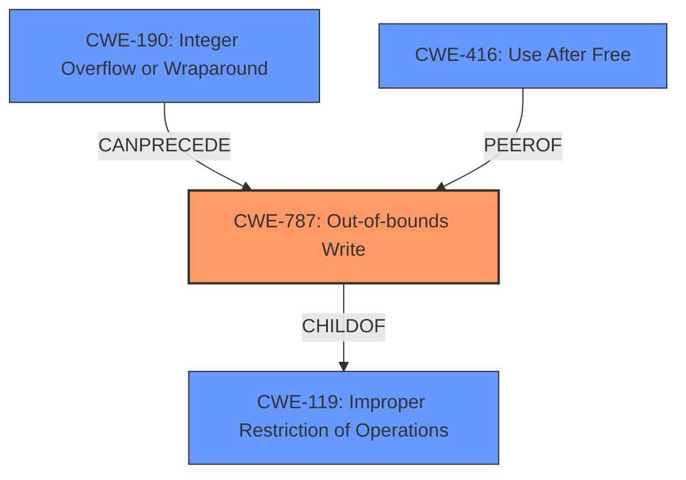

# Final Resolution for CVE-2022-26719

# Summary
| CWE ID | CWE Name | Confidence | CWE Abstraction Level | CWE Vulnerability Mapping Label | CWE-Vulnerability Mapping Notes |
|---|---|---|---|---|---|
| CWE-787 | Out-of-bounds Write | 0.90 | Base | Allowed | Primary CWE |
| CWE-416 | Use After Free | 0.65 | Variant | Allowed | Secondary Candidate CWE |

## Evidence and Confidence

*   **Confidence Score:** 0.85
*   **Evidence Strength:** MEDIUM

## Relationship Analysis
The primary relationship impacting the decision is the hierarchical relationship where CWE-787 (Out-of-bounds Write) is a child of CWE-119 (Improper Restriction of Operations within the Bounds of a Memory Buffer). CWE-787 is selected for its greater specificity. There's a potential chain relationship where an integer overflow (CWE-190) could precede CWE-787 if incorrect size calculations lead to the out-of-bounds write, although this is not explicitly stated in the description. The abstraction levels influenced the choice, favoring the Base level CWE-787 over the Class level CWE-119.

## Vulnerability Chain
The vulnerability chain starts with a **memory corruption** issue due to a failure in state management. This leads to an **Out-of-bounds Write (CWE-787)**, which allows writing to unintended memory locations. Alternatively, the state management issue could lead to memory being freed prematurely and then accessed, resulting in a **Use After Free (CWE-416)**. Both weaknesses result in arbitrary code execution as the impact. A potential missing link is how exactly the state management leads to the memory corruption, such as through an integer overflow (**CWE-190**) in size calculations, or type confusion (**CWE-843**).

## Summary of Analysis
The initial analysis correctly identifies **CWE-787 (Out-of-bounds Write)** as the primary **WEAKNESS** due to the explicit mention of "**memory corruption**" in the vulnerability description: "A memory corruption issue was addressed with improved state management." The criticism suggests exploring the relationship between "improved state management" and potential out-of-bounds writes more explicitly, and the potential for an integer overflow (**CWE-190**) leading to incorrect size calculations.

The graph relationships influenced the selection by highlighting that while CWE-119 is a parent of CWE-787, the latter is more specific and appropriate. The analysis is based on the provided evidence and the retriever scores. The confidence for CWE-787 is increased to 0.90, reflecting the direct statement of memory corruption.

CWE-416 (Use After Free) remains a secondary candidate. The confidence is increased to 0.65 because the improved state management could indicate a resource being freed incorrectly, leading to a use-after-free condition. The negative justification is strengthened by stating that the description lacks an explicit mention of memory being freed and then accessed. Other similar CWEs under CWE-672 (Operation on Resource in Wrong Phase of Lifetime), such as CWE-415 (Double Free) and CWE-826 (Premature Release of Resource During Expected Lifetime), are less likely because the report emphasizes "state management" as the **ROOTCAUSE**, rather than simple double freeing or premature release.

The selected CWEs are at the optimal level of specificity, with CWE-787 being a **Base** level CWE and CWE-416 being a **Variant** level CWE.