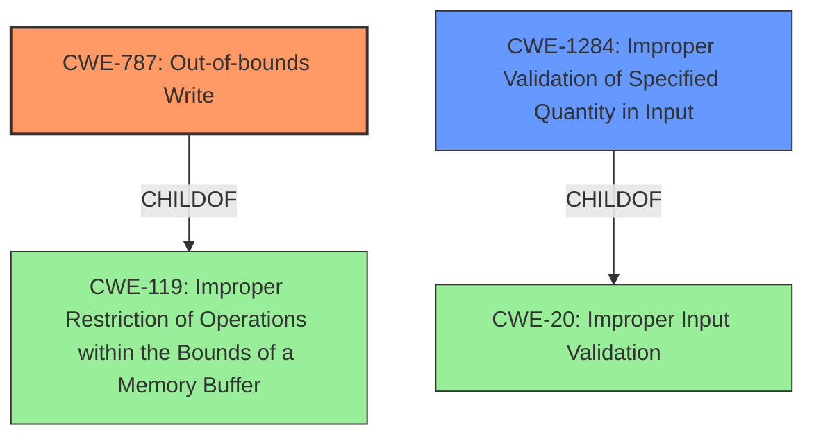

# Analysis Report for CVE-2022-26730

# Vulnerability Analysis Report: CVE-2022-26730

## Description

A memory corruption issue existed in the processing of ICC profiles. This issue was addressed with improved input validation. This issue is fixed in macOS Ventura 13. Processing a maliciously crafted image may lead to arbitrary code execution.

## Vulnerability Description Key Phrases

**Rootcause:** A memory corruption issue
**Impact:** arbitrary code execution
**Vector:** maliciously crafted image
**Product:** macOS
**Version:** Ventura 13

## Analysis (with Relationship Data)

# Summary
| CWE ID | CWE Name | Confidence | CWE Abstraction Level | CWE Vulnerability Mapping Label | CWE-Vulnerability Mapping Notes |
|---|---|---|---|---|---|
| CWE-787 | Out-of-bounds Write | 0.85 | Base | Allowed | Primary CWE |
| CWE-20 | Improper Input Validation | 0.6 | Class | Discouraged | Secondary Candidate |

## Evidence and Confidence

*   **Confidence Score:** 0.75
*   **Evidence Strength:** HIGH

- **Analysis and Justification:**  
  - *Explanation:* The vulnerability description clearly states "**A memory corruption issue** existed in the processing of ICC profiles" and that "**improved input validation**" was implemented to fix it. This indicates that the root cause of the vulnerability is an out-of-bounds write due to the lack of proper input validation, making CWE-787 (Out-of-bounds Write) the primary weakness. The description states that the impact is arbitrary code execution. While various memory corruption issues could lead to code execution, the reference to "processing of ICC profiles" suggests that a maliciously crafted image can cause the **memory corruption** by writing outside the intended buffer. CWE-787 is a Base level CWE and the mapping guidance indicates that its usage is ALLOWED. CWE-20 (Improper Input Validation) could be considered a contributing factor, as the lack of input validation leads to the **memory corruption**, but it's a Class level CWE and is DISCOURAGED when more specific CWEs are available.
  
  - *Relationship Analysis:* CWE-787 is a child of CWE-119 (Improper Restriction of Operations within the Bounds of a Memory Buffer). CWE-787 CanPrecede CWE-825 (Expired Pointer)

- **Confidence Score:**  
  - Confidence: 0.85 (High evidence from technical description and CVE reference materials)

---

# Summary
| CWE ID | CWE Name | Confidence | CWE Abstraction Level | CWE Vulnerability Mapping Label | CWE-Vulnerability Mapping Notes |
|---|---|---|---|---|---|
| CWE-787 | Out-of-bounds Write | 0.85 | Base | Allowed | Primary CWE |
| CWE-20 | Improper Input Validation | 0.6 | Class | Discouraged | Secondary Candidate |

## Evidence and Confidence

*   **Confidence Score:** 0.75
*   **Evidence Strength:** HIGH

- **Analysis and Justification:**  
  - *Explanation:* The vulnerability description clearly states "**A memory corruption issue** existed in the processing of ICC profiles" and that "**improved input validation**" was implemented to fix it. This indicates that the root cause of the vulnerability is an out-of-bounds write due to the lack of proper input validation, making CWE-787 (Out-of-bounds Write) the primary weakness. The description states that the impact is arbitrary code execution. While various memory corruption issues could lead to code execution, the reference to "processing of ICC profiles" suggests that a maliciously crafted image can cause the **memory corruption** by writing outside the intended buffer. CWE-787 is a Base level CWE and the mapping guidance indicates that its usage is ALLOWED. CWE-20 (Improper Input Validation) could be considered a contributing factor, as the lack of input validation leads to the **memory corruption**, but it's a Class level CWE and is DISCOURAGED when more specific CWEs are available.
  
  - *Relationship Analysis:* CWE-787 is a child of CWE-119 (Improper Restriction of Operations within the Bounds of a Memory Buffer). CWE-787 CanPrecede CWE-825 (Expired Pointer)

- **Confidence Score:**  
  - Confidence: 0.85 (High evidence from technical description and CVE reference materials)

---

## Criticism of Analysis

Okay, here's a detailed review of the provided CWE analysis, incorporating the full CWE specifications you've supplied.

**Overall Assessment:**

The analysis correctly identifies CWE-787 (Out-of-bounds Write) as the primary weakness, and it provides reasonable justification. The inclusion of CWE-20 (Improper Input Validation) as a secondary candidate is also understandable, given the context of "improved input validation" being the fix. However, the review of this analysis needs to address the *discouraged* usage of CWE-20 and explore if a more specific child CWE of CWE-20 could be more appropriate.  The analysis is well-written and demonstrates a good understanding of the vulnerability.  However, I will provide some insights that could improve the analysis based on the CWE specifications that were provided.

**Detailed Review:**

**1. CWE-787: Out-of-bounds Write**

*   **Initial Assessment:**  The primary CWE selection is strong and supported by the vulnerability description.
*   **CWE Specification Alignment:**

    *   **Description:** The analysis accurately reflects the description of CWE-787: "The product writes data past the end, or before the beginning, of the intended buffer." The description directly indicates a memory corruption issue that stems from data being written outside the intended boundaries.
    *   **Relationships:**
        *   The analysis notes that CWE-787 is a child of CWE-119, which is also correct and further validates the selection.
        *   The analysis further notes that the relationships of CWE-787 can follow CWE-825 which is correct, however, it is also worth to note that CWE-787 can precede it.
    *   **Mapping Guidance:** The analysis correctly acknowledges that CWE-787's usage is *Allowed* and is a preferred level of abstraction.
    *   **Potential Mitigations:** The analysis could be strengthened by briefly mentioning relevant mitigations from the CWE specification. For instance:

        *   Language Selection: Use memory-safe languages.
        *   Libraries/Frameworks: Use safe string handling libraries.
        *   Environment Hardening: Employ compiler-based buffer overflow detection mechanisms.
*   **Confidence:** The confidence score of 0.85 is appropriate, given the explicit mention of memory corruption and the corrective action of improved input validation.
*   **Room for Improvement:** None. The selection and analysis of CWE-787 is strong.

**2. CWE-20: Improper Input Validation**

*   **Initial Assessment:**  Including CWE-20 as a secondary weakness makes sense on the surface, but requires deeper scrutiny due to CWE's mapping guidance.
*   **CWE Specification Alignment:**

    *   **Description:** The analysis notes that the "**improved input validation**" implies that the lack of proper input validation leads to the **memory corruption**.
    *   **Relationships:** The analysis notes that CWE-787 is a child of CWE-119 and CWE-119 is a child of CWE-20. This relationship is accurate from the CWE definitions.
    *   **Mapping Guidance:** This is the most crucial point. The analysis acknowledges that CWE-20 is a *Discouraged* mapping because it's a high-level Class CWE. The CWE Specification explicitly states: "CWE-20 is commonly misused in low-information vulnerability reports when lower-level CWEs could be used instead, or when more details about the vulnerability are available [REF-1287]. It is not useful for trend analysis. It is also a level-1 Class (i.e., a child of a Pillar)."  The specification urges considering "lower-level children such as Improper Use of Validation Framework (CWE-1173) or improper validation involving specific types or properties of input such as Specified Quantity (CWE-1284); Specified Index, Position, or Offset (CWE-1285); Syntactic Correctness (CWE-1286); Specified Type (CWE-1287); Consistency within Input (CWE-1288); or Unsafe Equivalence (CWE-1289)."
    *   **Potential Mitigations:** If we were to keep CWE-20 then the analysis could be strengthened by briefly mentioning relevant mitigations from the CWE specification. For instance:

        *   Attack Surface Reduction: LangSec techniques that use a formal language and build "recognizers" for that language
        *   Libraries/Frameworks: Use an input validation framework.
        *   Attack Surface Reduction: Understand all the potential areas where untrusted inputs can enter your software

*   **Recommendations:**
    *   **Replace CWE-20 with a more specific child CWE.**  Consider the following possibilities, based on the provided descriptions:
        *   **CWE-1285: Improper Validation of Specified Index, Position, or Offset in Input:** If the ICC profile processing involves using attacker-controlled data as an index/offset into a buffer, this is a strong candidate.
        *   **CWE-1284: Improper Validation of Specified Quantity in Input:** If the ICC profile contains size/length fields that are not adequately validated, leading to an out-of-bounds write, this is another good option.
        *   **CWE-1286: Improper Validation of Syntactic Correctness of Input**: If the ICC profile has to conform with an expected syntax, and a failure to validate that syntax leads to the memory corruption, then this is a very good choice.

    *   **If no more specific child CWE of CWE-20 is relevant, consider removing CWE-20 entirely.** While input validation is *related*, it's not necessarily the *direct* cause.  If the code directly uses a value from the image profile without any bounds checking *at all*, then the lack of input validation is a contributing factor, but not the most precise description of the vulnerability. In this case, the primary issue is the out-of-bounds write and the lack of *any* bounds checking, rather than an error in the validation itself.

**3. General Comments**

*   **Evidence Strength:** The analysis correctly assesses the evidence strength as HIGH.
*   **Confidence Scores:** The confidence scores are appropriately high. A slight adjustment might be needed if CWE-20 is replaced with a more specific CWE, depending on the strength of the evidence for that specific CWE.
*   **Relationship Analysis:** The parent/child relationships are correctly identified.

**Revised Summary Table (Example, assuming CWE-1285 is the best replacement for CWE-20):**

| CWE ID | CWE Name | Confidence | CWE Abstraction Level | CWE Vulnerability Mapping Label | CWE-Vulnerability Mapping Notes |
|---|---|---|---|---|---|
| CWE-787 | Out-of-bounds Write | 0.85 | Base | Allowed | Primary CWE |
| CWE-1285 | Improper Validation of Specified Index, Position, or Offset in Input | 0.70 | Base | Allowed | Secondary Candidate |

**Key Takeaways for Improvement:**

*   **Specificity is Key:** The most important aspect of this review is the emphasis on selecting the *most specific* CWE available.  CWE-20 is a useful concept, but it's often too broad to be truly actionable.
*   **Mitigations:** Briefly mentioning relevant mitigations from the CWE specifications can add further value to the analysis.
*   **Chain Analysis:**  While not strictly *required* for this analysis, exploring potential *chains* involving the CWEs can provide deeper insights. For example: "An attacker provides a maliciously crafted ICC profile (vector). The software fails to properly validate the size of a chunk of data (CWE-1284), leading to a subsequent out-of-bounds write (CWE-787) which allows for arbitrary code execution (impact)".

By following these recommendations, the analysis can be made more precise, actionable, and aligned with best practices for CWE mapping.

## Final Resolution

# Summary
| CWE ID | CWE Name | Confidence | CWE Abstraction Level | CWE Vulnerability Mapping Label | CWE-Vulnerability Mapping Notes |
|---|---|---|---|---|---|
| CWE-787 | Out-of-bounds Write | 0.85 | Base | Allowed | Primary CWE |
| CWE-1284 | Improper Validation of Specified Quantity in Input | 0.70 | Base | Allowed | Secondary Candidate |

## Evidence and Confidence

*   **Confidence Score:** 0.80
*   **Evidence Strength:** HIGH

## Relationship Analysis
The primary weakness is **CWE-787 (Out-of-bounds Write)**, which is a child of **CWE-119 (Improper Restriction of Operations within the Bounds of a Memory Buffer)**. The secondary weakness is **CWE-1284 (Improper Validation of Specified Quantity in Input)**, which is a child of **CWE-20 (Improper Input Validation)**. The analysis considered replacing **CWE-20 (Improper Input Validation)** with a more specific child CWE, and selected **CWE-1284 (Improper Validation of Specified Quantity in Input)** as a better fit. This shows the importance of specificity in CWE selection.

## Vulnerability Chain
The vulnerability chain starts with the lack of proper input validation, specifically related to the size or length of data within the ICC profile (**CWE-1284 (Improper Validation of Specified Quantity in Input)**). This leads to a **memory corruption** issue where data is written past the end of the intended buffer (**CWE-787 (Out-of-bounds Write)**), ultimately resulting in arbitrary code execution.

## Summary of Analysis
The initial analysis correctly identified **CWE-787 (Out-of-bounds Write)** as the primary weakness. However, the inclusion of **CWE-20 (Improper Input Validation)** as a secondary candidate was less optimal due to its high level of abstraction. The criticism highlighted the discouraged usage of **CWE-20 (Improper Input Validation)** and suggested exploring more specific child CWEs.

Based on the vulnerability description, which mentions "processing of ICC profiles" and a fix involving "improved input validation", **CWE-1284 (Improper Validation of Specified Quantity in Input)** was selected as a more appropriate secondary CWE. This is because ICC profiles often contain size/length fields, and the vulnerability arises from not properly validating these quantities, which is in line with **CWE-1284 (Improper Validation of Specified Quantity in Input)**.

The final decision is based on the provided evidence and the CWE relationship analysis. The selection of **CWE-787 (Out-of-bounds Write)** and **CWE-1284 (Improper Validation of Specified Quantity in Input)** represents the optimal level of specificity, providing a more accurate and actionable classification of the vulnerability. Specifically, the vulnerability description states "**A memory corruption issue existed in the processing of ICC profiles. This issue was addressed with improved input validation.**" This highlights both the **memory corruption** and the connection to input validation.

*Report generated on 2025-03-18 12:17:34*
