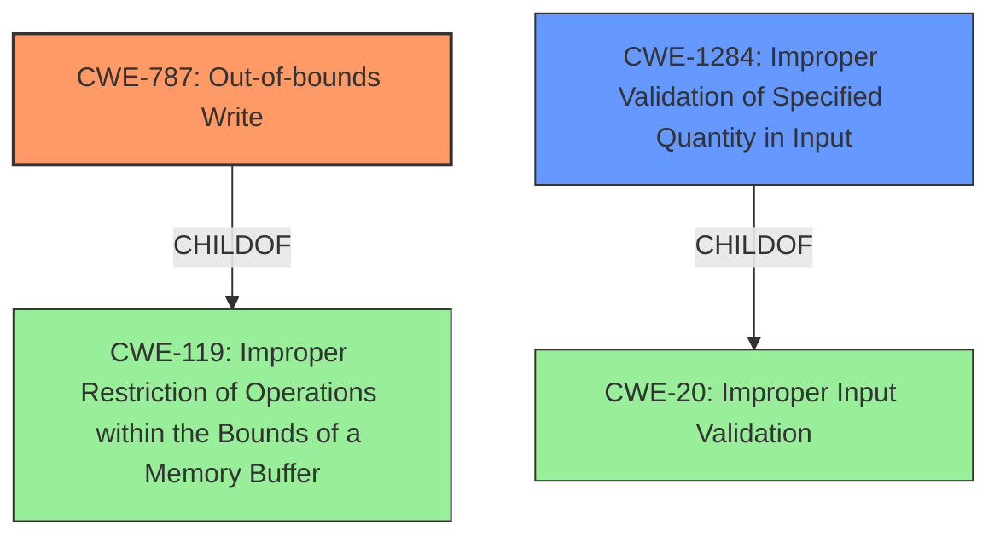

# Final Resolution for CVE-2022-26730

# Summary
| CWE ID | CWE Name | Confidence | CWE Abstraction Level | CWE Vulnerability Mapping Label | CWE-Vulnerability Mapping Notes |
|---|---|---|---|---|---|
| CWE-787 | Out-of-bounds Write | 0.85 | Base | Allowed | Primary CWE |
| CWE-1284 | Improper Validation of Specified Quantity in Input | 0.70 | Base | Allowed | Secondary Candidate |

## Evidence and Confidence

*   **Confidence Score:** 0.80
*   **Evidence Strength:** HIGH

## Relationship Analysis
The primary weakness is **CWE-787 (Out-of-bounds Write)**, which is a child of **CWE-119 (Improper Restriction of Operations within the Bounds of a Memory Buffer)**. The secondary weakness is **CWE-1284 (Improper Validation of Specified Quantity in Input)**, which is a child of **CWE-20 (Improper Input Validation)**. The analysis considered replacing **CWE-20 (Improper Input Validation)** with a more specific child CWE, and selected **CWE-1284 (Improper Validation of Specified Quantity in Input)** as a better fit. This shows the importance of specificity in CWE selection.

## Vulnerability Chain
The vulnerability chain starts with the lack of proper input validation, specifically related to the size or length of data within the ICC profile (**CWE-1284 (Improper Validation of Specified Quantity in Input)**). This leads to a **memory corruption** issue where data is written past the end of the intended buffer (**CWE-787 (Out-of-bounds Write)**), ultimately resulting in arbitrary code execution.

## Summary of Analysis
The initial analysis correctly identified **CWE-787 (Out-of-bounds Write)** as the primary weakness. However, the inclusion of **CWE-20 (Improper Input Validation)** as a secondary candidate was less optimal due to its high level of abstraction. The criticism highlighted the discouraged usage of **CWE-20 (Improper Input Validation)** and suggested exploring more specific child CWEs.

Based on the vulnerability description, which mentions "processing of ICC profiles" and a fix involving "improved input validation", **CWE-1284 (Improper Validation of Specified Quantity in Input)** was selected as a more appropriate secondary CWE. This is because ICC profiles often contain size/length fields, and the vulnerability arises from not properly validating these quantities, which is in line with **CWE-1284 (Improper Validation of Specified Quantity in Input)**.

The final decision is based on the provided evidence and the CWE relationship analysis. The selection of **CWE-787 (Out-of-bounds Write)** and **CWE-1284 (Improper Validation of Specified Quantity in Input)** represents the optimal level of specificity, providing a more accurate and actionable classification of the vulnerability. Specifically, the vulnerability description states "**A memory corruption issue existed in the processing of ICC profiles. This issue was addressed with improved input validation.**" This highlights both the **memory corruption** and the connection to input validation.