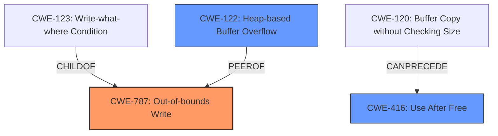

# Final Resolution for CVE-2022-26762

# Summary
| CWE ID | CWE Name | Confidence | CWE Abstraction Level | CWE Vulnerability Mapping Label | CWE-Vulnerability Mapping Notes |
|---|---|---|---|---|---|
| CWE-787 | Out-of-bounds Write | 0.8 | Base | Allowed | Primary CWE. The vulnerability involves **memory corruption** which can lead to writing data outside the intended buffer. |
| CWE-416 | Use After Free | 0.4 | Variant | Allowed | Secondary candidate. The vulnerability involves **memory corruption** which may cause the program to access a memory location that has been freed. |
| CWE-122 | Heap-based Buffer Overflow | 0.5 | Variant | Allowed | Secondary candidate. This is a more specific type of out-of-bounds write if the buffer is heap allocated. |

## Evidence and Confidence

*   **Confidence Score:** 0.75
*   **Evidence Strength:** MEDIUM

## Relationship Analysis
The primary CWE is CWE-787 (**Out-of-bounds Write**), which is a base level CWE. CWE-787 has child relationships with CWE-123 (**Write-what-where Condition**).

CWE-416 (**Use After Free**) is a variant and is a peer of CWE-415 (**Double Free**). It can follow CWE-120 (**Buffer Copy without Checking Size**).

CWE-122 (**Heap-based Buffer Overflow**) is a variant of buffer overflow, specifying that the overflow occurs in the heap.

The abstraction levels are appropriate; selecting base and variant CWEs offers suitable specificity.

## Vulnerability Chain
The vulnerability chain starts with **memory corruption** due to improper memory handling. This leads to an **out-of-bounds write** (CWE-787), potentially overwriting critical data and allowing arbitrary code execution. A possible alternative is a **heap-based buffer overflow** (CWE-122) if the affected memory region is heap-allocated. Another possibility is a **use-after-free** (CWE-416) if memory is freed and then accessed again. The final impact is arbitrary code execution with system privileges.

## Summary of Analysis
The initial analysis correctly identified CWE-787 as a primary candidate. However, the confidence in CWE-416 and CWE-843 was not well-justified.

The vulnerability description states: "A memory corruption issue was addressed with improved memory handling. A malicious application may be able to execute arbitrary code with system privileges." This points to a **memory corruption** issue leading to code execution, strongly suggesting an **out-of-bounds write** (CWE-787).

The criticism is valid in pointing out that "memory corruption *can* lead to..." is not strong enough justification. The analysis needs to explain *how* the **memory corruption** occurs. Considering the retriever results, CWE-122 (**Heap-based Buffer Overflow**) is a strong candidate if the **memory corruption** involves heap-allocated memory.

The selection of CWE-787 is justified because it directly addresses the **out-of-bounds write** aspect of the **memory corruption**. The confidence level is increased to 0.8 due to the direct connection between **memory corruption**, **out-of-bounds write**, and arbitrary code execution.

CWE-416 is retained as a secondary candidate, but the confidence is lowered to 0.4 because there is no direct evidence of a use-after-free condition. It remains a possibility, but it is less likely than CWE-787.

CWE-122 is included as a secondary candidate with a confidence of 0.5 because it is a more specific case of CWE-787. If the **memory corruption** involves a heap-allocated buffer, then CWE-122 is a better fit.

The selected CWEs are at the optimal level of specificity because they are base and variant level CWEs. This provides a balance between accuracy and detail.