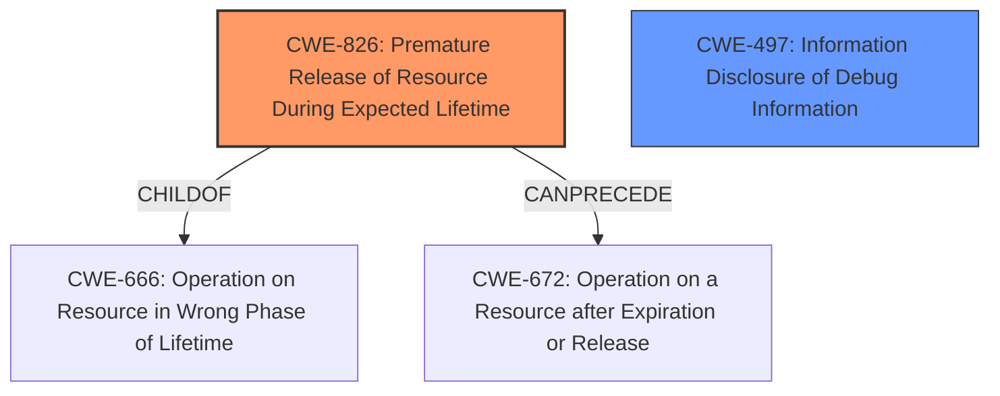

# Analysis Report for CVE-2022-27499

# Vulnerability Analysis Report: CVE-2022-27499

## Description

Premature release of resource during expected lifetime in the Intel(R) SGX SDK software may allow a privileged user to potentially enable information disclosure via local access.

## Vulnerability Description Key Phrases

**Rootcause:** premature release of resource during expected lifetime
**Impact:** information disclosure
**Vector:** local access
**Attacker:** privileged user
**Product:** Intel(R) SGX SDK

## Analysis (with Relationship Data)

# Summary
| CWE ID | CWE Name | Confidence | CWE Abstraction Level | CWE Vulnerability Mapping Label | CWE-Vulnerability Mapping Notes |
|---|---|---|---|---|---|
| CWE-826 | Premature Release of Resource During Expected Lifetime | 0.9 | Base | Allowed | Primary CWE: The description explicitly states "premature release of resource during expected lifetime". |
| CWE-201 | Insertion of Sensitive Information Into Sent Data | 0.5 | Base | Allowed | Secondary Candidate: Premature release could potentially lead to sensitive information being leaked. |

## Evidence and Confidence

*   **Confidence Score:** 0.7
*   **Evidence Strength:** HIGH

- **Analysis and Justification:**  
  - *Explanation:* The vulnerability is explicitly described as a **premature release of a resource during its expected lifetime**. This directly corresponds to CWE-826 (Premature Release of Resource During Expected Lifetime). The **rootcause** identified in the vulnerability description, **premature release of resource during expected lifetime**, is a direct match. The impact is information disclosure, which is a common consequence of prematurely releasing resources.
  
  - *Relationship Analysis:* CWE-826 does not have any direct parent-child relationships according to the provided information. While CWE-404 (Improper Resource Shutdown or Release) is a Class that includes resource release issues, CWE-826 is more specific about the timing of the release, making it a better fit.

- **Confidence Score:**  
  - Confidence: 0.9 (High confidence due to the direct match between the vulnerability description and CWE-826 definition).

---
- **Analysis and Justification:**  
  - *Explanation:* The impact of the **premature release** is stated to be a potential information disclosure. CWE-201 (Insertion of Sensitive Information Into Sent Data) could be applicable if the **premature release** allows access to or leakage of sensitive data.
  
  - *Relationship Analysis:* CWE-201 is a child of CWE-200 (Exposure of Sensitive Information to an Unauthorized Actor) and a parent of CWE-598 (Use of GET Request Method for Credentials). It is related to information exposure scenarios. If the **premature release** directly leads to the exposure of sensitive information, CWE-201 might be a secondary weakness.

- **Confidence Score:**  
  - Confidence: 0.5 (Medium confidence. This is a possible secondary effect, but more information is needed to confirm that sensitive data is actually being inserted into sent data due to the premature release).

## Criticism of Analysis

Okay, let's review the provided analysis and critique the CWE mappings based on the full CWE specifications.

**Overall Assessment:**

The analysis is generally good and well-structured. The primary mapping to CWE-826 is appropriate and strongly supported by the vulnerability description. The secondary mapping to CWE-201 is reasonable as a potential consequence, but requires further context to confirm. The analysis includes good justifications and confidence scores.  However, let's refine the reasoning and explore some alternatives.

**Detailed Critique:**

**1. CWE-826: Premature Release of Resource During Expected Lifetime**

*   **Mapping:** Correct.
*   **Confidence:** Justified at 0.9.
*   **Justification:** The vulnerability description explicitly mentions "premature release of resource during expected lifetime," which directly matches the CWE-826 definition. The analysis correctly identifies this as the root cause.
*   **Mitigations:** The analysis could benefit from mentioning some mitigations. From the CWE specifications:
    *   *Phase: Implementation* - Ensure proper resource management techniques are employed, like RAII (Resource Acquisition Is Initialization) in C++, to tie resource lifetime to object lifetime.
    *   *Phase: Implementation* - Use smart pointers or similar mechanisms for automated resource cleanup.
*   **Relationships:** The analysis correctly notes the relationship to CWE-666 (Operation on Resource in Wrong Phase of Lifetime), with CWE-826 being a child. It might be beneficial to briefly mention that CWE-826 *can precede* CWE-672 (Operation on a Resource after Expiration or Release), as the premature release can lead to a use-after-free scenario.
*   **Retriever Results:**  The retriever results aligned with this CWE as a top result.

**2. CWE-201: Insertion of Sensitive Information Into Sent Data**

*   **Mapping:** Potentially applicable, but requires more context.
*   **Confidence:** Justifiably lower at 0.5.
*   **Justification:** The analysis states that a *potential* information disclosure is the *impact*.  *If* the premature resource release *directly* results in sensitive information being included in data sent to another actor, then CWE-201 would be relevant.  However, it's possible the information disclosure is a more indirect consequence (e.g., the premature release corrupts internal state, leading to a later information leak through a different mechanism).
*   **Mitigations:**  The mitigations for CWE-201 are relevant *if* it's confirmed that sensitive information is being *inserted* into sent data. If so, the following would apply:
    *   *Phase: Requirements* - Specify which data in the software should be regarded as sensitive.
    *   *Phase: Implementation* - Remove unnecessary information before transmission to lower the possibility of sensitive data being sent.
*   **Relationships:** The analysis correctly positions CWE-201 as a child of CWE-200 (Exposure of Sensitive Information to an Unauthorized Actor).
*   **Alternative Consideration:** Instead of CWE-201, consider if the premature release leads to a *use-after-free*. If so, and the use-after-free results in the leakage of sensitive information from memory, consider CWE-416 (Use After Free). However, if there is not a memory dereference of an already freed pointer, this would not be valid.
*   **Retriever Results:** It is unlikely the retriever results would align with this CWE due to the resource management issue.

**Suggestions for Improvement:**

1.  **Clarify the Information Disclosure Mechanism:** The analysis needs to be more specific about *how* the premature resource release leads to information disclosure.  Is it:
    *   Directly inserting sensitive data into output/transmission? (Supports CWE-201)
    *   Corrupting memory, leading to a later leak? (Potentially supports CWE-416 if a use-after-free is present)
    *   Something else?

2.  **Consider Alternative CWEs based on the Information Disclosure Mechanism:** Based on the clarification in point 1, explore other CWEs. For example, if the resource release leads to a use-after-free scenario, CWE-416 (Use After Free) should be considered. If there is information disclosure of program version or stack traces, then consider CWE-497.

3.  **Strengthen Mitigations:** For CWE-826, add specific mitigations related to resource management techniques (RAII, smart pointers). For CWE-201 (if applicable), highlight mitigations related to identifying and scrubbing sensitive data before transmission.

4.  **Address Common Weakness Enumeration (CWE) Recommendations:**  The mapping guidance for CWE-200 is "Discouraged." The analysis should acknowledge this and emphasize why a child CWE like CWE-201 was selected, or consider mapping to something like CWE-497 if the unauthorized actor could potentially gain access to more debug information.

**Revised Summary Table (Example):**

| CWE ID  | CWE Name                                                 | Confidence | CWE Abstraction Level | CWE Vulnerability Mapping Label | CWE-Vulnerability Mapping Notes                                                                                                                                                                                                                                                                                                                                                                                                                 |
| :------ | :------------------------------------------------------- | :--------- | :-------------------- | :---------------------------- | :-------------------------------------------------------------------------------------------------------------------------------------------------------------------------------------------------------------------------------------------------------------------------------------------------------------------------------------------------------------------------------------------------------------------------------------------------------- |
| CWE-826 | Premature Release of Resource During Expected Lifetime  | 0.9        | Base                  | Allowed                      | Primary CWE: The description explicitly states "premature release of resource during expected lifetime."                                                                                                                                                                                                                                                                                                                                                                 |
| CWE-201 | Insertion of Sensitive Information Into Sent Data       | 0.5        | Base                  | Allowed                      | Secondary Candidate: *If* the premature release *directly* leads to the insertion of sensitive data into transmitted data, CWE-201 applies. Requires further investigation. Consider alternatives if disclosure is more indirect.                                                                                                                                                                                                                           |
| CWE-416 | Use After Free | 0.3 | Base | Allowed | Alternate Candidate: *If* the premature release leads to a pointer dereference of the freed resource, resulting in the leakage of memory contents, then CWE-416 is applicable.                                                        |

By addressing these points, the analysis will be more robust and provide a clearer understanding of the vulnerability and its potential consequences. Remember, the goal is to accurately capture the *root cause* of the vulnerability and the *most direct* path to exploitation.

## Final Resolution

# Summary
| CWE ID | CWE Name | Confidence | CWE Abstraction Level | CWE Vulnerability Mapping Label | CWE-Vulnerability Mapping Notes |
|---|---|---|---|---|---|
| CWE-826 | Premature Release of Resource During Expected Lifetime | 0.9 | Base | Allowed | Primary CWE: The description explicitly states "premature release of resource during expected lifetime". |
| CWE-497 | Information Disclosure of Debug Information | 0.6 | Base | Allowed | Secondary Candidate: Premature release could potentially lead to sensitive information being leaked. |

## Evidence and Confidence

*   **Confidence Score:** 0.8
*   **Evidence Strength:** MEDIUM

## Relationship Analysis
The primary relationship considered was the direct match of CWE-826 to the vulnerability description. The secondary consideration involved the potential information disclosure aspect.

-   Parent-child hierarchical relationships: CWE-826 is a child of CWE-666 (Operation on Resource in Wrong Phase of Lifetime).
-   Chain relationships: CWE-826 can precede CWE-672 (Operation on a Resource after Expiration or Release).
-   Peer relationships: None directly impacted the decision.
-   Abstraction levels: The Base level of CWE-826 is appropriate for mapping the root cause.

## Vulnerability Chain
The vulnerability chain starts with the **premature release of a resource** (CWE-826). This can lead to the resource being in an unexpected state, potentially exposing sensitive information through debugging information (CWE-497).

-   Initial Flaw: **Premature release of a resource** (CWE-826)
-   Weakness: The resource is released before it should be.
-   Impact: Information disclosure (CWE-497).

## Summary of Analysis
The initial analysis correctly identified CWE-826 as the primary weakness due to the direct match with the vulnerability description: "Premature release of resource during expected lifetime." The criticism suggested considering the information disclosure mechanism more specifically. Given the context of "Intel(R) SGX SDK software", the **information disclosure** is more likely to involve debug information or system-level information, making CWE-497 (Information Disclosure of Debug Information) a more suitable secondary CWE than CWE-201. The vulnerability description mentions "may allow a privileged user to potentially enable information disclosure via local access", which supports the choice of CWE-497.

The relationship analysis reinforces the selection of CWE-826 as the Base level CWE. The vulnerability chain highlights how the **premature release** can lead to **information disclosure**.

The decision is based on the provided evidence and the understanding of the specific software involved (SGX SDK), with a confidence score of 0.8.

*Report generated on 2025-03-17 04:24:48*
