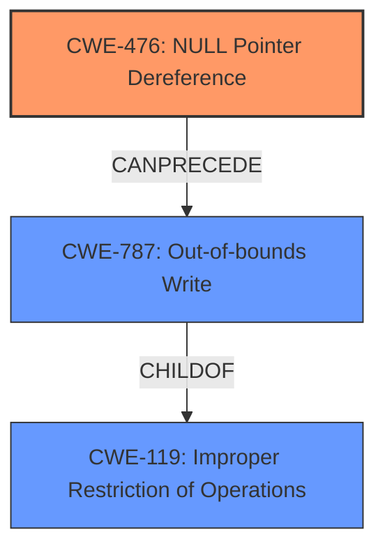

# Final Resolution for CVE-2022-27567

# Summary
| CWE ID | CWE Name | Confidence | CWE Abstraction Level | CWE Vulnerability Mapping Label | CWE-Vulnerability Mapping Notes |
|---|---|---|---|---|---|
| CWE-476 | NULL Pointer Dereference | 0.95 | Base | Primary | Root cause: explicit mention in description. |
| CWE-787 | Out-of-bounds Write | 0.75 | Base | Secondary | Consequence of CWE-476: dereferencing the null pointer results in a write to an unexpected memory location. |

## Evidence and Confidence

*   **Confidence Score:** 0.85
*   **Evidence Strength:** HIGH

## Relationship Analysis
The primary relationship is that **CWE-476 (NULL Pointer Dereference)** leads to **CWE-787 (Out-of-bounds Write)**. **CWE-476** is the root cause due to the explicit mention in the vulnerability description, while **CWE-787** is a consequence of the dereference occurring on a NULL pointer. While **CWE-787** has a parent-child relationship to **CWE-119 (Improper Restriction of Operations within the Bounds of a Memory Buffer)**, **CWE-787** is selected for its higher specificity to an out-of-bounds write. The abstraction levels of both selected CWEs are Base, making them appropriate for mapping.

## Vulnerability Chain
The vulnerability chain starts with a NULL pointer being dereferenced **(CWE-476)**. This leads to a write operation at an invalid memory location, resulting in an out-of-bounds write **(CWE-787)**. The root cause is **CWE-476**, while **CWE-787** is the impact of the dereference. There are no missing links in the chain as described.

## Summary of Analysis
The initial analysis and criticism are both accurate and well-supported. The primary mapping to **CWE-476 (NULL Pointer Dereference)** is strongly justified by the explicit mention of "null pointer dereference" in the vulnerability description. The secondary mapping to **CWE-787 (Out-of-bounds Write)** is also appropriate, as the description mentions "out of bounds write" as a consequence.

The graph relationships confirm that **CWE-476** can lead to **CWE-787**, and that **CWE-787** is a more specific instance of **CWE-119**. The abstraction levels (Base) are appropriate for the identified weaknesses.

The selected CWEs are at the optimal level of specificity, as **CWE-476** directly reflects the root cause and **CWE-787** accurately describes the resulting out-of-bounds write.

The vulnerability description explicitly states a "**Null pointer dereference**" as the root cause in the `parser_hvcC` function. This aligns directly with **CWE-476 (NULL Pointer Dereference)**, which describes a scenario where a product dereferences a pointer that it expects to be valid but is NULL. The CVE Reference Links Content Summary reinforces this by stating: "The vulnerability is a null pointer dereference within the `parser_hvcC` function of the `libsimba` library." This provides high confidence in the mapping to **CWE-476**.

The vulnerability description also mentions "**out of bounds write**" as a weakness resulting from the null pointer dereference. This corresponds to **CWE-787 (Out-of-bounds Write)**, where the product writes data past the end or before the beginning of the intended buffer. The CVE Reference Links Content Summary also supports this: "A successful exploit could lead to out-of-bounds writes by remote attackers."