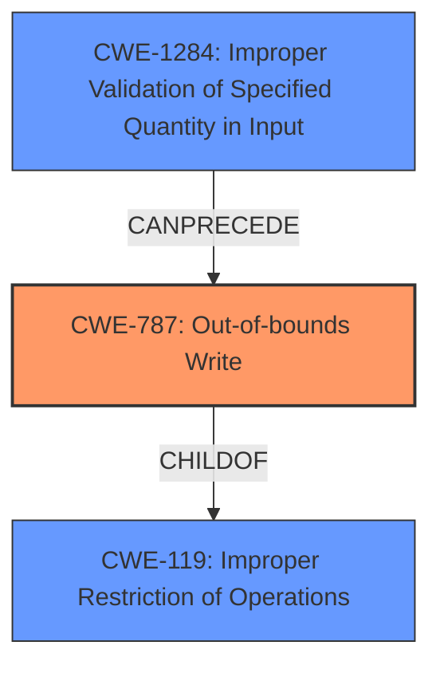

# Final Resolution for CVE-2022-27624

# Summary
| CWE ID | CWE Name | Confidence | CWE Abstraction Level | CWE Vulnerability Mapping Label | CWE-Vulnerability Mapping Notes |
|---|---|---|---|---|---|
| CWE-787 | Out-of-bounds Write | 0.85 | Base | Allowed | Primary CWE |
| CWE-1284 | Improper Validation of Specified Quantity in Input | 0.5 | Base | Allowed | Secondary Candidate: Root cause that may result in insufficient size of buffer. |
| CWE-119 | Improper Restriction of Operations within the Bounds of a Memory Buffer | 0.6 | Class | Discouraged | Secondary Candidate |

## Evidence and Confidence

*   **Confidence Score:** 0.8
*   **Evidence Strength:** MEDIUM

## Relationship Analysis
The primary CWE is CWE-787 (**Out-of-bounds Write**), which is a child of CWE-119 (**Improper Restriction of Operations within the Bounds of a Memory Buffer**). This indicates that CWE-787 is a more specific type of buffer handling issue than CWE-119, which is a more general class. CWE-1284 (**Improper Validation of Specified Quantity in Input**) is added as a secondary candidate because the **out-of-bounds write** often results from a failure to properly validate the size or format of input before writing it to the buffer. The retriever results also support the inclusion of this CWE.

## Vulnerability Chain
The vulnerability chain starts with CWE-1284 (**Improper Validation of Specified Quantity in Input**), where the input data's size or format isn't adequately validated. This leads to CWE-787 (**Out-of-bounds Write**), where data is written past the intended buffer's boundaries. CWE-119 (**Improper Restriction of Operations within the Bounds of a Memory Buffer**) is the broader class that encompasses these issues.

## Summary of Analysis
The initial analysis correctly identified CWE-787 as the primary weakness. The criticism provided valuable suggestions, particularly the connection to input validation. The vulnerability description states that there is "improper restriction of operations within the bounds of a memory buffer," leading to arbitrary command execution, with "out-of-bounds write/memory corruption" being present.

Based on the retriever results and the criticism, CWE-1284 (**Improper Validation of Specified Quantity in Input**) has been added as a secondary candidate since input validation often precedes **out-of-bounds writes**. The relationships between these CWEs (CWE-1284 CanPrecede CWE-787) support this assessment. The selected CWEs are at the optimal level of specificity, with CWE-787 being a base-level CWE and CWE-1284 providing more context to the root cause. The mapping guidance for CWE-787 and CWE-1284 both indicate that they are allowed.