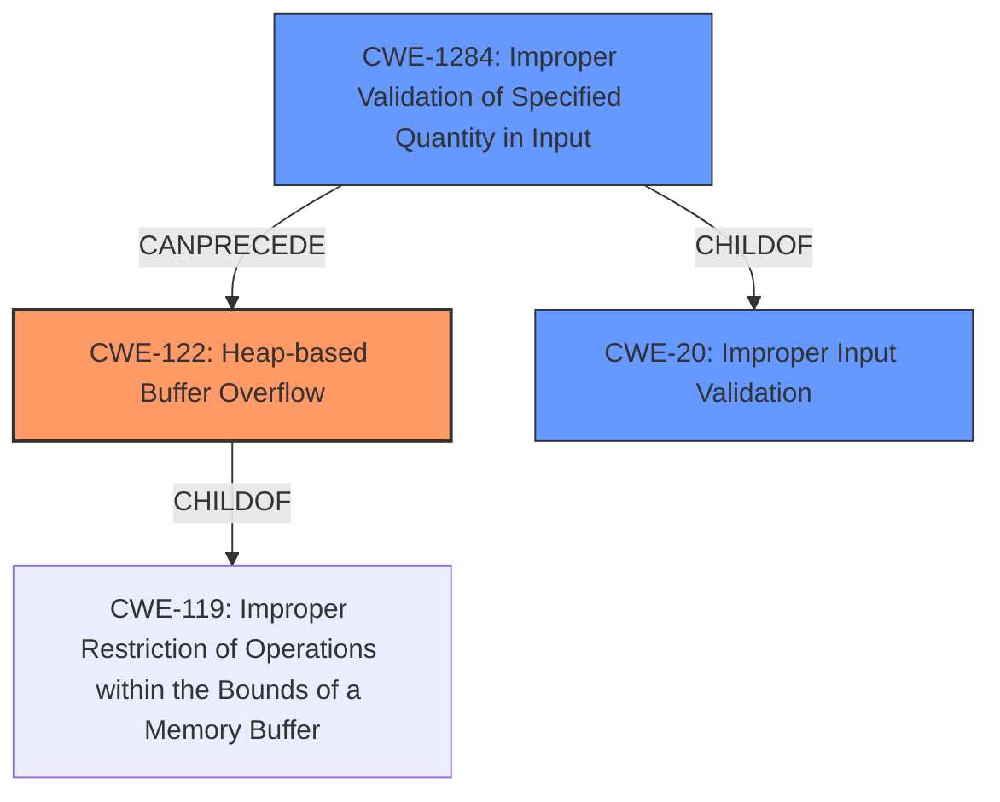

# Analysis Report for CVE-2022-28196

# Vulnerability Analysis Report: CVE-2022-28196

## Description

NVIDIA Jetson Linux Driver Package contains a vulnerability in the Cboot blob_decompress function, where insufficient validation of untrusted data may allow a local attacker with elevated privileges to cause a memory buffer overflow, which may lead to code execution, limited loss of Integrity, and limited denial of service. The scope of impact can extend to other components.

## Vulnerability Description Key Phrases

**Rootcause:** insufficient validation of untrusted data
**Weakness:** memory buffer overflow
**Impact:** ['code execution', 'limited loss of Integrity', 'limited denial of service']
**Attacker:** local attacker with elevated privileges
**Product:** NVIDIA Jetson Linux Driver Package
**Component:** Cboot blob_decompress function

## Analysis (with Relationship Data)

# Summary
| CWE ID | CWE Name | Confidence | CWE Abstraction Level | CWE Vulnerability Mapping Label | CWE-Vulnerability Mapping Notes |
|---|---|---|---|---|---|
| CWE-122 | Heap-based Buffer Overflow | 0.85 | Variant | Allowed | Primary CWE |
| CWE-20 | Improper Input Validation | 0.60 | Class | Discouraged | Secondary Candidate |
| CWE-1284 | Improper Validation of Specified Quantity in Input | 0.50 | Base | Allowed | Secondary Candidate |

## Evidence and Confidence

*   **Confidence Score:** 0.80
*   **Evidence Strength:** MEDIUM

- **Analysis and Justification:**  
  - *Explanation:* The vulnerability description clearly states that there is a **memory buffer overflow** due to **insufficient validation of untrusted data** within the `blob_decompress` function of the Cboot module in the NVIDIA Jetson Linux Driver Package. Given that the overflow occurs in the Cboot module, it is likely that the buffer is allocated on the heap, making CWE-122 (Heap-based Buffer Overflow) the most specific and appropriate primary mapping. CWE-122 is a Variant of CWE-119 (Improper Restriction of Operations within the Bounds of a Memory Buffer), which is a more general case. The description notes local access with elevated privileges is required for exploitation. The MITRE mapping guidance for CWE-122 indicates it is ALLOWED and at the Variant level of abstraction, which is a preferred level. CWE-20 (Improper Input Validation) could be a contributing factor, given that the untrusted data is not sufficiently validated.

  - *Relationship Analysis:* CWE-122 is a variant of CWE-119 (Improper Restriction of Operations within the Bounds of a Memory Buffer). CWE-20 (Improper Input Validation) is related as the **insufficient validation** leads to the overflow.

- **Confidence Score:**  
  - *Example:* Confidence: 0.85 (High evidence due to the explicit mention of a **memory buffer overflow** and **insufficient validation**.)

---
- **Analysis and Justification:**
    - *Explanation:* CWE-20 (Improper Input Validation) is considered as a secondary candidate because the vulnerability stems from "**insufficient validation of untrusted data**". This aligns with CWE-20's description, which focuses on the product receiving input but not validating that the input has the required properties to process the data safely and correctly. However, CWE-20 is a broad, high-level Class-level CWE, and more specific CWEs like CWE-122 and CWE-1284 are more directly applicable. CWE-20 is DISCOURAGED when more specific information is available.
    - *Relationship Analysis:* CWE-20 is a class-level CWE that can be a parent to many other CWEs related to input validation issues. It's a general weakness that can lead to more specific vulnerabilities.
- **Confidence Score:**
    - *Example:* Confidence: 0.60 (Medium confidence because while input validation is involved, the primary issue is the buffer overflow.)

---
- **Analysis and Justification:**
    - *Explanation:* CWE-1284 (Improper Validation of Specified Quantity in Input) is a potential secondary candidate because the vulnerability involves "**insufficient validation of untrusted data**" which may specify a quantity (such as size or length) related to the buffer. If the size of the data being decompressed is not properly validated, it can lead to a buffer overflow. However, the description does not explicitly mention a quantity.
    - *Relationship Analysis:* CWE-1284 is a Base-level CWE related to input validation, but it is more specific than CWE-20.
- **Confidence Score:**
    - *Example:* Confidence: 0.50 (Low confidence as there's no direct evidence to confirm the involvement of quantity-related input validation.)

## Criticism of Analysis

Okay, I've reviewed the analysis against the full CWE specifications provided. Here's my critique, focusing on the accuracy of the CWE mappings, the confidence levels, and the overall justification.

**Overall Assessment**

The analysis is generally sound and well-reasoned. The primary mapping to CWE-122 (Heap-based Buffer Overflow) is very likely correct, and the secondary mappings to CWE-20 (Improper Input Validation) and CWE-1284 (Improper Validation of Specified Quantity in Input) are reasonable given the information available, though their confidence levels reflect the uncertainty.  The analysis shows a good understanding of the CWE hierarchy and the nuances of input validation-related weaknesses. However, CWE-823 may also be relevant and should be considered as a potential third option.

**Detailed Review of Each CWE Mapping**

*   **CWE-122: Heap-based Buffer Overflow (Primary Mapping)**
    *   **Confidence Level:** 0.85 - appropriate.
    *   **Justification:** The core of the vulnerability is explicitly described as a "memory buffer overflow" in the `blob_decompress` function.  The analysis correctly infers the likely use of heap allocation within Cboot. The requirement for elevated privileges is also consistent with exploitation scenarios for this type of vulnerability.
    *   **Mapping Guidance Check:** The Variant level is ideal. Mapping guidance recommends this level of abstraction and notes to "carefully read both the name and description to ensure that this mapping is an appropriate fit." This has been done. It's a good fit.
    *   **Potential Mitigations:** Mitigations such as using memory-safe languages or employing automatic buffer overflow detection mechanisms are directly relevant to this type of vulnerability.
    *   **Critique:** Good mapping. No significant issues.
    *   **Enhancement Suggestion:** Add a brief note about how Cboot's environment makes heap overflows particularly dangerous due to its role in early boot.

*   **CWE-20: Improper Input Validation (Secondary Candidate)**
    *   **Confidence Level:** 0.60 - appropriate.
    *   **Justification:** The description highlights "**insufficient validation of untrusted data**" as the root cause. This aligns with CWE-20's general description.  However, as the analysis points out, CWE-20 is a very broad category.
    *   **Mapping Guidance Check:** Discouraged for usage. The analysis correctly acknowledges the recommendation to find more specific CWEs. This is appropriate given the context of this analysis.
    *   **Potential Mitigations:** While all the general mitigations for CWE-20 apply, they are too broad to be particularly helpful in this specific case.
    *   **Critique:** A reasonable secondary mapping because the overflow is a *consequence* of inadequate validation. The analysis clearly explains why this is a less precise mapping than CWE-122.
    *    **Enhancement Suggestion:** Elaborate on *what* aspects of the input are not validated. This could strengthen the case for CWE-1284.

*   **CWE-1284: Improper Validation of Specified Quantity in Input (Secondary Candidate)**
    *   **Confidence Level:** 0.50 - appropriate.
    *   **Justification:** This mapping is based on the *possibility* that the untrusted data specifies a quantity, such as the size of the data to be decompressed. If the size is improperly validated, it could lead to a buffer overflow. However, this is not explicitly stated in the vulnerability description.
    *   **Mapping Guidance Check:** The analysis correctly identifies this as a Base level CWE and Allowed for Usage.
    *   **Potential Mitigations:** Mitigations for CWE-1284 such as using an "accept known good" input validation strategy are certainly relevant.
    *   **Critique:** A plausible but not definitive mapping. The confidence level reflects the uncertainty.  It depends on whether the 'untrusted data' directly controls a size or length value related to the buffer.
    *   **Enhancement Suggestion:** Try to determine if the size or length is directly derived from input, if so include evidence.

**Additional CWE Considerations**

* **CWE-823: Use of Out-of-range Pointer Offset**
    *   **Justification:** Given that the vulnerability is a buffer overflow in the `blob_decompress` function, it might be possible that the function uses an offset to access data within the decompressed blob, and this offset is derived from an untrusted source.  If the offset is not properly validated, it could lead to reading or writing outside the bounds of the allocated buffer. Graph retriever gave a high score to this (1.00).
    *   **Mapping Guidance Check:** Allowed Usage, Rationale is correct.
    *   **Potential Mitigations:** Could be relevant by ensuring validated of offset usage and pointer arithmetics.
    *   **Critique:** Should be considered as a potential third option.
    *   **Enhancement Suggestion:** Investigate if pointer arithmetic with untrusted offset is being used, and explain why or why not it is a relevant mapping.

**General Suggestions**

*   **Root Cause Specificity:**  The analysis is good at identifying the immediate weakness (buffer overflow) and a contributing factor (insufficient validation). If more details were available about the exact type of input that's not being validated, the analysis could become even more precise. For example:
    *   Is it the *size* of the compressed data that's unchecked? (CWE-1284)
    *   Is it a *count* of elements to be copied?
    *   Is it a *format string* that allows memory to be read or written to? (Not likely in this case but should be considered).

*   **Clarify Scope of Impact:** The description mentions the scope of impact "can extend to other components." It would be beneficial to elaborate on how this extension might occur. Is it because Cboot is used early in the boot process, or is there a specific mechanism by which the overflow could corrupt data used by other components?

**Revised Summary Table**

| CWE ID | CWE Name | Confidence | CWE Abstraction Level | CWE Vulnerability Mapping Label | CWE-Vulnerability Mapping Notes |
|---|---|---|---|---|---|
| CWE-122 | Heap-based Buffer Overflow | 0.85 | Variant | Allowed | Primary CWE |
| CWE-20 | Improper Input Validation | 0.60 | Class | Discouraged | Secondary Candidate |
| CWE-1284 | Improper Validation of Specified Quantity in Input | 0.50 | Base | Allowed | Secondary Candidate |
| CWE-823 | Use of Out-of-range Pointer Offset | 0.40 | Base | Allowed | Potential Third Option |

By considering these points, you can further refine the analysis and increase confidence in the accuracy of the CWE mappings. The inclusion of CWE-823 in the analysis would also be a valuable addition.

## Final Resolution

# Summary
| CWE ID | CWE Name | Confidence | CWE Abstraction Level | CWE Vulnerability Mapping Label | CWE-Vulnerability Mapping Notes |
|---|---|---|---|---|---|
| CWE-122 | Heap-based Buffer Overflow | 0.85 | Variant | Allowed | Primary CWE |
| CWE-1284 | Improper Validation of Specified Quantity in Input | 0.65 | Base | Allowed | Secondary Candidate |
| CWE-20 | Improper Input Validation | 0.60 | Class | Discouraged | Secondary Candidate |

## Evidence and Confidence

*   **Confidence Score:** 0.80
*   **Evidence Strength:** MEDIUM

## Relationship Analysis
The primary CWE is CWE-122 (**Heap-based Buffer Overflow**), a variant of CWE-119 (**Improper Restriction of Operations within the Bounds of a Memory Buffer**). The secondary CWE, CWE-1284 (**Improper Validation of Specified Quantity in Input**), is a child of CWE-20 (**Improper Input Validation**). The relationship indicates that improper input validation regarding a size or length quantity can lead to a heap-based buffer overflow.

## Vulnerability Chain
The vulnerability chain starts with **insufficient validation of untrusted data** (CWE-20 and more specifically CWE-1284). If the untrusted data specifies a quantity like size, and this quantity is not validated, it leads to allocating a buffer of improper size and subsequently a **heap-based buffer overflow** (CWE-122). This can result in code execution, limited loss of integrity, and limited denial of service.

## Summary of Analysis
The initial analysis correctly identifies CWE-122 (**Heap-based Buffer Overflow**) as the primary weakness, supported by the vulnerability description stating a "**memory buffer overflow**" within the `blob_decompress` function. The criticism suggested considering CWE-823, but there isn't enough evidence to support that. The vulnerability description explicitly mentions "**insufficient validation of untrusted data**," making CWE-20 (**Improper Input Validation**) a reasonable secondary candidate, although it's a broad, Class-level CWE. CWE-1284 (**Improper Validation of Specified Quantity in Input**) is considered, as the input data likely includes a size parameter for decompression.

The decision to include CWE-1284 as a secondary candidate is based on the likelihood that the **untrusted data** includes a size or length value related to the buffer, which, if improperly validated, could lead to the overflow. I'm raising the confidence level on CWE-1284 because if the `blob_decompress` function is decompressing a blob, it almost certainly has a size parameter that must be validated. This is a more specific instance of input validation than CWE-20 and therefore more appropriate.

CWE-20 is still included to highlight the general issue of **improper input validation** that contributes to the vulnerability, but with a slightly lower confidence.

The selected CWEs are at the optimal level of specificity, with CWE-122 representing the specific type of buffer overflow and CWE-1284 capturing the improper validation of a quantity in the input that leads to the overflow.

*Report generated on 2025-03-18 12:22:38*
