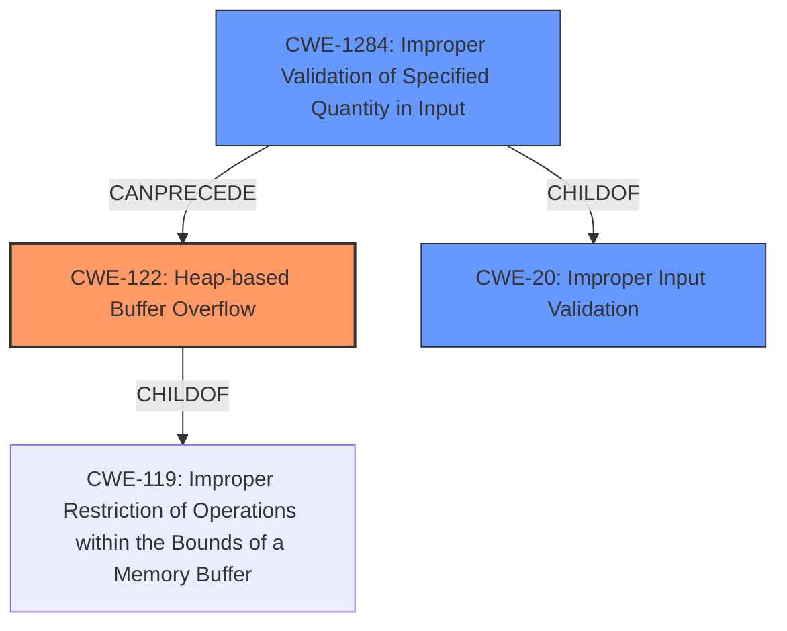

# Final Resolution for CVE-2022-28196

# Summary
| CWE ID | CWE Name | Confidence | CWE Abstraction Level | CWE Vulnerability Mapping Label | CWE-Vulnerability Mapping Notes |
|---|---|---|---|---|---|
| CWE-122 | Heap-based Buffer Overflow | 0.85 | Variant | Allowed | Primary CWE |
| CWE-1284 | Improper Validation of Specified Quantity in Input | 0.65 | Base | Allowed | Secondary Candidate |
| CWE-20 | Improper Input Validation | 0.60 | Class | Discouraged | Secondary Candidate |

## Evidence and Confidence

*   **Confidence Score:** 0.80
*   **Evidence Strength:** MEDIUM

## Relationship Analysis
The primary CWE is CWE-122 (**Heap-based Buffer Overflow**), a variant of CWE-119 (**Improper Restriction of Operations within the Bounds of a Memory Buffer**). The secondary CWE, CWE-1284 (**Improper Validation of Specified Quantity in Input**), is a child of CWE-20 (**Improper Input Validation**). The relationship indicates that improper input validation regarding a size or length quantity can lead to a heap-based buffer overflow.

## Vulnerability Chain
The vulnerability chain starts with **insufficient validation of untrusted data** (CWE-20 and more specifically CWE-1284). If the untrusted data specifies a quantity like size, and this quantity is not validated, it leads to allocating a buffer of improper size and subsequently a **heap-based buffer overflow** (CWE-122). This can result in code execution, limited loss of integrity, and limited denial of service.

## Summary of Analysis
The initial analysis correctly identifies CWE-122 (**Heap-based Buffer Overflow**) as the primary weakness, supported by the vulnerability description stating a "**memory buffer overflow**" within the `blob_decompress` function. The criticism suggested considering CWE-823, but there isn't enough evidence to support that. The vulnerability description explicitly mentions "**insufficient validation of untrusted data**," making CWE-20 (**Improper Input Validation**) a reasonable secondary candidate, although it's a broad, Class-level CWE. CWE-1284 (**Improper Validation of Specified Quantity in Input**) is considered, as the input data likely includes a size parameter for decompression.

The decision to include CWE-1284 as a secondary candidate is based on the likelihood that the **untrusted data** includes a size or length value related to the buffer, which, if improperly validated, could lead to the overflow. I'm raising the confidence level on CWE-1284 because if the `blob_decompress` function is decompressing a blob, it almost certainly has a size parameter that must be validated. This is a more specific instance of input validation than CWE-20 and therefore more appropriate.

CWE-20 is still included to highlight the general issue of **improper input validation** that contributes to the vulnerability, but with a slightly lower confidence.

The selected CWEs are at the optimal level of specificity, with CWE-122 representing the specific type of buffer overflow and CWE-1284 capturing the improper validation of a quantity in the input that leads to the overflow.