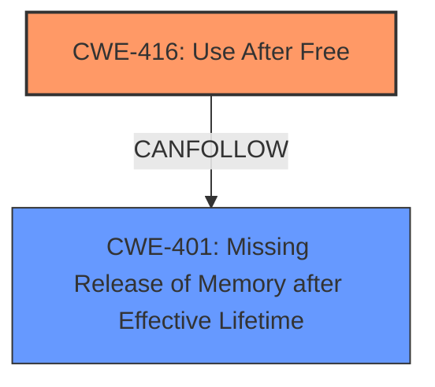

# Analysis Report for CVE-2022-28269

# Vulnerability Analysis Report: CVE-2022-28269

## Description

Acrobat Reader DC versions 22.001.20085 (and earlier), 20.005.3031x (and earlier) and 17.012.30205 (and earlier) are affected by a use-after-free vulnerability in the processing of Annotation objects that could result in a memory leak in the context of the current user. Exploitation of this issue requires user interaction in that a victim must open a malicious file.

## Vulnerability Description Key Phrases

**Rootcause:** use-after-free
**Impact:** memory leak
**Product:** Adobe Acrobat Reader DC
**Version:** ['22.001.20085 (and earlier)', '20.005.3031x (and earlier)', '17.012.30205 (and earlier)']
**Component:** Annotation objects

## Analysis (with Relationship Data)

# Summary
| CWE ID | CWE Name | Confidence | CWE Abstraction Level | CWE Vulnerability Mapping Label | CWE-Vulnerability Mapping Notes |
|---|---|---|---|---|---|
| CWE-416 | Use After Free | 0.95 | Variant | Allowed | Primary CWE.  This is a Use-After-Free (UAF) vulnerability, which occurs when a program attempts to use memory that has already been freed. |
| CWE-401 | Missing Release of Memory after Effective Lifetime | 0.75 | Variant | Allowed | Secondary CWE. Exploitation of the Use-After-Free vulnerability could lead to a memory leak. |

## Evidence and Confidence

*   **Confidence Score:** 0.90
*   **Evidence Strength:** HIGH

- **Analysis and Justification:**  
  - *Explanation:* The vulnerability description explicitly states a **use-after-free** condition in the processing of Annotation objects in Adobe Acrobat Reader DC. The CVE Reference Links Content Summary also confirms the **root cause** as Use-After-Free (UAF), which occurs when a program attempts to use memory that has already been freed. This directly corresponds to CWE-416 (Use After Free), which is a Variant-level CWE and ALLOWED for use according to MITRE mapping guidance. The vulnerability can lead to a memory leak, which aligns with CWE-401 (Missing Release of Memory after Effective Lifetime).
  
  - *Relationship Analysis:* CWE-416 (Use After Free) is a variant. While it doesn't have direct parent-child relationships listed in the provided information, it's a specific type of memory corruption issue. CWE-401 (Missing Release of Memory after Effective Lifetime) can be a consequence of a Use-After-Free vulnerability as the memory may not be properly managed.

- **Confidence Score:**  
  - Confidence: 0.95 (High confidence due to explicit mention of use-after-free in the vulnerability description and CVE summary).

---

## Criticism of Analysis

Okay, here's a breakdown of the analysis and critique, focusing on the CWE specifications you provided:

**Summary of the Provided Analysis:**

The analysis identifies the following CWEs:

*   **CWE-416 (Use After Free):**  Primary CWE.  Justified by the explicit mention of "use-after-free" in the vulnerability description and CVE summary.
*   **CWE-401 (Missing Release of Memory after Effective Lifetime):** Secondary CWE.  Justified as a potential consequence of the UAF (memory leak).

**Critique of the Analysis:**

Overall, the analysis is **good**, but with some potential areas for refinement, particularly concerning alternative CWEs suggested by the retriever results.

**1. CWE-416 (Use After Free):**

*   **Strengths:** This is the correct primary CWE. The vulnerability description directly states the UAF condition. The analysis accurately points to this.
*   **Weaknesses:** None. The rationale and confidence are high.

**2. CWE-401 (Missing Release of Memory after Effective Lifetime):**

*   **Strengths:**  It's reasonable to include this as a *potential* consequence. UAF vulnerabilities *can* lead to memory leaks.
*   **Weaknesses:** While possible, it's not *guaranteed*. A UAF doesn't *always* result in a detectable memory leak. The freed memory might be reused quickly, overwritten, or the leak may be too small to notice easily. It's more of a *possible impact* rather than a direct root cause or a guaranteed secondary effect. Because the vulnerability description explicitly states that this UAF "could result in a memory leak", it is reasonable to include CWE-401.
*   **Recommendation:** Consider lowering the confidence score slightly (e.g., 0.70). It's also good to clearly state in the description that it is a *possible* consequence, not a certainty.

**3. Analysis of Retriever Results and Potential Alternative CWEs:**

Here's an examination of the other CWEs suggested by the retriever, and why they might or might not be applicable, using the full CWE specifications:

*   **CWE-787 (Out-of-bounds Write):** The high retriever score is interesting. While a UAF *can* lead to an out-of-bounds write (if the freed memory is reallocated and then accessed through the dangling pointer), it's not the direct root cause. The core issue is using memory *after* it's been freed, not necessarily writing outside buffer boundaries *in the first instance*. The analysis is correct in prioritizing CWE-416, which more directly reflects the root cause.
    *   **Decision:** Do not include as a primary or secondary CWE unless there's further evidence suggesting an out-of-bounds write occurs as a direct part of the *freeing* process. It is less descriptive and more of a potential consequence.

*   **CWE-367 (Time-of-check Time-of-use (TOCTOU) Race Condition):** This is very unlikely to be relevant unless there is evidence of multi-threaded/multi-process interaction. The provided information doesn't suggest any race condition is involved in *freeing* the Annotation objects. The vulnerability description indicates user interaction, suggesting the issue is more related to the object's lifecycle within a single thread of execution.
    *   **Decision:** Reject. Insufficient evidence.

*   **CWE-356 (Product UI does not Warn User of Unsafe Actions):** This CWE is about the UI's failure to warn the user about the dangers of opening a malicious file. While user interaction is required to trigger the vulnerability, the root cause is not a UI issue. The core problem lies in how the application *processes* the file.
    *   **Decision:** Reject. This is a consequence and not the root cause.

*   **CWE-770 (Allocation of Resources Without Limits or Throttling):** This CWE describes a scenario where resources are allocated without limits, potentially leading to resource exhaustion. It's not directly related to the core vulnerability of a UAF. While it might contribute to a DoS, the primary issue is the UAF during Annotation object processing, not unlimited resource allocation.
    *   **Decision:** Reject. It's a stretch.

*   **CWE-457 (Use of Uninitialized Variable):** This CWE is about using a variable before it's initialized. There's no evidence in the provided information to suggest this is related to the UAF.
    *   **Decision:** Reject. Unrelated.

*   **CWE-122 (Heap-based Buffer Overflow):** Similar to CWE-787, while *possible* as a later consequence, the root cause is the UAF. Including this CWE might be appropriate if there were a known mechanism in which the use after free *directly* resulted in a heap overflow.
     *   **Decision:** Do not include as a primary or secondary CWE unless there's further evidence suggesting a heap overflow occurs as a *direct* part of the free'ing process. It is less descriptive and more of a potential consequence.

*   **CWE-121 (Stack-based Buffer Overflow):** Same reasoning as CWE-122 (Heap-based Buffer Overflow).
      *   **Decision:** Do not include as a primary or secondary CWE unless there's further evidence suggesting a stack overflow occurs as a *direct* part of the free'ing process. It is less descriptive and more of a potential consequence.

*   **CWE-788 (Access of Memory Location After End of Buffer):** Similar to CWE-787, this is a potential consequence rather than a root cause in this particular case. Focus should be on the core UAF.
    *   **Decision:** Reject

**4.  Mitigation Strategies (from CWE Specifications):**

*   **CWE-416 Mitigations:** The analysis *could* briefly mention some relevant mitigations from the CWE-416 specification in the report.
    *   **Language Selection:** Using languages with automatic memory management (Java, C#, etc.) can prevent UAF vulnerabilities.
    *   **Setting pointers to NULL after freeing:** While helpful, it doesn't eliminate all UAF risks, especially in multi-threaded environments or complex data structures.

*   **CWE-401 Mitigations:**
    *   **Automatic memory management:** Again, using languages with garbage collection helps.
    *   **Smart pointers (C++):** These can help manage memory more safely.
    *   **Static analysis tools (Valgrind, etc.):**  Can help detect memory leaks during development.

**Revised Summary Table (Based on Critique):**

| CWE ID | CWE Name | Confidence | CWE Abstraction Level | CWE Vulnerability Mapping Label | CWE-Vulnerability Mapping Notes |
|---|---|---|---|---|---|
| CWE-416 | Use After Free | 0.95 | Variant | Allowed | Primary CWE. This is a Use-After-Free (UAF) vulnerability, which occurs when a program attempts to use memory that has already been freed. |
| CWE-401 | Missing Release of Memory after Effective Lifetime | 0.70 | Variant | Allowed | Secondary CWE. Exploitation of the Use-After-Free vulnerability *could* lead to a memory leak. |

**Revised Evidence and Confidence:**

*   **Confidence Score:** 0.90
*   **Evidence Strength:** HIGH

- **Analysis and Justification:**
  - *Explanation:* The vulnerability description explicitly states a **use-after-free** condition in the processing of Annotation objects in Adobe Acrobat Reader DC. The CVE Reference Links Content Summary also confirms the **root cause** as Use-After-Free (UAF), which occurs when a program attempts to use memory that has already been freed. This directly corresponds to CWE-416 (Use After Free), which is a Variant-level CWE and ALLOWED for use according to MITRE mapping guidance. The vulnerability *can* lead to a memory leak, which aligns with CWE-401 (Missing Release of Memory after Effective Lifetime). However, a memory leak is not guaranteed.

**Key Improvements:**

*   Lowered confidence for CWE-401.
*   Clarified that CWE-401 is a *potential* consequence.
*   Explicitly justified the rejection of the other suggested CWEs based on the CWE specifications and the provided vulnerability information.

This detailed critique should help refine the analysis and make it more accurate and informative. Remember to always prioritize the most direct and accurate representation of the root cause of the vulnerability.

## Final Resolution

# Summary
| CWE ID | CWE Name | Confidence | CWE Abstraction Level | CWE Vulnerability Mapping Label | CWE-Vulnerability Mapping Notes |
|---|---|---|---|---|---|
| CWE-416 | Use After Free | 0.95 | Variant | Allowed | Primary CWE. This is a Use-After-Free (UAF) vulnerability, which occurs when a program attempts to use memory that has already been freed. |
| CWE-401 | Missing Release of Memory after Effective Lifetime | 0.70 | Variant | Allowed | Secondary CWE. Exploitation of the Use-After-Free vulnerability *could* lead to a memory leak. |

## Evidence and Confidence

*   **Confidence Score:** 0.90
*   **Evidence Strength:** HIGH

## Relationship Analysis
The primary relationship influencing the decision is the potential chain relationship where **CWE-416 (Use After Free)** can lead to **CWE-401 (Missing Release of Memory after Effective Lifetime)**. While a UAF doesn't always result in a memory leak, the vulnerability description explicitly states that the UAF "could result in a memory leak," making CWE-401 a relevant secondary consideration. The abstraction levels (both are Variants) are appropriate for the specificity of the description. We considered other related CWEs like **CWE-787 (Out-of-bounds Write)**, **CWE-122 (Heap-based Buffer Overflow)** and **CWE-121 (Stack-based Buffer Overflow)** but they are consequences of the **CWE-416 (Use After Free)** and not the root cause in this case.

## Vulnerability Chain
The vulnerability chain starts with **CWE-416 (Use After Free)**, where the application attempts to use memory that has already been freed. This occurs during the processing of Annotation objects. The use of freed memory *can* lead to **CWE-401 (Missing Release of Memory after Effective Lifetime)**, potentially resulting in a memory leak in the context of the current user. The initial flaw is the failure to properly manage the lifecycle of the Annotation objects, resulting in a dangling pointer. The consequence is the potential exposure of sensitive information or denial of service due to memory exhaustion.

## Summary of Analysis
The analysis is based on the explicit mention of "use-after-free" in the vulnerability description: "Acrobat Reader DC versions 22.001.20085 (and earlier), 20.005.3031x (and earlier) and 17.012.30205 (and earlier) are affected by a use-after-free vulnerability in the processing of Annotation objects that could result in a memory leak...". This provides strong evidence for classifying the vulnerability as **CWE-416 (Use After Free)**. The graph relationships helped to identify potential secondary CWEs, with **CWE-401 (Missing Release of Memory after Effective Lifetime)** being selected due to the vulnerability description stating that the UAF "could result in a memory leak". Other CWEs, while potentially related as consequences, were deemed less directly relevant as root causes. The selected CWEs are at the optimal level of specificity, with CWE-416 being a Variant that directly matches the vulnerability description. The confidence score is high (0.90) due to the clear evidence and the explicit mention of the vulnerability type.

*Report generated on 2025-03-18 12:23:18*
