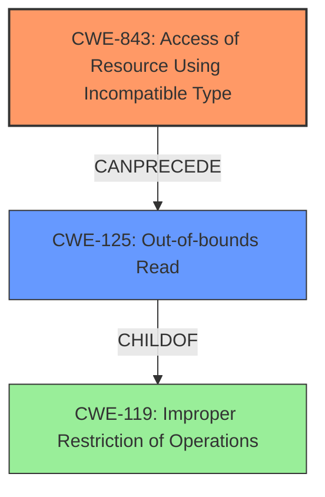

# Final Resolution for CVE-2022-28285

# Summary
| CWE ID | CWE Name | Confidence | CWE Abstraction Level | CWE Vulnerability Mapping Label | CWE-Vulnerability Mapping Notes |
|---|---|---|---|---|---|
| CWE-843 | Access of Resource Using Incompatible Type ('Type Confusion') | 0.9 | Base | Allowed | Primary CWE |
| CWE-125 | Out-of-bounds Read | 0.8 | Base | Allowed | Secondary Candidate |

## Evidence and Confidence

*   **Confidence Score:** 0.9
*   **Evidence Strength:** MEDIUM

## Relationship Analysis
The primary relationship considered here is a chain relationship. The **CWE-843** (**Access of Resource Using Incompatible Type**) *CanPrecedes* **CWE-125** (**Out-of-bounds Read**). **CWE-125** is a child of the class **CWE-119** (**Improper Restriction of Operations within the Bounds of a Memory Buffer**), but **CWE-125** is more specific and thus preferred. The **CWE-843** better represents the root cause, while **CWE-125** represents the impact.

## Vulnerability Chain
The chain of events starts with an **incorrect AliasSet** being used, which leads to type confusion (**CWE-843**). This type confusion then enables bypassing memory safety checks, resulting in an **out-of-bounds read** (**CWE-125**). This is further complicated by the need for another vulnerability to be present for exploitation, but is separate from the root cause. The chain is **CWE-843** *CanPrecedes* **CWE-125**.

## Summary of Analysis
The initial analysis correctly identified **CWE-125** (**Out-of-bounds Read**) as a potential candidate, however, it focused primarily on the impact of the vulnerability. The criticism correctly pointed out that the root cause lies in the **incorrect AliasSet** and the resulting type confusion.

The vulnerability description states that "When generating the assembly code for MLoadTypedArrayElementHole, an incorrect AliasSet was used. In conjunction with another vulnerability this could have been used for an out of bounds memory read." This clearly indicates that the incorrect AliasSet is the root cause.

By considering the relationship between **CWE-843** and **CWE-125**, a more complete picture of the vulnerability emerges. **CWE-843** directly addresses the type confusion aspect, while **CWE-125** describes the resulting out-of-bounds read. The decision to make **CWE-843** the primary CWE is based on the fact that it represents the root cause of the vulnerability, while **CWE-125** represents the impact. This aligns with the principle of identifying the most fundamental weakness.

The selected CWEs are at the optimal level of specificity. **CWE-843** is a Base level CWE that accurately describes the type confusion, and **CWE-125** is a Base level CWE that accurately describes the out-of-bounds read. Both CWEs are more specific than their parent class CWEs, such as **CWE-119**.