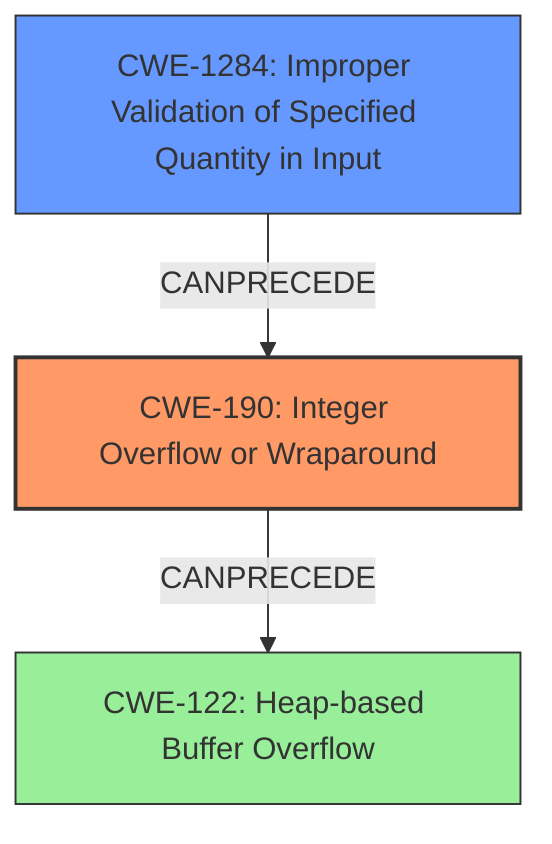

# Analysis Report for CVE-2022-28471

# Vulnerability Analysis Report: CVE-2022-28471

## Description

In ffjpeg (commit hash caade60), the function bmp_load() in bmp.c contains an integer overflow vulnerability, which eventually results in the heap overflow in jfif_encode() in jfif.c. This is due to the incomplete patch for issue 38

## Vulnerability Description Key Phrases

**Rootcause:** integer overflow
**Impact:** heap overflow
**Product:** ffjpeg
**Version:** caade60
**Component:** bmp_load() in bmp.c

## Analysis (with Relationship Data)

# Summary
| CWE ID | CWE Name | Confidence | CWE Abstraction Level | CWE Vulnerability Mapping Label | CWE-Vulnerability Mapping Notes |
|---|---|---|---|---|---|
| CWE-190 | Integer Overflow or Wraparound | 0.95 | Base | Allowed | Primary CWE |
| CWE-122 | Heap-based Buffer Overflow | 0.85 | Variant | Allowed | Secondary Candidate |

## Evidence and Confidence

*   **Confidence Score:** 0.90
*   **Evidence Strength:** HIGH

- **Analysis and Justification:**  
  - *Explanation:* The vulnerability description explicitly states an "**integer overflow**" in the `bmp_load()` function, which is the **root cause** of a subsequent heap overflow. The "CVE Reference Links Content Summary" further confirms that the multiplication `pb->width * 3` overflows, leading to a smaller-than-expected stride value. This aligns perfectly with CWE-190 [Integer Overflow or Wraparound], where a calculation produces an unexpected result due to exceeding the maximum value of the integer type. The use of CWE-190 is ALLOWED based on MITRE guidance for mapping to the root causes of vulnerabilities.
  The resulting heap overflow is a consequence of the integer overflow, supporting a chain of weaknesses.

  - *Relationship Analysis:* CWE-190 has no direct relationships listed in the provided data. However, it CanPrecede a buffer overflow vulnerability.

- **Confidence Score:**  
  - Confidence: 0.95 (High confidence because the description explicitly mentions "integer overflow" and the reference link confirms the overflow occurs in the stride calculation)

---

- **Analysis and Justification:**  
  - *Explanation:* The vulnerability ultimately leads to a heap overflow in `jfif_encode()`. Because the integer overflow causes a smaller buffer to be allocated, writing data into that buffer causes a heap overflow. This aligns with CWE-122 [Heap-based Buffer Overflow], which occurs when a buffer allocated on the heap is overwritten. This is a direct consequence of CWE-190. This is an ALLOWED mapping based on MITRE guidance.

  - *Relationship Analysis:* CWE-122 is a variant of buffer overflow. CWE-190 can precede this.

- **Confidence Score:**  
  - *Example:* Confidence: 0.85 (High confidence because the description explicitly mentions a heap overflow resulting from the integer overflow)

## Criticism of Analysis

Okay, let's review the provided CWE analysis for the ffjpeg integer overflow vulnerability and heap overflow.

**Overall Assessment:**

The analysis is generally good and identifies the core issues correctly: Integer Overflow (CWE-190) leading to Heap-based Buffer Overflow (CWE-122). The confidence scores are appropriate given the explicit nature of the vulnerability description. The justifications are well-reasoned and explain the relationship between the two CWEs.

**Detailed Critique and Suggestions:**

1.  **CWE-190: Integer Overflow or Wraparound**

    *   **Strengths:**
        *   Accurate identification of CWE-190 as the root cause.
        *   Good justification, explaining the overflow in the stride calculation.
        *   Correctly notes the ALLOWED usage based on MITRE guidance.
    *   **Suggestions:**
        *   None. The analysis for CWE-190 is solid.

2.  **CWE-122: Heap-based Buffer Overflow**

    *   **Strengths:**
        *   Accurate identification of CWE-122 as the consequence of the integer overflow.
        *   Justification clearly explains how the undersized buffer allocation leads to the heap overflow.
        *   Correctly notes the ALLOWED usage based on MITRE guidance.
    *   **Suggestions:**
        *   None. The analysis for CWE-122 is solid.

3. **Retriever Results:**
    *   The Retriever Results were very good. The list of CWEs aligns well with the analysis, including the top two results as Integer Overflow or Wraparound and Integer Underflow.
    *   CWE-1284 shows up as the third one, which could indicate that the improper validation of inputs may have been a cause of the integer overflow.
    *   CWE-122 was listed as number 4, which aligns well with the fact it is caused by an integer overflow.

4.  **Potential Improvement: Focus on Mitigation for CWE-190**

    * The analysis could be slightly improved by highlighting the mitigation strategies for CWE-190 in the specific context of `bmp_load()`. For example:
        *   **Explicit Overflow Checks:**  The code should explicitly check if `pb->width * 3` exceeds a safe limit before assigning it to `pb->stride`. This could involve a conditional statement that uses `SIZE_MAX` (or equivalent) to determine if an overflow will occur.
        *   **Safe Integer Libraries:**  The analysis could mention using safe integer libraries (like SafeInt or IntegerLib) to perform the multiplication and ensure that overflows are handled gracefully (e.g., by throwing an exception or returning an error code).
        *   **Data Type Considerations:** Discuss the choice of data type for `pb->width` and `pb->stride`. Using a wider integer type might postpone the overflow, but it's not a complete solution.  The analysis could emphasize the importance of choosing a data type that can accommodate the maximum expected width of a BMP image.

5.  **Relationship to CWE-1284 (Improper Validation of Specified Quantity in Input):**

    *   The analysis implicitly touches upon CWE-1284, but it could be made more explicit.  The `pb->width` value is essentially a "specified quantity" that comes from the BMP file. The code *attempts* to validate the size by checking `pb->stride` later, but this check is ineffective because the overflow has already occurred.
    *   A small paragraph could be added to explain that *before* performing the calculation `pb->width * 3`, `pb->width` should be validated to be within a reasonable range. This would prevent the integer overflow from happening in the first place.

**Revised Summary Table (incorporating CWE-1284):**

| CWE ID | CWE Name | Confidence | CWE Abstraction Level | CWE Vulnerability Mapping Label | CWE-Vulnerability Mapping Notes |
|---|---|---|---|---|---|
| CWE-190 | Integer Overflow or Wraparound | 0.95 | Base | Allowed | Primary CWE |
| CWE-1284 | Improper Validation of Specified Quantity in Input | 0.70 | Base | Allowed | Contributing Factor |
| CWE-122 | Heap-based Buffer Overflow | 0.85 | Variant | Allowed | Secondary Candidate |

**Revised Analysis (example addition for CWE-1284):**

```
- **Analysis and Justification:**
  - *Explanation:* The vulnerability can also be attributed to CWE-1284 [Improper Validation of Specified Quantity in Input]. The `pb->width` value read from the BMP file represents a quantity (the image width). The code fails to properly validate that this width is within acceptable bounds *before* performing the multiplication `pb->width * 3`.  If `pb->width` is excessively large, it triggers the integer overflow.  The later size check on `pb->stride` is then ineffective because it's operating on an already-overflowed value. This is ALLOWED based on MITRE's mapping guidance.
  - *Relationship Analysis:* CWE-1284 can precede CWE-190 (as seen in CVE-2022-21668).
- **Confidence Score:**
  - Confidence: 0.70 (Medium confidence; While not explicitly stated in the initial description, the lack of input validation on the image width is a clear contributing factor to the overflow vulnerability).
```

**Revised Analysis (Addition to Mitigations):**
CWE-190 Potential Mitigations:
* Implement explicit overflow checks before calculating `pb->stride`. Use safe integer libraries, and carefully consider the data types used for width and stride calculations.
* Validate that the `pb->width` is within a pre-defined limit before the calculation is performed.

**In conclusion:**

The original analysis is strong and correctly identifies the core weaknesses. The suggestions aim to provide a more comprehensive understanding of the vulnerability by explicitly including CWE-1284 and offering more specific mitigation recommendations focused on preventing the integer overflow from occurring in the first place.

## Final Resolution

# Summary
| CWE ID | CWE Name | Confidence | CWE Abstraction Level | CWE Vulnerability Mapping Label | CWE-Vulnerability Mapping Notes |
|---|---|---|---|---|---|
| CWE-190 | Integer Overflow or Wraparound | 0.95 | Base | Allowed | Primary CWE |
| CWE-1284 | Improper Validation of Specified Quantity in Input | 0.70 | Base | Allowed | Contributing Factor |
| CWE-122 | Heap-based Buffer Overflow | 0.85 | Variant | Allowed | Secondary Candidate |

## Evidence and Confidence

*   **Confidence Score:** 0.92
*   **Evidence Strength:** HIGH

## Relationship Analysis
The initial analysis correctly identified CWE-190 as the **root cause**, leading to CWE-122. The criticism enhances this by suggesting the inclusion of CWE-1284 as a contributing factor due to the lack of input validation. CWE-1284 can precede CWE-190, which in turn can precede CWE-122. The abstraction levels are appropriate, with CWE-190 and CWE-1284 at the Base level and CWE-122 at the Variant level.



## Vulnerability Chain
The vulnerability chain starts with **CWE-1284**, where the product fails to validate the input width. This leads to **CWE-190**, as the unvalidated width is used in a multiplication that overflows. The overflow results in a smaller-than-expected buffer being allocated. Finally, **CWE-122** occurs when data is written into this undersized buffer, causing a heap overflow.

## Summary of Analysis
The initial analysis was well-justified and accurate. The criticism provided a valuable addition by identifying CWE-1284 as a contributing factor. The vulnerability description explicitly states an "**integer overflow**" in the `bmp_load()` function, which is the **root cause** of a subsequent heap overflow. The "CVE Reference Links Content Summary" further confirms that the multiplication `pb->width * 3` overflows, leading to a smaller-than-expected stride value.

The relationship analysis confirms the chain of weaknesses: lack of input validation (CWE-1284) leads to integer overflow (CWE-190), which leads to heap overflow (CWE-122).

The selected CWEs are at the optimal level of specificity. CWE-190 accurately captures the integer overflow, CWE-1284 captures the lack of input validation contributing to the overflow, and CWE-122 accurately captures the resulting heap overflow.


*Report generated on 2025-03-18 12:26:19*
