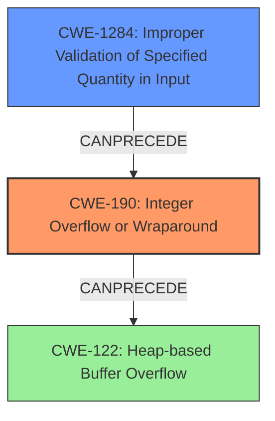

# Final Resolution for CVE-2022-28471

# Summary
| CWE ID | CWE Name | Confidence | CWE Abstraction Level | CWE Vulnerability Mapping Label | CWE-Vulnerability Mapping Notes |
|---|---|---|---|---|---|
| CWE-190 | Integer Overflow or Wraparound | 0.95 | Base | Allowed | Primary CWE |
| CWE-1284 | Improper Validation of Specified Quantity in Input | 0.70 | Base | Allowed | Contributing Factor |
| CWE-122 | Heap-based Buffer Overflow | 0.85 | Variant | Allowed | Secondary Candidate |

## Evidence and Confidence

*   **Confidence Score:** 0.92
*   **Evidence Strength:** HIGH

## Relationship Analysis
The initial analysis correctly identified CWE-190 as the **root cause**, leading to CWE-122. The criticism enhances this by suggesting the inclusion of CWE-1284 as a contributing factor due to the lack of input validation. CWE-1284 can precede CWE-190, which in turn can precede CWE-122. The abstraction levels are appropriate, with CWE-190 and CWE-1284 at the Base level and CWE-122 at the Variant level.

## Vulnerability Chain
The vulnerability chain starts with **CWE-1284**, where the product fails to validate the input width. This leads to **CWE-190**, as the unvalidated width is used in a multiplication that overflows. The overflow results in a smaller-than-expected buffer being allocated. Finally, **CWE-122** occurs when data is written into this undersized buffer, causing a heap overflow.

## Summary of Analysis
The initial analysis was well-justified and accurate. The criticism provided a valuable addition by identifying CWE-1284 as a contributing factor. The vulnerability description explicitly states an "**integer overflow**" in the `bmp_load()` function, which is the **root cause** of a subsequent heap overflow. The "CVE Reference Links Content Summary" further confirms that the multiplication `pb->width * 3` overflows, leading to a smaller-than-expected stride value.

The relationship analysis confirms the chain of weaknesses: lack of input validation (CWE-1284) leads to integer overflow (CWE-190), which leads to heap overflow (CWE-122).

The selected CWEs are at the optimal level of specificity. CWE-190 accurately captures the integer overflow, CWE-1284 captures the lack of input validation contributing to the overflow, and CWE-122 accurately captures the resulting heap overflow.