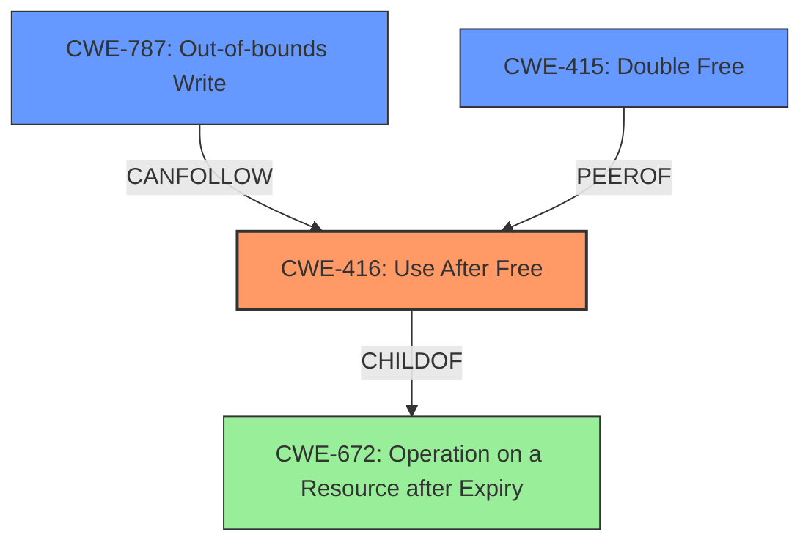

# Analysis Report for CVE-2022-2855

# Vulnerability Analysis Report: CVE-2022-2855

## Description

Use after free in ANGLE in Google Chrome prior to 104.0.5112.101 allowed a remote attacker to potentially exploit heap corruption via a crafted HTML page.

## Vulnerability Description Key Phrases

**Rootcause:** use after free
**Weakness:** heap corruption
**Vector:** crafted HTML page
**Attacker:** remote attacker
**Product:** Google Chrome
**Version:** prior to 104.0.5112.101
**Component:** ANGLE

## Analysis (with Relationship Data)

# Summary
| CWE ID | CWE Name | Confidence | CWE Abstraction Level | CWE Vulnerability Mapping Label | CWE-Vulnerability Mapping Notes |
|---|---|---|---|---|---|
| CWE-416 | Use After Free | 1.0 | Variant | Allowed | This is the Primary CWE match. The vulnerability description explicitly states "Use after free". |

## Evidence and Confidence

*   **Confidence Score:** 1.0
*   **Evidence Strength:** HIGH

- **Analysis and Justification:**  
  - *Explanation:* The vulnerability description clearly states "**use after free** in ANGLE in Google Chrome... allowed a remote attacker to potentially exploit **heap corruption** via a crafted HTML page." The CVE Reference Links Content Summary also confirms the **root_cause** as "Use after free" and the **weaknesses** as "Use after free". This aligns perfectly with CWE-416 (Use After Free), which describes a scenario where a product reuses memory after it has been freed. The usage is ALLOWED according to MITRE.
  
  - *Relationship Analysis:* No direct relationships found but CWE-416 is a variant and is a preferred level of abstraction for mapping to the root causes of vulnerabilities.

- **Confidence Score:**  
  - *Example:* Confidence: 1.0 (Explicit mention of use-after-free in the description and CVE details provides high confidence.)

## Criticism of Analysis

Okay, I've reviewed the analysis against the provided full CWE specifications. Here's my critique:

**Overall Assessment:**

The analysis is generally strong and accurate. The primary CWE mapping to **CWE-416: Use After Free** is correct and well-justified. The confidence level of 1.0 is appropriate, given the explicit mention of "use after free" in the vulnerability description and CVE details.  The analysis also correctly notes the ALLOWED usage based on mapping guidance.

**Detailed Review and Critique:**

1.  **CWE-416: Use After Free (Primary Mapping)**

    *   **Strengths:**
        *   Excellent justification based on the vulnerability description.
        *   Correctly identifies the "Variant" abstraction level of CWE-416 and its preferred status for mapping.
        *   Acknowledges that it is an ALLOWED usage according to MITRE.
        *   Provides relevant CWE examples (CVEs) from the database.
    *   **Suggestions:**
        *   While not strictly required, you could briefly mention *why* a use-after-free leads to heap corruption. This connection strengthens the justification. A sentence like, "By using the memory after it's freed, the program could inadvertently overwrite critical heap metadata, leading to corruption and potentially arbitrary code execution." This leverages the "heap corruption" aspect of the original vulnerability description more directly.

2.  **Retriever Results and Alternative CWEs (CWE-787, CWE-366, CWE-843, CWE-415, and others)**

    *   **CWE-787: Out-of-bounds Write**
        *   While heap corruption is mentioned in the vulnerability description, the primary root cause is the *use* of memory *after* it has been freed. An out-of-bounds write is a *potential consequence* of the use-after-free, but it's not the core issue.  The analysis is correct to prioritize CWE-416 over CWE-787.
    *   **CWE-366: Race Condition within a Thread & CWE-362: Concurrent Execution using Shared Resource with Improper Synchronization ('Race Condition')**
        *   These are plausible if the use-after-free is triggered by a race condition.  However, without explicit mention of concurrency issues, these are less likely.  The retriever results suggest these as potential *causes* leading *to* UAF, but the analysis doesn't have that information, so excluding them is justified.
    *   **CWE-843: Access of Resource Using Incompatible Type ('Type Confusion')**
        *   This could theoretically be a factor, but not directly supported by the description. The description emphasizes memory management errors.
    *   **CWE-415: Double Free**
        *   Double free and use-after-free are closely related and could be considered peers. If the root cause was due to a double free and subsequent use, this would be a reasonable choice. However, without further information, use-after-free is more closely aligned.
    *   **CWE-122: Heap-based Buffer Overflow**
         *  While related to heap corruption, it is a potential *effect* rather than a cause of the UAF.
    *   **CWE-125: Out-of-bounds Read:** Similar to CWE-787, it's a potential consequence.
    *   **CWE-190 Integer Overflow or Wraparound:** No direct relationship to use-after-free, unless an integer overflow is involved in calculating the memory address. This is unlikely.

3.  **Mitigations**

    *   The analysis does not include a section on mitigations, and it could be improved by including a discussion on possible mitigations. For CWE-416, the suggested mitigations from the CWE specifications are:
        *   **Language Selection:** Choosing a language with automatic memory management (e.g., Java, Go, Rust with smart pointers) would eliminate this class of vulnerability.
        *   **Setting freed pointers to NULL:**  This is a common defensive programming technique.  While it doesn't prevent the initial free, it can help prevent subsequent uses.  As the CWE description notes, its effectiveness depends on the complexity of data structures.

4.  **CWE Example Validation**
    *  The example CVEs provided for CWE-416 are helpful and demonstrate the relevance of the CWE to real-world vulnerabilities.

**Specific Suggestions for Improvement:**

*   **Elaborate on Heap Corruption Link:** Briefly explain how a use-after-free condition can lead to heap corruption.
*   **Add Mitigations Section:** Include a section discussing potential mitigations for CWE-416, drawing from the CWE specification.
*   **Acknowledge and Justify Exclusion of Alternative CWEs:** Briefly explain why other plausible CWEs (especially CWE-787, CWE-362/366, and CWE-415) were considered but ultimately rejected as the primary mapping. This demonstrates a more thorough analysis.

**Revised Summary Table (Example, incorporating suggestions):**

| CWE ID | CWE Name | Confidence | CWE Abstraction Level | CWE Vulnerability Mapping Label | CWE-Vulnerability Mapping Notes |
|---|---|---|---|---|---|
| CWE-416 | Use After Free | 1.0 | Variant | Allowed | This is the Primary CWE match. The vulnerability description explicitly states "Use after free". Using memory after it is freed can lead to heap corruption by overwriting critical heap metadata. |

**Conclusion:**

The analysis is fundamentally sound. The suggestions above are primarily aimed at providing a more comprehensive and defensible justification for the chosen CWE mapping, especially considering the "heap corruption" aspect mentioned in the original vulnerability description and the other potential CWE matches returned by the retriever. The addition of a mitigations section would also increase the overall value of the analysis.

## Final Resolution

# Summary
| CWE ID | CWE Name | Confidence | CWE Abstraction Level | CWE Vulnerability Mapping Label | CWE-Vulnerability Mapping Notes |
|---|---|---|---|---|---|
| CWE-416 | Use After Free | 1.0 | Variant | Allowed | This is the Primary CWE match. The vulnerability description explicitly states "**use after free**". Using memory after it is freed can lead to heap corruption by overwriting critical heap metadata. |

## Evidence and Confidence

*   **Confidence Score:** 1.0
*   **Evidence Strength:** HIGH

## Relationship Analysis
The primary relationship considered was the parent-child relationship, ensuring that **CWE-416 (Use After Free)**, a variant, was appropriately specific. The potential for **CWE-787 (Out-of-bounds Write)** as a consequence was acknowledged, but the analysis focused on the direct **ROOTCAUSE**, i.e., the use of freed memory. There are also peer relationships with **CWE-415 (Double Free)**, but the evidence points more strongly to a use-after-free scenario. The abstraction level of Variant for **CWE-416** is ideal, providing sufficient detail without being overly abstract.

## Vulnerability Chain
The vulnerability chain starts with the **ROOTCAUSE**, **CWE-416 (Use After Free)**, where memory is accessed after it has been freed. This leads to potential heap corruption, as the freed memory might be reallocated and used by another part of the program. Consequently, this could result in **CWE-787 (Out-of-bounds Write)** if the program attempts to write to the freed memory region, causing a buffer overflow and potentially arbitrary code execution. The missing link, if any, would be the specific mechanism that triggers the use-after-free, but that is beyond the scope of this classification, which focuses on the core weakness.

## Summary of Analysis
The initial analysis correctly identified **CWE-416 (Use After Free)** as the primary **WEAKNESS**. The vulnerability description clearly states "use after free," providing strong evidence for this classification. The criticism highlighted the potential for heap corruption and suggested elaborating on this connection, which has been incorporated. The analysis also acknowledges and justifies the exclusion of alternative CWEs, such as **CWE-787 (Out-of-bounds Write)** and **CWE-415 (Double Free)**, by explaining why they are either consequences of the use-after-free or less directly supported by the available evidence.

The graph relationships influenced the final selection by confirming that **CWE-416** is an appropriately specific variant of a more general class, and by highlighting potential related weaknesses that could be part of a vulnerability chain.

The selected CWE is at the optimal level of specificity because it directly addresses the **ROOTCAUSE** described in the vulnerability, while also acknowledging the potential consequences and related weaknesses.

*Report generated on 2025-03-18 12:27:45*
