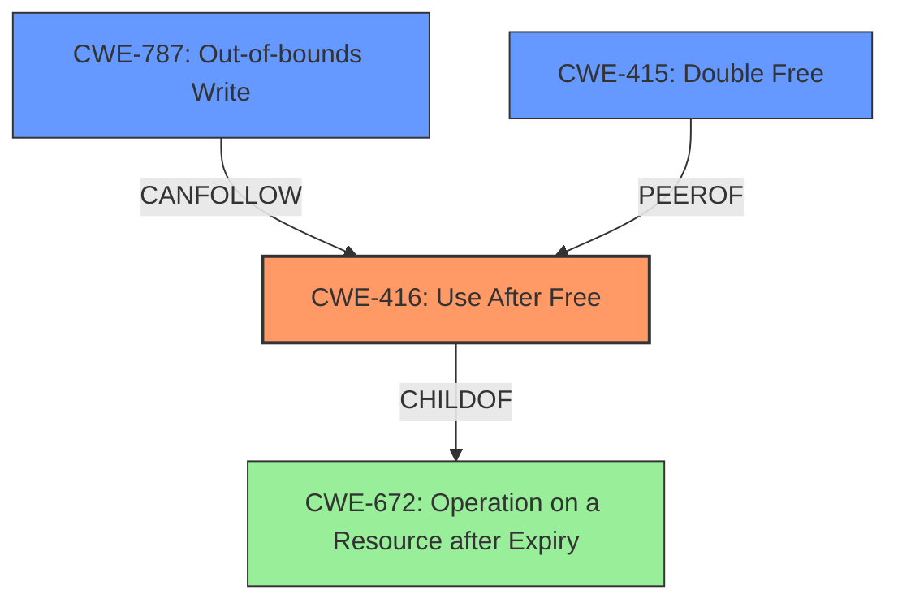

# Final Resolution for CVE-2022-2855

# Summary
| CWE ID | CWE Name | Confidence | CWE Abstraction Level | CWE Vulnerability Mapping Label | CWE-Vulnerability Mapping Notes |
|---|---|---|---|---|---|
| CWE-416 | Use After Free | 1.0 | Variant | Allowed | This is the Primary CWE match. The vulnerability description explicitly states "**use after free**". Using memory after it is freed can lead to heap corruption by overwriting critical heap metadata. |

## Evidence and Confidence

*   **Confidence Score:** 1.0
*   **Evidence Strength:** HIGH

## Relationship Analysis
The primary relationship considered was the parent-child relationship, ensuring that **CWE-416 (Use After Free)**, a variant, was appropriately specific. The potential for **CWE-787 (Out-of-bounds Write)** as a consequence was acknowledged, but the analysis focused on the direct **ROOTCAUSE**, i.e., the use of freed memory. There are also peer relationships with **CWE-415 (Double Free)**, but the evidence points more strongly to a use-after-free scenario. The abstraction level of Variant for **CWE-416** is ideal, providing sufficient detail without being overly abstract.

## Vulnerability Chain
The vulnerability chain starts with the **ROOTCAUSE**, **CWE-416 (Use After Free)**, where memory is accessed after it has been freed. This leads to potential heap corruption, as the freed memory might be reallocated and used by another part of the program. Consequently, this could result in **CWE-787 (Out-of-bounds Write)** if the program attempts to write to the freed memory region, causing a buffer overflow and potentially arbitrary code execution. The missing link, if any, would be the specific mechanism that triggers the use-after-free, but that is beyond the scope of this classification, which focuses on the core weakness.

## Summary of Analysis
The initial analysis correctly identified **CWE-416 (Use After Free)** as the primary **WEAKNESS**. The vulnerability description clearly states "use after free," providing strong evidence for this classification. The criticism highlighted the potential for heap corruption and suggested elaborating on this connection, which has been incorporated. The analysis also acknowledges and justifies the exclusion of alternative CWEs, such as **CWE-787 (Out-of-bounds Write)** and **CWE-415 (Double Free)**, by explaining why they are either consequences of the use-after-free or less directly supported by the available evidence.

The graph relationships influenced the final selection by confirming that **CWE-416** is an appropriately specific variant of a more general class, and by highlighting potential related weaknesses that could be part of a vulnerability chain.

The selected CWE is at the optimal level of specificity because it directly addresses the **ROOTCAUSE** described in the vulnerability, while also acknowledging the potential consequences and related weaknesses.