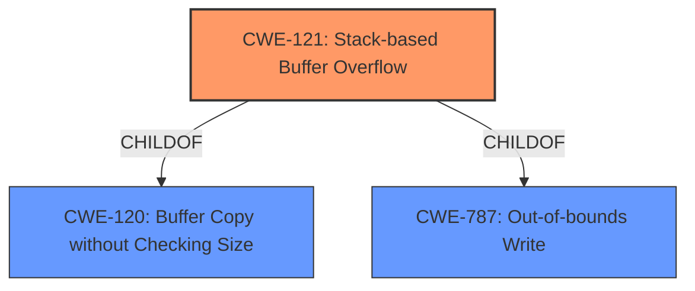

# Final Resolution for CVE-2022-28556

# Summary
| CWE ID | CWE Name | Confidence | CWE Abstraction Level | CWE Vulnerability Mapping Label | CWE-Vulnerability Mapping Notes |
|---|---|---|---|---|---|
| CWE-121 | Stack-based Buffer Overflow | 0.9 | Variant | Allowed | Primary CWE. Exploitability can involve overwriting return addresses or other stack data. Consider mitigations like ASLR and DEP. |
| CWE-120 | Buffer Copy without Checking Size of Input ('Classic Buffer Overflow') | 0.6 | Base | Allowed-with-Review | Secondary Candidate. Highlights the lack of input size validation. |

## Evidence and Confidence

*   **Confidence Score:** 0.9
*   **Evidence Strength:** HIGH

## Relationship Analysis
The primary CWE is CWE-121, which is a variant of buffer overflow. CWE-120 is a parent of CWE-121, representing a more general case of buffer copy without size checking. While CWE-787 (Out-of-bounds Write) could be considered a parent, CWE-121 is more specific to stack-based overflows, making it a more appropriate primary classification given the vulnerability description. The abstraction levels influenced the decision to choose the more specific variant (CWE-121) over the base class (CWE-120).

## Vulnerability Chain
The vulnerability chain starts with the **lack of input size validation** when copying the `startip` and `endip` data to a stack-based buffer using the `sanf` function. This leads to **CWE-121 (Stack-based Buffer Overflow)**, where the buffer on the stack is overwritten. The consequence is potential **control of execution** by overwriting return addresses or other critical stack data.

## Summary of Analysis
The initial analysis correctly identified **CWE-121 (Stack-based Buffer Overflow)** as the primary **weakness**. The vulnerability description explicitly states a stack overflow, which provides strong evidence for this classification. The criticism suggested considering CWE-787 but ultimately agreed that CWE-121 is the better fit due to its specificity. The chain relationship clarifies the progression from the initial flaw (lack of input validation) to the impact (potential for code execution). The selection of CWE-121 is at the optimal level of specificity because it directly reflects the stack-based nature of the buffer overflow, as indicated in the vulnerability description: "The stack overflow vulnerability lies in the /goform/setpptpservercfg interface of the web. The sent post data startip and endip are copied to the stack using the sanf function, resulting in stack overflow."