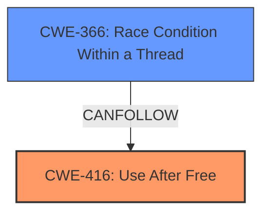

# Analysis Report for CVE-2022-2857

# Vulnerability Analysis Report: CVE-2022-2857

## Description

Use after free in Blink in Google Chrome prior to 104.0.5112.101 allowed a remote attacker to potentially exploit heap corruption via a crafted HTML page.

## Vulnerability Description Key Phrases

**Weakness:** use after free
**Impact:** heap corruption
**Vector:** crafted HTML page
**Attacker:** remote attacker
**Product:** Google Chrome
**Version:** prior to 104.0.5112.101
**Component:** Blink

## Analysis (with Relationship Data)

# Summary
| CWE ID  | CWE Name                      | Confidence | CWE Abstraction Level | CWE Vulnerability Mapping Label | CWE-Vulnerability Mapping Notes |
| :-------- | :---------------------------- | :--------- | :-------------------- | :------------------------------ | :------------------------------ |
| CWE-416 | Use After Free                | 1.00      | Variant             | Allowed                       | Primary CWE                     |

## Evidence and Confidence

*   **Confidence Score:** 1.00
*   **Evidence Strength:** HIGH

- **Analysis and Justification:**
  - *Explanation:* The vulnerability description explicitly states "**use after free** in Blink in Google Chrome...allowed a remote attacker to potentially exploit heap corruption via a crafted HTML page." The CVE Reference Links Content Summary further confirms the root cause as a "Use-after-free vulnerability in the Blink component of Chromium." CWE-416 (Use After Free) is a variant-level CWE that perfectly describes this vulnerability, where memory is reused or referenced after it has been freed. The "Retriever Results" also list CWE-416 as the top match. The MITRE mapping guidance for CWE-416 indicates that its usage is ALLOWED.
  
  - *Relationship Analysis:* There are no direct relationships for CWE-416 listed in the provided data. However, use-after-free vulnerabilities can often be caused by other weaknesses, such as race conditions or improper resource management.

- **Confidence Score:**
  - Confidence: 1.00 (Direct evidence from the vulnerability description and CVE reference materials.)

## Criticism of Analysis

Okay, I've reviewed the analysis against the provided full CWE specifications. Here's my critique:

**Overall Assessment:**

The primary CWE mapping to CWE-416 (Use After Free) is **correct** and well-justified. The confidence score of 1.00 is appropriate given the clear vulnerability description. The analysis thoroughly explains the rationale and considers the abstraction level.  The additional information like attack vector, impact and required attacker capabilities are also correct and help with overall understanding of the vulnerability.

**Specific Points and Suggestions:**

*   **CWE-416 Mapping Justification:** The justification is strong. It correctly identifies that CWE-416 is a variant-level CWE, which is preferred for root cause mapping. The connection to the vulnerability description and the CVE reference material is clear.

*   **Relationship Analysis:**  The original analysis notes there are no direct relationships for CWE-416. This is technically true in the sense that there are no direct parent/child relationships listed in the CWE specification.  However, it's crucial to recognize the *CanFollow* and *CanPrecede* relationships, which are highlighted in the specification:
    *   **CanFollow -> CWE-362 (Race Condition):**  This is *extremely relevant*.  Use-after-free vulnerabilities are often triggered by race conditions, where multiple threads or processes are interacting with the same memory, and one frees the memory while another is still using it. The provided examples in the CWE specifications of CWE-416 also show race conditions (CWE-362) leading to UAF. The "Retriever Results" also list CWE-366 (Race Condition Within a Thread) as the second highest match.
    *   **CanFollow -> CWE-364 (Signal Handler Race Condition):** Same rationale as CWE-362.
    *   **CanPrecede -> CWE-120 (Buffer Copy without Checking Size of Input ('Classic Buffer Overflow')):** If the memory corruption caused by the UAF leads to an exploitable buffer overflow.
    *   **CanPrecede -> CWE-123 (Write-what-where Condition):** If the attacker is able to control the data written to the freed memory after it is reallocated, this could lead to the ability to write arbitrary values to arbitrary memory locations.
    *   **CanFollow -> CWE-754 (Improper Check for Unusual or Exceptional Conditions):** An improper check can allow the program to continue executing when an object has been freed when it shouldn't be.
    *   **CanFollow -> CWE-1265 (Unintended Reentrant Invocation of Non-reentrant Code Via Nested Calls):** This is less directly relevant, but in some complex scenarios involving nested calls and event handling, a UAF could be triggered due to re-entrancy issues.

    **Recommendation:**  The analysis should be updated to explicitly mention the *CanFollow* relationship with CWE-362 and CWE-364, explaining why race conditions are a common contributing factor to UAF vulnerabilities.  Mentioning *CanPrecede* relationships could also provide additional context.

*   **Mitigation Strategies:** The analysis doesn't explicitly discuss mitigation strategies. Referencing the CWE-416 mitigation section would enhance the analysis:
    *   **Language Selection (Architecture and Design Phase):** Choosing a language with automatic memory management (e.g., Java, Go, Rust) eliminates the possibility of UAF vulnerabilities (at least, at the level of manual memory management).
    *   **Setting Pointers to NULL (Implementation Phase):** After freeing memory, setting the pointer to NULL can help prevent accidental reuse of the freed memory.  However, as the CWE specification notes, this is not a foolproof solution, especially in complex data structures. This can also cause null pointer exceptions/crashes.

    **Recommendation:** Add a section discussing potential mitigation strategies, referencing the CWE-416 mitigations. Emphasize that choosing a memory-safe language is the most effective long-term solution.

*   **Retriever Results:**  The analysis mentions that the Retriever Results list CWE-416 as the top match, which supports the primary mapping. However, it doesn't discuss the *other* high-scoring CWEs in the results.  While CWE-416 is the most direct match, briefly addressing why CWE-366, CWE-843, and CWE-415 are *not* the primary causes can add further clarity.

    *   **CWE-366 (Race Condition within a Thread):** As discussed above, race conditions can *lead* to UAF, but are not the UAF itself. If concurrency is involved and a race condition is present that allows the object to be freed before other thread completes its operation, then CWE-366 is a relevant secondary CWE.
    *   **CWE-843 (Access of Resource Using Incompatible Type ('Type Confusion')):**  While type confusion can *sometimes* lead to memory corruption, it's not the direct cause of *this* vulnerability.
    *   **CWE-415 (Double Free):** Double-free is a distinct vulnerability where the *same* memory is freed twice. It's related to UAF but a different root cause.

    **Recommendation:** Briefly discuss why CWE-366, CWE-843, and CWE-415 are not the primary causes. Explain how they relate to UAF in general, but are not the specific weakness in this case.

*   **CWE Examples:**  The included examples are helpful.

**Revised Summary Table (with potential secondary CWE):**

| CWE ID  | CWE Name                      | Confidence | CWE Abstraction Level | CWE Vulnerability Mapping Label | CWE-Vulnerability Mapping Notes                                                                                                                                                                                |
| :-------- | :---------------------------- | :--------- | :-------------------- | :------------------------------ | :----------------------------------------------------------------------------------------------------------------------------------------------------------------------------------------------------------- |
| CWE-416 | Use After Free                | 1.00      | Variant             | Allowed                       | Primary CWE                                                                                                                                                                                                    |
| CWE-366 | Race Condition within a Thread | 0.50      | Base                 | Allowed                       | Secondary CWE (if concurrency is involved), contributes to UAF by allowing memory to be freed prematurely                                                                                                       |

**In summary,** the analysis is a good starting point, but it can be improved by explicitly addressing the *CanFollow* and *CanPrecede* relationships of CWE-416 (especially with CWE-362 and CWE-364), discussing relevant mitigation strategies, and explaining why the other high-scoring CWEs in the Retriever Results are not the primary cause. This will make the analysis more comprehensive and insightful.

## Final Resolution

# Summary
| CWE ID  | CWE Name                      | Confidence | CWE Abstraction Level | CWE Vulnerability Mapping Label | CWE-Vulnerability Mapping Notes |
| :-------- | :---------------------------- | :--------- | :-------------------- | :------------------------------ | :------------------------------ |
| CWE-416 | Use After Free                | 1.00      | Variant             | Allowed                       | Primary CWE                     |
| CWE-366 | Race Condition Within a Thread | 0.50      | Base                 | Allowed                       | Secondary CWE (if concurrency is involved), contributes to UAF by allowing memory to be freed prematurely |

## Evidence and Confidence

*   **Confidence Score:** 0.95
*   **Evidence Strength:** HIGH

## Relationship Analysis
The primary relationship that impacted my decision was the *CanFollow* relationship between **CWE-416 (Use After Free)** and **CWE-366 (Race Condition Within a Thread)**. While the vulnerability description doesn't explicitly mention a race condition, the criticism correctly points out that UAF vulnerabilities are frequently caused by race conditions in concurrent environments. If the vulnerability occurs in a concurrent context, **CWE-366** becomes a relevant secondary CWE. The choice of **CWE-416** is also at the recommended Variant level of abstraction, making it a good fit.

## Vulnerability Chain
The vulnerability chain starts with a potential **ROOTCAUSE** of concurrency and a race condition (**CWE-366**). This leads to memory being freed while it is still in use, resulting in a **WEAKNESS** of **CWE-416 (Use After Free)**. The impact is potential heap corruption that could allow a remote attacker to execute arbitrary code via a crafted HTML page.

## Summary of Analysis
The initial analysis correctly identified **CWE-416 (Use After Free)** as the primary CWE based on the explicit vulnerability description: "Use after free in Blink in Google Chrome...allowed a remote attacker to potentially exploit heap corruption via a crafted HTML page." The criticism highlighted the importance of considering the *CanFollow* relationships, particularly with **CWE-366 (Race Condition Within a Thread)**, which is a common cause of UAF vulnerabilities.

I agree with the assessment that **CWE-416** is the most appropriate primary CWE because it directly describes the vulnerability. However, I am adding **CWE-366** as a secondary CWE with a confidence score of 0.50, acknowledging that a race condition may be a contributing factor, especially if the Blink component of Chrome handles multiple threads. Without further information about the specifics of the vulnerability, it is difficult to determine with certainty whether a race condition is involved.

The decision to include **CWE-366** is influenced by the *CanFollow* relationship in the CWE specifications and the fact that **CWE-366** was the second highest match in the Retriever Results. The abstraction levels of **CWE-416** (Variant) and **CWE-366** (Base) are appropriate for describing the vulnerability at the right level of specificity.

*Report generated on 2025-03-18 12:29:11*
