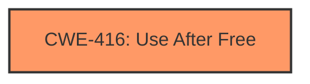

# Analysis Report for CVE-2022-2859

# Vulnerability Analysis Report: CVE-2022-2859

## Description

Use after free in Chrome OS Shell in Google Chrome prior to 104.0.5112.101 allowed a remote attacker who convinced a user to engage in specific UI interactions to potentially exploit heap corruption via specific UI interactions.

## Vulnerability Description Key Phrases

**Rootcause:** use after free
**Weakness:** heap corruption
**Vector:** specific UI interactions
**Attacker:** remote attacker
**Product:** Google Chrome
**Version:** prior to 104.0.5112.101
**Component:** Chrome OS Shell

## Analysis (with Relationship Data)

# Summary
| CWE ID | CWE Name | Confidence | CWE Abstraction Level | CWE Vulnerability Mapping Label | CWE-Vulnerability Mapping Notes |
|---|---|---|---|---|---|
| CWE-416 | Use After Free | 1.0 | Variant | Allowed | This is the primary CWE because the vulnerability is a use-after-free. |

## Evidence and Confidence

*   **Confidence Score:** 1.0
*   **Evidence Strength:** HIGH

- **Analysis and Justification:**  
  - *Explanation:* The vulnerability description clearly states "**use after free** in Chrome OS Shell". The summary of the CVE Reference Links Content also has a clear rootcause of "**Use after free**". The definition of CWE-416 (Use After Free) is "The product reuses or references memory after it has been freed." The description provided for CWE-416, the vulnerability details, and the CVE Reference Links Content Summary are all an exact match, leading to high confidence.
  
  - *Relationship Analysis:* CWE-416 is a Variant level weakness, which is preferred.

- **Confidence Score:**  
  - Confidence: 1.0 (Complete and direct evidence from the vulnerability description and CVE reference materials.)

## Criticism of Analysis

Okay, I've reviewed the analysis provided, including the full CWE specifications. Here's my critique, focusing on the appropriateness of the CWE-416 mapping and considering the other candidate CWEs identified by the retrievers:

**Overall Assessment:**

The primary mapping to CWE-416 (Use After Free) is **correct and well-justified.** The evidence from the vulnerability description and CVE summary strongly supports this mapping. The analysis clearly explains why CWE-416 is the most accurate representation of the root cause.  The confidence score of 1.0 is appropriate given the direct evidence.

**Detailed Critique:**

*   **CWE-416 (Use After Free):**
    *   **Strengths:** The analysis correctly identifies the "use after free" terminology in the vulnerability description and CVE summary. The description of CWE-416 directly matches the vulnerability: memory is freed, and then subsequently accessed. The Variant level abstraction is also appropriate.
    *   **Mapping Guidance:** The analysis correctly acknowledges the mapping guidance, noting that the Variant level is preferred. It appropriately uses the "Acceptable-Use" reason.
    *   **Potential Mitigations:** The mitigations listed in the CWE specification are relevant. Choosing a language with automatic memory management would prevent the vulnerability. Setting pointers to NULL after freeing, while not a complete solution, is a standard defensive practice.

*   **Consideration of Other CWEs and Retriever Results:**
    *   The analysis *does not* address the other possible options returned from the Retriever. While not explicitly *required*, it would be good practice to say something about why the other CWEs are *not* the best fit. Here's how I'd address some of the top contenders:

        *   **CWE-366 (Race Condition within a Thread) & CWE-362 (Concurrent Execution using Shared Resource with Improper Synchronization):** These are related. A use-after-free *can* be caused by a race condition, but the primary issue here, as described, isn't *specifically* about concurrency. The description doesn't mention threads or processes racing to access the freed memory. If the UAF was *caused* by a race condition, it would be appropriate to *chain* CWE-362 or CWE-366 *to* CWE-416. Without further information on the root cause, it is best to just assign CWE-416.
            *   Specifically, examine the examples in the CWE specification. CVE-2022-2621 is a *chain* of CWE-366 -> CWE-416, but the details indicate that the *cause* of the UAF was a race condition, which is not specified in this particular case.

        *   **CWE-843 (Access of Resource Using Incompatible Type ('Type Confusion')):** Type confusion *could* be a factor if the memory is reallocated and then accessed as a different type, *after* the free. However, without more information, it's safer to stick with the direct "use after free" identification.
        *   **CWE-415 (Double Free):** A double free is a related, but distinct, issue. The description explicitly states "use after free," not a double free.

        *   **CWE-1021 (Improper Restriction of Rendered UI Layers or Frames) & CWE-356 (Product UI does not Warn User of Unsafe Actions) & CWE-451 (User Interface (UI) Misrepresentation of Critical Information):** It might be tempting to relate the UI interactions, but the root cause is *still* a memory management issue. These UI issues are more related to the attack vector. The attacker is exploiting a UAF by convincing a user to engage in certain UI interactions. This does *not* indicate a failure to restrict rendered UI layers or misrepresentation of information. This is the *method* used to trigger the vulnerability.

        *   **CWE-122 (Heap-based Buffer Overflow):** A heap corruption can be caused by heap-based buffer overflow, *or* a use-after-free. The fact that the vulnerability description uses the phrase "heap corruption" does *not* mean there is a buffer overflow. A UAF can directly lead to heap corruption. Without more information, it is best to stick with UAF.

*   **Heap Corruption:**  The vulnerability description mentions "heap corruption." It is important to understand that a Use-After-Free is *one way* to cause heap corruption. The heap is the region of memory used for dynamic allocation, so any vulnerability that allows out-of-bounds writes or operations on freed memory could be described as "heap corruption". Therefore, the UAF *causes* the heap corruption. No need to assign a second CWE to "heap corruption."

**Recommendations:**

1.  **Address Alternative CWEs:** Briefly explain why the other highly-ranked CWEs from the retriever results were *not* selected. This strengthens the justification for choosing CWE-416.
2.  **Chain to Other CWEs?** Consider if the UAF is a *direct* result of another CWE (e.g., race condition). If so, create a CWE chain. This is unlikely given the information available.
3.  **Attack Vector vs. Root Cause:** Reinforce the distinction between the attack vector ("specific UI interactions") and the root cause (UAF). The UI interactions are the *trigger* for the vulnerability, not the vulnerability itself.

In summary, the analysis is sound in its primary CWE-416 mapping. Adding a short explanation of why the other CWEs are less appropriate and emphasizing the attack vector/root cause distinction would improve the analysis further.

## Final Resolution

# Summary
| CWE ID | CWE Name | Confidence | CWE Abstraction Level | CWE Vulnerability Mapping Label | CWE-Vulnerability Mapping Notes |
|---|---|---|---|---|---|
| CWE-416 | Use After Free | 1.0 | Variant | Allowed | Primary CWE: The vulnerability is a use-after-free. |

## Evidence and Confidence

*   **Confidence Score:** 1.0
*   **Evidence Strength:** HIGH

## Relationship Analysis
The primary relationship considered was the direct match of the vulnerability description to the definition of CWE-416. While other CWEs like CWE-366 (Race Condition) and CWE-122 (Heap-based Buffer Overflow) were considered, they were deemed less appropriate because the provided description focuses specifically on a "use after free" condition rather than a race condition or buffer overflow as the root cause. The variant level of CWE-416 provides good specificity for this vulnerability.

## Vulnerability Chain
The vulnerability chain starts with a memory region being freed, followed by a subsequent attempt to access that memory region. This **WEAKNESS** leads to heap corruption and allows a remote attacker to potentially exploit the system. The **ROOTCAUSE** is the use of memory after it has been freed.

## Summary of Analysis
The initial analysis correctly identified CWE-416 (Use After Free) as the primary CWE. The criticism highlighted the importance of addressing why other potential CWEs were not selected.

The vulnerability description explicitly states "Use after free in Chrome OS Shell". This aligns directly with the definition of **CWE-416 (Use After Free)**, which describes a situation where "The product reuses or references memory after it has been freed." The high confidence score of 1.0 is justified due to this direct and explicit evidence.

The criticism suggested considering other CWEs such as **CWE-366 (Race Condition within a Thread)**, **CWE-122 (Heap-based Buffer Overflow)**, and **CWE-415 (Double Free)**. However, the provided vulnerability description does not provide sufficient evidence to support these alternative classifications. While a race condition could potentially lead to a use-after-free, the description doesn't mention any concurrent access or synchronization issues. Similarly, while heap corruption is mentioned, it is a consequence of the UAF, not necessarily indicative of a heap-based buffer overflow. A double free is also a distinct issue not directly mentioned in the description.

Therefore, based on the available evidence, **CWE-416 (Use After Free)** remains the most appropriate classification at the optimal level of specificity.

*Report generated on 2025-03-18 12:30:29*
