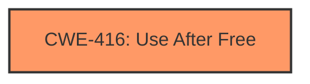

# Final Resolution for CVE-2022-2859

# Summary
| CWE ID | CWE Name | Confidence | CWE Abstraction Level | CWE Vulnerability Mapping Label | CWE-Vulnerability Mapping Notes |
|---|---|---|---|---|---|
| CWE-416 | Use After Free | 1.0 | Variant | Allowed | Primary CWE: The vulnerability is a use-after-free. |

## Evidence and Confidence

*   **Confidence Score:** 1.0
*   **Evidence Strength:** HIGH

## Relationship Analysis
The primary relationship considered was the direct match of the vulnerability description to the definition of CWE-416. While other CWEs like CWE-366 (Race Condition) and CWE-122 (Heap-based Buffer Overflow) were considered, they were deemed less appropriate because the provided description focuses specifically on a "use after free" condition rather than a race condition or buffer overflow as the root cause. The variant level of CWE-416 provides good specificity for this vulnerability.

## Vulnerability Chain
The vulnerability chain starts with a memory region being freed, followed by a subsequent attempt to access that memory region. This **WEAKNESS** leads to heap corruption and allows a remote attacker to potentially exploit the system. The **ROOTCAUSE** is the use of memory after it has been freed.

## Summary of Analysis
The initial analysis correctly identified CWE-416 (Use After Free) as the primary CWE. The criticism highlighted the importance of addressing why other potential CWEs were not selected.

The vulnerability description explicitly states "Use after free in Chrome OS Shell". This aligns directly with the definition of **CWE-416 (Use After Free)**, which describes a situation where "The product reuses or references memory after it has been freed." The high confidence score of 1.0 is justified due to this direct and explicit evidence.

The criticism suggested considering other CWEs such as **CWE-366 (Race Condition within a Thread)**, **CWE-122 (Heap-based Buffer Overflow)**, and **CWE-415 (Double Free)**. However, the provided vulnerability description does not provide sufficient evidence to support these alternative classifications. While a race condition could potentially lead to a use-after-free, the description doesn't mention any concurrent access or synchronization issues. Similarly, while heap corruption is mentioned, it is a consequence of the UAF, not necessarily indicative of a heap-based buffer overflow. A double free is also a distinct issue not directly mentioned in the description.

Therefore, based on the available evidence, **CWE-416 (Use After Free)** remains the most appropriate classification at the optimal level of specificity.