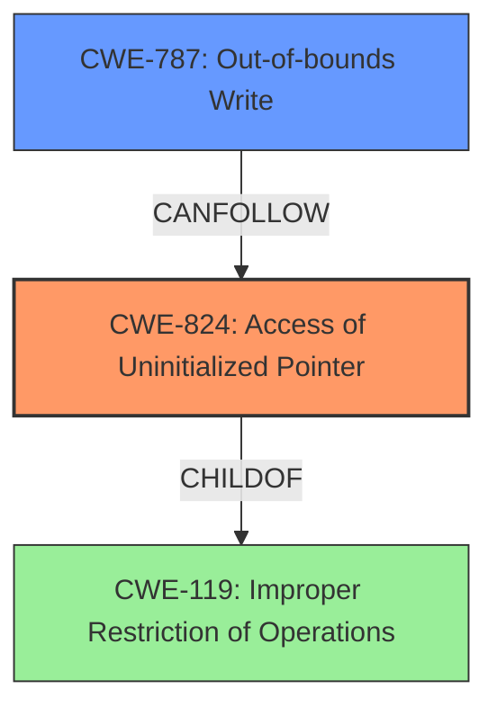

# Analysis Report for CVE-2022-28690

# Vulnerability Analysis Report: CVE-2022-28690

## Description

The affected product is vulnerable to an out-of-bounds write via uninitialized pointer, which may allow an attacker to execute arbitrary code.

## Vulnerability Description Key Phrases

**Rootcause:** uninitialized pointer
**Weakness:** out-of-bounds write
**Impact:** execute arbitrary code
**Attacker:** attacker

## Analysis (with Relationship Data)

# Summary
| CWE ID | CWE Name | Confidence | CWE Abstraction Level | CWE Vulnerability Mapping Label | CWE-Vulnerability Mapping Notes |
|---|---|---|---|---|---|
| CWE-824 | Access of Uninitialized Pointer | 0.95 | Base | Primary | Allowed |
| CWE-787 | Out-of-bounds Write | 0.85 | Base | Secondary | Allowed |

## Evidence and Confidence

*   **Confidence Score:** 0.90
*   **Evidence Strength:** HIGH

- **Analysis and Justification:**  
  - *Explanation:* The vulnerability description explicitly states an "**out-of-bounds write** via **uninitialized pointer**". This directly maps to two distinct weaknesses. The **uninitialized pointer** is the root cause, and **out-of-bounds write** is the direct consequence of it. Therefore, CWE-824 (Access of Uninitialized Pointer) is the primary weakness. The retriever results confirm this, with CWE-824 having the highest combined score. The description for CWE-824 perfectly aligns with the root cause: "The product accesses or uses a pointer that has not been initialized." MITRE mapping guidance indicates that using CWE-824 is ALLOWED. CWE-787 (Out-of-bounds Write) is a result of the **uninitialized pointer**, thus being a secondary weakness.
  
  - *Relationship Analysis:* CWE-824 can precede CWE-787, as an access of an **uninitialized pointer** can lead to an **out-of-bounds write**. The retriever results confirm that both CWE-824 and CWE-787 are high scoring candidates. The vulnerability description indicates a clear sequence of events: first, an **uninitialized pointer** is accessed, then an **out-of-bounds write** occurs, leading to arbitrary code execution.

- **Confidence Score:**
  - Confidence: 0.95 (High confidence due to direct evidence from the vulnerability description and supporting retriever results)

---

## Criticism of Analysis

Okay, here's a detailed review of the provided analysis, considering the full CWE specifications:

**Overall Assessment:**

The analysis is generally sound and well-reasoned. The primary and secondary CWE assignments (CWE-824 and CWE-787 respectively) are appropriate, given the vulnerability description. The confidence level of 0.95 is justifiable. The evidence provided is strong, directly referencing the vulnerability description and supported by the retriever results.

**Detailed Breakdown:**

1.  **CWE-824: Access of Uninitialized Pointer (Primary)**

    *   **Strengths:**
        *   The justification for selecting CWE-824 as the primary weakness is excellent. The analysis correctly identifies the "uninitialized pointer" as the *root cause* of the vulnerability.
        *   The analysis explicitly states the description of CWE-824 perfectly aligns with the root cause.
        *   The mapping guidance for CWE-824 explicitly states that its "Usage" is "Allowed" and the "Rationale" mentions that it is at the "Base level of abstraction, which is a preferred level of abstraction for mapping to the root causes of vulnerabilities." This is correctly considered in the analysis.
        *   The relationships section for CWE-824 lists `CanPrecede -> CWE-787`, which further supports the analysis, as **out-of-bounds write** is the direct consequence of the **uninitialized pointer**.

    *   **Possible Improvements (Minor):**
        *   While not strictly necessary, the analysis could briefly mention potential *exploitative* uses of an uninitialized pointer to further illustrate the significance of the weakness.  CWE-824's extended description hints at this: "If the uninitialized pointer is used as a function call, then arbitrary functions could be invoked. If an attacker can influence the portion of uninitialized memory that is contained in the pointer, this weakness could be leveraged to execute code or perform other attacks."

2.  **CWE-787: Out-of-bounds Write (Secondary)**

    *   **Strengths:**
        *   The analysis accurately identifies "out-of-bounds write" as a direct consequence of the uninitialized pointer, thus making it a suitable secondary weakness.
        *   The analysis correctly points out that the retriever results support the selection of CWE-787.
        *   The rationale clearly explains the *relationship* between CWE-824 and CWE-787.

    *   **Possible Improvements (Minor):**
        *   The analysis could briefly mention some potential mitigations for CWE-787. Given that CWE-787 is a consequence of CWE-824, addressing the root cause (CWE-824) is paramount, but defense-in-depth strategies, like those suggested in CWE-787's "Potential Mitigations" section, could be beneficial.

3.  **Confidence and Evidence:**

    *   The confidence score of 0.95 is reasonable. The analysis is well-structured, clearly articulates the reasoning behind the CWE assignments, and provides supporting evidence from the vulnerability description and retriever results.
    *   The "Evidence Strength" being "HIGH" is also appropriate.

4.  **Retriever Results:**

    *   The analysis correctly uses the Retriever Results to support the CWE selection.

**Specific Comments/Suggestions:**

*   **Consider Mitigations (Optional):** While the focus is on CWE assignment, briefly mentioning potential mitigations for both CWE-824 and CWE-787 could add value. For CWE-824, the most important mitigation is to always initialize pointers before using them.

*   **Relationship to CWE-119 (Optional):** While it's good to focus on the most specific CWEs, you could briefly acknowledge the potential relationship to CWE-119 (Improper Restriction of Operations within the Bounds of a Memory Buffer), which is a broader category that encompasses both out-of-bounds reads and writes. However, your choice to use the more specific CWE-787 is correct because the description clearly indicates an *out-of-bounds write*.

**Conclusion:**

This is a solid analysis. The CWE mappings are well-justified, and the reasoning is clear and consistent. The minor suggestions above are simply for further enhancement and are not critical to the overall quality of the analysis.

## Final Resolution

# Summary

| CWE ID | CWE Name | Confidence | CWE Abstraction Level | CWE Vulnerability Mapping Label | CWE-Vulnerability Mapping Notes |
|---|---|---|---|---|---|
| CWE-824 | Access of Uninitialized Pointer | 0.95 | Base | Primary | Allowed |
| CWE-787 | Out-of-bounds Write | 0.85 | Base | Secondary | Allowed |

## Evidence and Confidence

*   **Confidence Score:** 0.95
*   **Evidence Strength:** HIGH

## Relationship Analysis
The primary relationship influencing the decision is the CANPRECEDE relationship between CWE-824 (**Access of Uninitialized Pointer**) and CWE-787 (**Out-of-bounds Write**). This relationship accurately reflects the vulnerability description, where an uninitialized pointer leads to an out-of-bounds write. CWE-824 is a child of CWE-119 (**Improper Restriction of Operations within the Bounds of a Memory Buffer**), but choosing CWE-824 provides a more specific classification as it directly addresses the root cause.

## Vulnerability Chain
The vulnerability chain starts with the **ROOTCAUSE** being an **uninitialized pointer** (CWE-824). This allows the program to potentially access an arbitrary memory location. Dereferencing this **uninitialized pointer** leads to an **out-of-bounds write** (CWE-787), which can then result in arbitrary code execution.

## Summary of Analysis
The initial analysis and criticism are both accurate and well-supported by evidence from the vulnerability description. The description clearly states "out-of-bounds write via uninitialized pointer", which directly supports the selection of CWE-824 and CWE-787.

The graph relationships, particularly the CANPRECEDE relationship between CWE-824 and CWE-787, reinforces this decision. Selecting CWE-824 as the primary **WEAKNESS** accurately reflects the **ROOTCAUSE** of the vulnerability. The selection of these CWEs is at the optimal level of specificity because they directly address the flaws described in the vulnerability report. Higher level CWEs, such as CWE-119, would not be as precise in describing the root cause and consequence of this vulnerability.

The confidence remains high at 0.95 due to the explicit evidence in the vulnerability description and the confirming relationships between the selected CWEs.

*Report generated on 2025-03-18 12:31:06*
