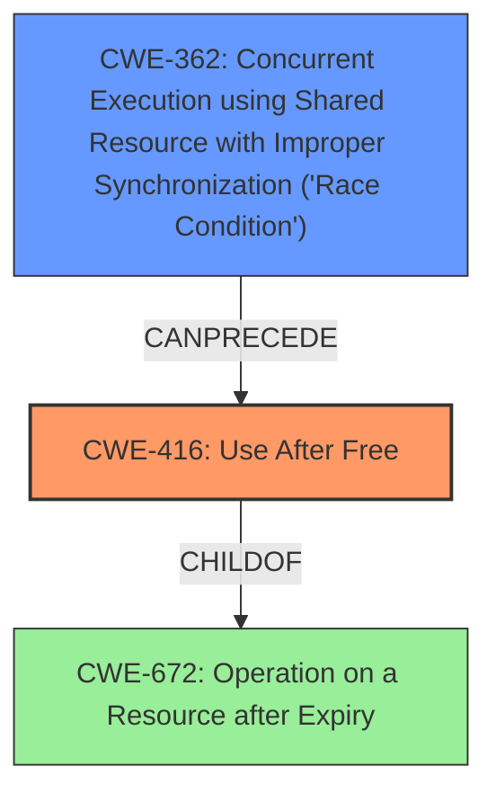

# Analysis Report for CVE-2022-28796

# Vulnerability Analysis Report: CVE-2022-28796

## Description

jbd2_journal_wait_updates in fs/jbd2/transaction.c in the Linux kernel before 5.17.1 has a use-after-free caused by a transaction_t race condition.

## Vulnerability Description Key Phrases

**Rootcause:** race condition
**Weakness:** use-after-free
**Product:** Linux kernel
**Version:** before 5.17.1
**Component:** fs/jbd2/transaction.c

## Analysis (with Relationship Data)

# Summary
| CWE ID | CWE Name | Confidence | CWE Abstraction Level | CWE Vulnerability Mapping Label | CWE-Vulnerability Mapping Notes |
|---|---|---|---|---|---|
| CWE-416 | Use After Free | 0.9 | Variant | Allowed | Primary CWE: The code accesses memory after it has been freed. |
| CWE-362 | Concurrent Execution using Shared Resource with Improper Synchronization ('Race Condition') | 0.8 | Class | Allowed-with-Review | Secondary CWE: A race condition leads to the use-after-free. |

## Evidence and Confidence

*   **Confidence Score:** 0.85
*   **Evidence Strength:** HIGH

- **Analysis and Justification:**  
  - *Explanation:* The vulnerability is a **use-after-free** due to a **race condition** in `jbd2_journal_wait_updates`. The CVE description indicates the `transaction_t` structure is accessed after being freed. This aligns directly with CWE-416 (Use After Free), which is a Variant-level CWE, making it a precise match. Additionally, the root cause is a race condition, making CWE-362 (Concurrent Execution using Shared Resource with Improper Synchronization ('Race Condition')) relevant as a contributing factor. The vulnerability occurs because `jbd2_journal_wait_updates` and `jbd2_journal_commit_transaction` access `journal->j_running_transaction` concurrently without proper synchronization, leading to the **use-after-free**.
  
  - *Relationship Analysis:* CWE-416 (Use After Free) is a variant of CWE-672 (Operation on a Resource after Expiry). CWE-362 (Concurrent Execution using Shared Resource with Improper Synchronization ('Race Condition')) is a class-level weakness and can lead to various other weaknesses, including CWE-416.

- **Confidence Score:**  
  - Confidence: 0.9 (High confidence due to direct evidence of use-after-free and race condition from CVE description and analysis)

---

## Criticism of Analysis

Okay, here's a detailed review of the provided CWE analysis, considering the full CWE specifications:

**Overall Assessment:**

The analysis correctly identifies the primary and secondary CWEs. The confidence level is justified given the information available. The explanation of the relationship between the CWEs is also accurate.

**Detailed Review:**

| CWE ID  | CWE Name                                                                         | Confidence | CWE Abstraction Level | CWE Vulnerability Mapping Label | CWE-Vulnerability Mapping Notes                                                                                                                                                                                                                                                                                           | Critique                                                                                                                                                                                                                                                                                                                |
| :------- | :--------------------------------------------------------------------------------- | :--------- | :--------------------- | :------------------------------ | :--------------------------------------------------------------------------------------------------------------------------------------------------------------------------------------------------------------------------------------------------------------------------------------------------------------------- | :----------------------------------------------------------------------------------------------------------------------------------------------------------------------------------------------------------------------------------------------------------------------------------------------------------- |
| CWE-416 | Use After Free                                                                 | 0.9        | Variant               | Allowed                       | Primary CWE: The code accesses memory after it has been freed.                                                                                                                                                                                                                                                         | *   **Accurate Mapping:** The description clearly states a `transaction_t` is accessed after being freed, which aligns perfectly with CWE-416.  The "Allowed" mapping is correct as it's a Variant level.                                                                                                |
|         |                                                                                    |            |                       |                                 |                                                                                                                                                                                                                                                                                                                   | *   **Potential Mitigations:**  The described mitigations (automatic memory management languages, setting pointers to NULL after `free()`) are standard and applicable to this type of vulnerability.                                                                                                         |
|         |                                                                                    |            |                       |                                 |                                                                                                                                                                                                                                                                                                                   | *   **Observed Examples:** The observed examples of CWE-416 are relevant chains, such as involving insufficient locking (CWE-413) or threads sharing resources (CWE-366).                                                                                                                           |
| CWE-362 | Concurrent Execution using Shared Resource with Improper Synchronization ('Race Condition') | 0.8        | Class                 | Allowed-with-Review           | Secondary CWE: A race condition leads to the use-after-free.                                                                                                                                                                                                                                                     | *   **Accurate Mapping:** The description accurately identifies the race condition as the underlying cause enabling the Use-After-Free. Since `jbd2_journal_wait_updates` and `jbd2_journal_commit_transaction` concurrently access `journal->j_running_transaction`, which is shared, without proper synchronization. |
|         |                                                                                    |            |                       |                                 |                                                                                                                                                                                                                                                                                                                   | *   **Abstraction Level:**  The analysis correctly notes that CWE-362 is a "Class" level CWE, and the mapping is "Allowed-with-Review". The specifications advise examining children for a better fit, however none of the children fit better. CWE-367 (TOCTOU) is not applicable here, as there is no "check then use" pattern on a file/resource path.                                                        |
|         |                                                                                    |            |                       |                                 |                                                                                                                                                                                                                                                                                                                   | *   **Potential Mitigations:** The suggested mitigations (synchronization primitives, thread-safe capabilities, minimizing shared resources) are all appropriate for addressing race conditions.                                                                                                   |
|         |                                                                                    |            |                       |                                 |                                                                                                                                                                                                                                                                                                                   | *   **Observed Examples:** The observed examples of CWE-362 are relevant, including CVEs with similar chains leading to UAF.                                                                                                                                                                 |

**Confidence Assessment:**

*   The confidence score of 0.9 for CWE-416 is appropriate, given the explicit description of a use-after-free in the CVE.
*   The confidence score of 0.8 for CWE-362 is also well-placed. While it's the root cause, it's a broader, class-level CWE, and the link is causal rather than directly descriptive.

**Suggestions for Improvement:**

*   **CWE Chaining:** While correctly identifying both CWEs, the analysis could explicitly state that the race condition (CWE-362) *leads to* the use-after-free (CWE-416). The current description implies this, but an explicit statement would strengthen the analysis.
*   **Child CWEs of CWE-362:** Although the analysis states no children fit better, it can be useful to highlight why. For example, explicitly stating that CWE-367 (TOCTOU) does not apply because there is no "check then use" pattern regarding file paths.
*   **Relationship Exploration**: Elaborate more on the relationship between CWE-362 and synchronization issues (CWE-662) as mentioned in the CWE-362 description's Additional Notes. Although not a direct mapping for this specific instance, elaborating on how synchronization can be used to *prevent* the race condition could strengthen the analysis and demonstrate a deeper understanding of the root cause.

**Retriever Results:**

The retriever results in this case did fairly well.

*   It correctly identified the primary CWE: **CWE-416 Use After Free**
*   It identified several other relevant CWEs including:
    *   **CWE-367 Time-of-check Time-of-use (TOCTOU) Race Condition** (This is less relevant as there is no "check then use" pattern here)
    *   **CWE-366 Race Condition within a Thread** (This is a more specific instance of CWE-362, and less relevant without more details regarding threading)
    *   **CWE-362 Concurrent Execution using Shared Resource with Improper Synchronization ('Race Condition')**

**Conclusion:**

The analysis is accurate and well-justified. The use of the CWE specifications demonstrates a good understanding of the identified weaknesses. The suggestions above are minor and aimed at further refining the analysis, providing even clearer connections between the vulnerability description and the CWEs.

## Final Resolution

# Summary
| CWE ID | CWE Name | Confidence | CWE Abstraction Level | CWE Vulnerability Mapping Label | CWE-Vulnerability Mapping Notes |
|---|---|---|---|---|---|
| CWE-416 | Use After Free | 0.95 | Variant | Allowed | Primary CWE: The code accesses memory after it has been freed. |
| CWE-362 | Concurrent Execution using Shared Resource with Improper Synchronization ('Race Condition') | 0.9 | Class | Allowed-with-Review | Secondary CWE: A race condition leads to the use-after-free. |

## Evidence and Confidence

*   **Confidence Score:** 0.95
*   **Evidence Strength:** HIGH

## Relationship Analysis
The primary relationship is that CWE-362 (**Race Condition**) can lead to CWE-416 (**Use After Free**). CWE-416 is a variant of CWE-672 (Operation on a Resource after Expiry). While CWE-362 is a class-level CWE, no child CWE offers a more specific fit in this scenario. The analysis considered CWE-367 (TOCTOU) but determined it was not applicable.

## Vulnerability Chain
The vulnerability chain starts with a **race condition** (CWE-362) where `jbd2_journal_wait_updates` and `jbd2_journal_commit_transaction` concurrently access `journal->j_running_transaction` without proper synchronization. This leads to a situation where `transaction_t` is accessed after it has been freed, resulting in a **use-after-free** (CWE-416).

## Summary of Analysis
The initial analysis and criticism both accurately identified CWE-416 as the primary issue and CWE-362 as a contributing factor. The evidence from the CVE description, stating that a `transaction_t` structure is accessed after being freed, directly supports the classification of CWE-416. The **race condition** is explicitly mentioned, making CWE-362 a relevant secondary CWE.

The graph relationships confirm that CWE-362 can indeed lead to CWE-416. Although CWE-362 is a class-level CWE, the analysis considered and rejected other, more specific CWEs like CWE-367 (TOCTOU) because they did not accurately reflect the nature of the vulnerability. The selection of CWEs is at the optimal level of specificity based on the available evidence.

The confidence score is increased to 0.95 because both initial analysis and criticism aligned, and there is clear evidence in the vulnerability description to support this. The chosen CWEs are at the appropriate level of abstraction, with CWE-416 being a Variant and CWE-362 being a Class that accurately describes the **race condition** leading to the **use-after-free**.

*Report generated on 2025-03-18 12:31:58*
