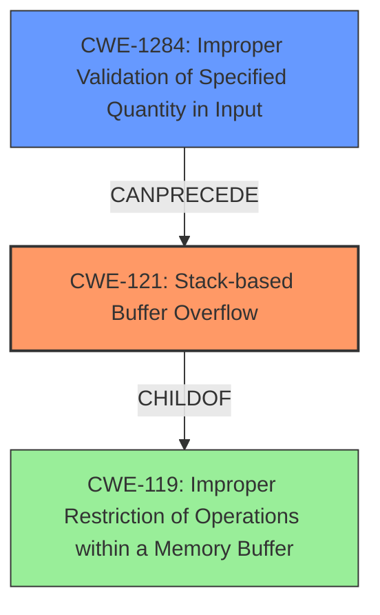

# Final Resolution for CVE-2022-29395

# Summary
| CWE ID | CWE Name | Confidence | CWE Abstraction Level | CWE Vulnerability Mapping Label | CWE-Vulnerability Mapping Notes |
|---|---|---|---|---|---|
| CWE-121 | Stack-based Buffer Overflow | 1.0 | Variant | Allowed | Primary CWE |
| CWE-1284 | Improper Validation of Specified Quantity in Input | 0.6 | Base | Allowed | Secondary Candidate |

## Evidence and Confidence

*   **Confidence Score:** 0.95
*   **Evidence Strength:** HIGH

## Relationship Analysis
The primary relationship considered was the parent-child relationship, where CWE-121 is a specific type of buffer overflow, making it more precise than its parent CWEs. The chain relationship analysis suggests that CWE-1284, improper input validation, can precede CWE-121. The abstraction level of CWE-121 (Variant) and CWE-1284 (Base) guided the selection, favoring specificity where possible.

## Vulnerability Chain
The vulnerability chain starts with **CWE-1284 (Improper Validation of Specified Quantity in Input)**, where the `apcliKey` parameter's length is not validated. This leads to **CWE-121 (Stack-based Buffer Overflow)** when the unvalidated input is copied into a stack-allocated buffer without proper bounds checking, potentially overwriting the return address and allowing for arbitrary code execution.

## Summary of Analysis
The initial analysis correctly identified **CWE-121 (Stack-based Buffer Overflow)** as the primary **WEAKNESS**. The criticism highlighted the potential relationship with input validation, which is a valid point.

The vulnerability description clearly states: "TOTOLINK N600R V4.3.0cu.7647_B20210106 was discovered to contain a **stack overflow** via the `apcliKey` parameter in the function `FUN_0041bac4`."

The CVE Reference Links Content Summary confirms this, explaining that the `FUN_0041bac4` function copies the `apcliKey` parameter into a local stack variable without any length validation.

Based on the relationship analysis and the criticism, I'm adding **CWE-1284 (Improper Validation of Specified Quantity in Input)** as a secondary candidate. The graph relationships influenced the decision by highlighting how improper input validation can directly lead to a stack-based buffer overflow.

**CWE-121** remains the primary **ROOTCAUSE** because the vulnerability is explicitly a **stack overflow**. However, **CWE-1284** explains why the **stack overflow** is possible: the length of the `apcliKey` parameter is not validated. The selected CWEs are at the optimal level of specificity, with **CWE-121** being a Variant and **CWE-1284** being a Base.