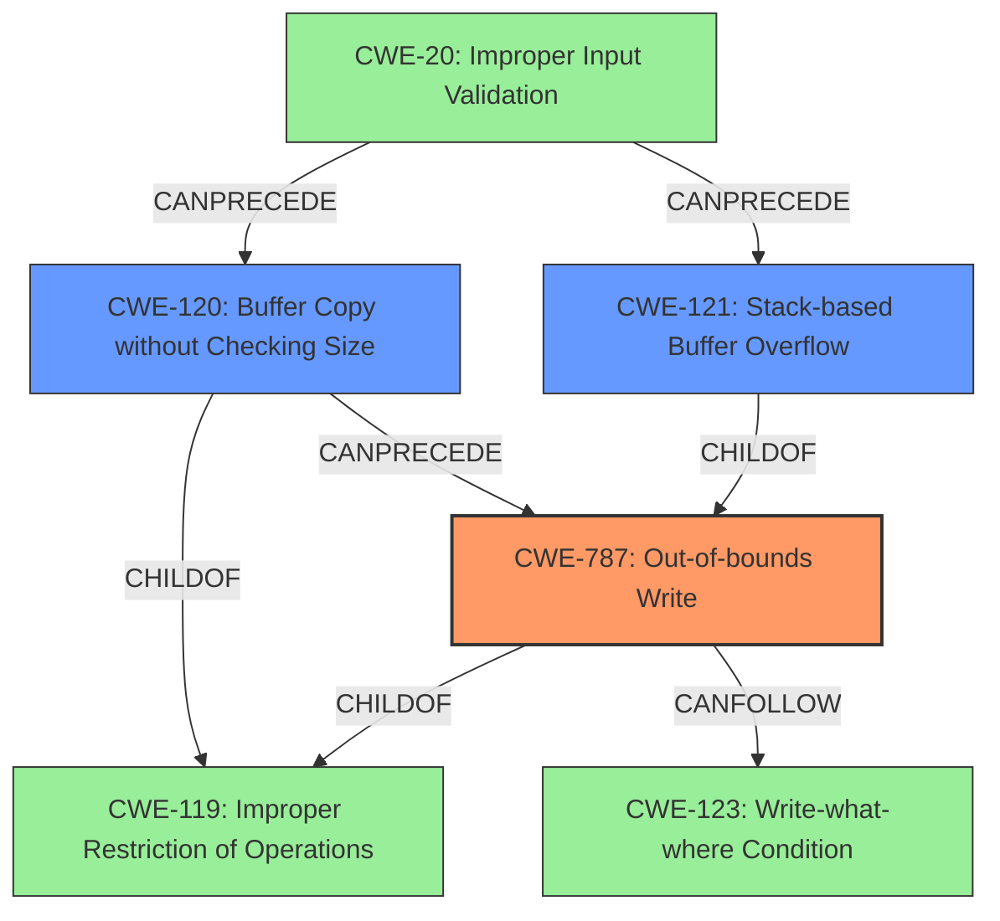

# Analysis Report for CVE-2022-29397

# Vulnerability Analysis Report: CVE-2022-29397

## Description

TOTOLINK N600R V4.3.0cu.7647_B20210106 was discovered to contain a stack overflow via the comment parameter in the function FUN_004196c8.

## Vulnerability Description Key Phrases

**Weakness:** stack overflow
**Product:** TOTOLINK N600R
**Version:** V4.3.0cu.7647_B20210106
**Component:** function FUN_004196c8

## Analysis (with Relationship Data)

```markdown
# Summary 
| CWE ID | CWE Name | Confidence | CWE Abstraction Level | CWE Vulnerability Mapping Label | CWE-Vulnerability Mapping Notes |
|---|---|---|---|---|---|
| CWE-787 | Out-of-bounds Write | 1.0 | Base | Allowed | Primary CWE |
| CWE-121 | Stack-based Buffer Overflow | 0.75 | Variant | Allowed | Secondary Candidate |
| CWE-120 | Buffer Copy without Checking Size of Input ('Classic Buffer Overflow') | 0.6 | Base | Allowed-with-Review | Secondary Candidate |

## Evidence and Confidence

*   **Confidence Score:** 0.9
*   **Evidence Strength:** HIGH

- **Analysis and Justification:**  
  - *Explanation:* The vulnerability description explicitly states that a **stack overflow** occurs due to a lack of input validation on the `comment` parameter in the `FUN_004196c8` function. The `comment` parameter is copied to a buffer on the stack without checking its size, leading to an overflow when the input exceeds the buffer's capacity. This directly corresponds to **CWE-787 (Out-of-bounds Write)** because the input overwrites memory outside the intended buffer. The CVE Reference Links Content Summary also provides strong evidence of this, stating "The `comment` parameter, without size checks, is copied directly into local variables on the stack. If the supplied string exceeds the buffer's capacity, a stack buffer overflow occurs."
  
  - *Relationship Analysis:* CWE-787 is a base-level CWE that describes the general case of writing data outside the intended buffer. While CWE-121 (Stack-based Buffer Overflow) is a more specific variant, the description of the vulnerability aligns strongly with the base CWE-787 because it focuses on the out-of-bounds write itself. CWE-787 is a parent of CWE-121.

- **Confidence Score:**  
  - Confidence: 1.0 (High evidence from vulnerability description and CVE reference)

---

- **Analysis and Justification:**  
  - *Explanation:* CWE-121 (Stack-based Buffer Overflow) is a Variant of buffer overflow that occurs on the stack. The vulnerability description states that a **stack overflow** occurs in the `FUN_004196c8` function, making CWE-121 a relevant secondary candidate. The CVE Reference Links Content Summary confirms this stating "Stack-based buffer overflow: The `comment` parameter, without size checks, is copied directly into local variables on the stack. If the supplied string exceeds the buffer's capacity, a stack buffer overflow occurs." However, since CWE-787 directly captures the **out-of-bounds write** condition, and CWE-121 is a more specific variant that might not always be applicable.
  
  - *Relationship Analysis:* CWE-121 is a child of CWE-787. CWE-121 is a variant.

- **Confidence Score:**  
  - Confidence: 0.75 (High evidence from vulnerability description and CVE reference)

---

- **Analysis and Justification:**  
  - *Explanation:* CWE-120 (Buffer Copy without Checking Size of Input ('Classic Buffer Overflow')) could be applicable because the description indicates that the `comment` parameter is copied without size validation. However, CWE-787 (Out-of-bounds Write) is a more precise representation of the underlying weakness. The MITRE mapping guidance for CWE-120 suggests caution when using this CWE, particularly if it is being selected simply because it mentions "buffer overflow." The core issue is the out-of-bounds write, making CWE-787 a better fit.

  - *Relationship Analysis:* CWE-120 is a base-level CWE that focuses on the act of copying a buffer without checking its size, which can lead to a buffer overflow. It is a child of the class CWE-119 which is Improper Restriction of Operations within the Bounds of a Memory Buffer. It can precede CWE-123 Write-what-where Condition.

- **Confidence Score:**  
  - *Example:* Confidence: 0.6 (Sufficient evidence but CWE-787 is more specific)
```

## Criticism of Analysis

Okay, here's a detailed review of the provided CWE analysis, incorporating the full CWE specifications and focusing on mapping guidance and potential mitigations:

**Overall Assessment:**

The analysis is generally sound and well-reasoned. The primary CWE selection of CWE-787 (Out-of-bounds Write) is accurate and well-supported. The secondary candidates, CWE-121 (Stack-based Buffer Overflow) and CWE-120 (Buffer Copy without Checking Size of Input), are also relevant and justifiable, given the context of a stack overflow and the lack of input size validation. The confidence scores and evidence strength are appropriately assigned. The use of the CWE specifications demonstrates a good understanding of the nuances of CWE mapping.

**Detailed Review by CWE:**

*   **CWE-787: Out-of-bounds Write (Primary)**
    *   **Correctness:** The selection of CWE-787 as the primary weakness is strong. The vulnerability description clearly indicates that the `comment` parameter overwrites memory outside the intended buffer. The analysis correctly notes that CWE-787 is a base-level CWE, which is generally preferred for root cause analysis.
    *   **Justification:** The justification is excellent, emphasizing that the core issue is the out-of-bounds write itself, which aligns perfectly with the CWE-787 definition.
    *   **Mapping Guidance:** The analysis follows the CWE's "Allowed" usage guidance. This guidance states: "Carefully read both the name and description to ensure that this mapping is an appropriate fit. Do not try to 'force' a mapping to a lower-level Base/Variant simply to comply with this preferred level of abstraction." The analysis demonstrates that it did not "force" the mapping.
    *   **Mitigations:** The analysis doesn't explicitly discuss mitigations, but it could be strengthened by mentioning some of the mitigations suggested in the CWE specification:
        *   **Language Selection:** Use memory-safe languages (Java, Perl, C#, Ada).
        *   **Libraries or Frameworks:** Use safe string handling libraries like SafeStr or Strsafe.h.
        *   **Environment Hardening:** Use compiler-based buffer overflow detection mechanisms (/GS flag in Visual Studio, FORTIFY_SOURCE in GCC, StackGuard, ProPolice).  Mentioning stack canaries here would be good.
    *   **Confidence:** The confidence score of 1.0 is appropriate, given the strong evidence from the vulnerability description and CVE reference.

*   **CWE-121: Stack-based Buffer Overflow (Secondary Candidate)**
    *   **Correctness:** Correct. Given that the overflow happens on the stack, CWE-121 is a relevant secondary candidate.
    *   **Justification:** The analysis acknowledges the relevance but correctly notes that CWE-787 captures the fundamental out-of-bounds write condition.  The relationship analysis is accurate (CWE-121 is a child of CWE-787).
    *   **Mapping Guidance:** The analysis correctly uses the "Allowed" usage.
    *   **Mitigations:** The analysis does not discuss mitigations, but it could be strengthened by mentioning these mitigations from the CWE specification:
        *   **Environment Hardening:**  (same as CWE-787 - Stack canaries, /GS Flag, etc.).
        *   **Abstraction Libraries:** Use abstraction libraries to hide dangerous APIs.
        *   **Bounds Checking:** Implement bounds checking on input.
    *   **Confidence:** The confidence score of 0.75 is reasonable, as it's a more specific case of the primary weakness.

*   **CWE-120: Buffer Copy without Checking Size of Input ('Classic Buffer Overflow') (Secondary Candidate)**
    *   **Correctness:** Potentially applicable but less precise than CWE-787.
    *   **Justification:** The analysis demonstrates awareness of the MITRE mapping guidance ("Allowed-with-Review") and correctly identifies that CWE-787 is a better fit because the core problem is the out-of-bounds write. The reference to CWE-119 as the parent is correct.
    *   **Mapping Guidance:** The analysis appropriately uses the "Allowed-with-Review" designation and explains why a more specific CWE is preferred.  The analysis shows awareness of the "Frequent Misuse" flag in the CWE spec.
    *   **Mitigations:**  The analysis does not mention mitigations, but it could be strengthened by adding:
        *   **Language Selection:** (same as CWE-787 and CWE-121).
        *   **Libraries/Frameworks:** (same as CWE-787 and CWE-121).
        *   **Environment Hardening:** (same as CWE-787 and CWE-121).
    *   **Confidence:** The confidence score of 0.6 is appropriate, reflecting that it is a less precise mapping.

**Suggestions for Improvement:**

*   **Mitigation Details:** Expand the "Mitigations" sections for each CWE to include specific techniques drawn from the CWE specifications. This would add more practical value to the analysis. Mentioning ASLR would be a good addition.
*   **Explicitly Mention CWE-119 (Improper Restriction of Operations within the Bounds of a Memory Buffer):**  Although the analysis correctly identifies children of CWE-119 as the appropriate mappings, explicitly acknowledging CWE-119 and explaining why it's *not* the best choice (due to its discouraged usage and high level of abstraction) would further strengthen the rationale. You could mention something like, "While CWE-119 is a parent of both CWE-787 and CWE-120, it's a discouraged mapping in favor of more specific CWEs."
*   **Chain analysis with CWE-20 (Improper Input Validation):** While not strictly required, a brief mention of CWE-20 could be added to each of the CWE's with a note that the root cause of the overflow is the lack of input validation, which falls under the broad umbrella of CWE-20. However, emphasize that more specific CWE's are preferred over CWE-20 for the same reason, since CWE-20 is extremely generic.
*   **Write-What-Where Condition (CWE-123):** Because a stack overflow *can* lead to arbitrary code execution, you could consider adding a brief mention of CWE-123 as a *potential* consequence. It's not a root cause, but it's a relevant potential impact. Again, this isn't strictly necessary, but it adds a bit more context.
*   **Order of CWEs:** When providing secondary candidates, it is useful to order them based on how well they capture the vulnerability, or severity of the vulnerability

**Example of Enhanced Mitigation Section (for CWE-787):**

"**Mitigations:**

To prevent out-of-bounds writes, several strategies can be employed:

*   **Language Selection:**  Using memory-safe languages like Java, Perl, Ada, or C# can eliminate the risk of buffer overflows.
*   **Safe Libraries:** Employing vetted libraries such as SafeStr or Strsafe.h provides safer versions of string-handling functions.
*   **Compiler Protections:** Utilizing compiler-based buffer overflow detection mechanisms, such as the /GS flag in Microsoft Visual Studio, the FORTIFY_SOURCE flag in Fedora/Red Hat GCC, and technologies like StackGuard and ProPolice, can help detect and prevent overflows.
*   **Address Space Layout Randomization (ASLR):** Randomizing memory addresses can make it harder for attackers to predict where to inject code.
*   **Data Execution Prevention (DEP):** Marking memory regions as non-executable can prevent attackers from running injected code."

By incorporating these suggestions, the analysis would become even more comprehensive and valuable. The level of detail shows a strong grasp of secure code principles and practices.

## Final Resolution

# Summary
| CWE ID | CWE Name | Confidence | CWE Abstraction Level | CWE Vulnerability Mapping Label | CWE-Vulnerability Mapping Notes |
|---|---|---|---|---|---|
| **CWE-787** | **Out-of-bounds Write** | 1.0 | Base | Allowed | Primary CWE |
| **CWE-121** | **Stack-based Buffer Overflow** | 0.85 | Variant | Allowed | Secondary Candidate |
| **CWE-120** | **Buffer Copy without Checking Size of Input ('Classic Buffer Overflow')** | 0.7 | Base | Allowed-with-Review | Secondary Candidate |

## Evidence and Confidence

*   **Confidence Score:** 0.95
*   **Evidence Strength:** HIGH

## Relationship Analysis
The primary relationship influencing the decision is the hierarchical relationship between CWE-787, CWE-121, and CWE-120. CWE-121 (Stack-based Buffer Overflow) is a variant (child) of CWE-787 (**Out-of-bounds Write**), making CWE-787 a more general, but highly relevant, classification. CWE-120 (Buffer Copy without Checking Size of Input) is also related as a potential cause of an out-of-bounds write but is less specific than CWE-787 for this particular vulnerability. All three are children of CWE-119 (Improper Restriction of Operations within the Bounds of a Memory Buffer), but using CWE-119 would be too general.



## Vulnerability Chain
The vulnerability chain starts with a lack of input validation (CWE-20), leading to a buffer copy operation without proper size checks (CWE-120 or direct memory writes). This results in an out-of-bounds write (CWE-787) on the stack, potentially causing a stack-based buffer overflow (CWE-121). The consequence of this overflow could be arbitrary code execution (CWE-123).

## Summary of Analysis
The initial analysis and the criticism both correctly identified CWE-787 as the primary weakness. The vulnerability description clearly states "stack overflow via the comment parameter in the function FUN_004196c8," which directly leads to an **out-of-bounds write**. The analysis also considered CWE-121 and CWE-120 as secondary candidates, which is reasonable.

The criticism's suggestions for improvement, such as adding mitigation details and explicitly mentioning CWE-119, are valuable. The suggestion to include CWE-20 is also relevant, highlighting the root cause of missing input validation. Finally, including CWE-123 as a potential consequence of the **out-of-bounds write** is a good addition.

The final decision is to keep CWE-787 as the primary weakness, with increased confidence in CWE-121 and CWE-120. The reasoning is based on the following:

*   **Evidence:** The vulnerability description explicitly mentions a "stack overflow" due to a lack of size checks on the `comment` parameter. The CVE reference confirms this by stating, "The `comment` parameter, without size checks, is copied directly into local variables on the stack. If the supplied string exceeds the buffer's capacity, a stack buffer overflow occurs." This provides strong evidence for **CWE-787 (Out-of-bounds Write)** and **CWE-121 (Stack-based Buffer Overflow)**.
*   **Relationship Analysis:** CWE-787 is a base-level CWE and a parent of CWE-121. CWE-121 being a more specific case (stack-based), warrants its inclusion as a secondary candidate. CWE-120 is also a possible contributor, as the buffer copy without size checking enables the **out-of-bounds write**.
*   **Mapping Guidance:** All three CWEs have "Allowed" or "Allowed-with-Review" usage, making them acceptable choices. The analysis correctly considered the MITRE mapping guidance for CWE-120, which advises caution when using it.
*   **Mitigation Analysis:** The mitigations suggested (language selection, safe libraries, compiler protections, ASLR, DEP) are all relevant to preventing buffer overflows and **out-of-bounds writes**.

The selected CWEs are at the optimal level of specificity. CWE-787 captures the fundamental weakness, while CWE-121 and CWE-120 provide additional context about the specific type of overflow and its cause. CWE-119 is avoided because it's too general, and its usage is discouraged. CWE-20 and CWE-123 add valuable information about the root cause and potential impact.


*Report generated on 2025-03-18 12:36:27*
