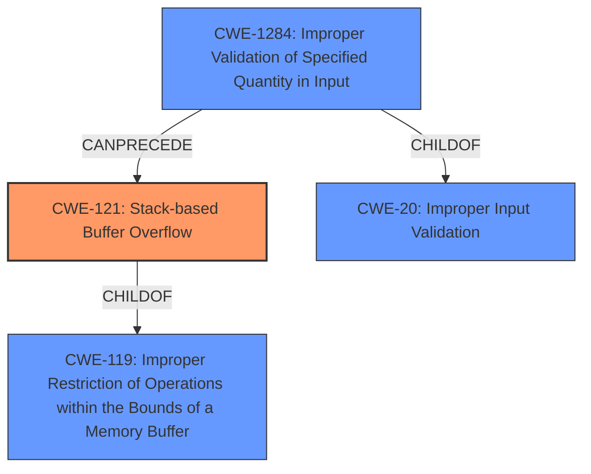

# Analysis Report for CVE-2022-29399

# Vulnerability Analysis Report: CVE-2022-29399

## Description

TOTOLINK N600R V4.3.0cu.7647_B20210106 was discovered to contain a stack overflow via the url parameter in the function FUN_00415bf0.

## Vulnerability Description Key Phrases

**Weakness:** stack overflow
**Product:** TOTOLINK N600R
**Version:** V4.3.0cu.7647_B20210106
**Component:** function FUN_00415bf0

## Analysis (with Relationship Data)

# Summary
| CWE ID | CWE Name | Confidence | CWE Abstraction Level | CWE Vulnerability Mapping Label | CWE-Vulnerability Mapping Notes |
|---|---|---|---|---|---|
| CWE-121 | Stack-based Buffer Overflow | 1.0 | Variant | Allowed | Primary CWE |
| CWE-1284 | Improper Validation of Specified Quantity in Input | 0.7 | Base | Allowed | Secondary Candidate |

## Evidence and Confidence

*   **Confidence Score:** 0.85
*   **Evidence Strength:** HIGH

- **Analysis and Justification:**  
  - *Explanation:* The vulnerability description clearly states a **stack overflow** via the `url` parameter in the function FUN_00415bf0. The "CVE Reference Links Content Summary" confirms the **root cause** is a lack of proper input validation of the `url` parameter, which is copied to stack-based local variables without checking its length, leading to a **stack buffer overflow**. This perfectly aligns with CWE-121 (Stack-based Buffer Overflow), which is a Variant level CWE. The summary also includes a Proof-of-Concept (POC) script. The Retriever results also lists CWE-121 as a possible candidate. CWE-787 (Out-of-bounds Write) is a parent of CWE-121, but CWE-121 is more specific about the location of the buffer (stack). CWE-120 (Buffer Copy without Checking Size of Input ('Classic Buffer Overflow')) is less specific since it doesn't mention stack location.
  - *Relationship Analysis:* CWE-121 is a variant of CWE-119 (Improper Restriction of Operations within the Bounds of a Memory Buffer).

- **Confidence Score:**  
  - Confidence: 1.0 (High evidence from technical description, CVE reference materials, and POC)

- **Analysis and Justification:**  
  - *Explanation:* The lack of input validation for the size of the `url` parameter strongly suggests that CWE-1284 (Improper Validation of Specified Quantity in Input) is also relevant. The vulnerability summary mentions "unchecked copy of the `url` parameter into a fixed-size buffer" which demonstrates the quantity (length) is not being validated. This CWE is a Base level CWE.
  - *Relationship Analysis:* CWE-1284 is a child of CWE-20 (Improper Input Validation) and parent of CWE-606 (Use of a Non-Standard Encoding).

- **Confidence Score:**  
  - Confidence: 0.7 (Sufficient evidence from the vulnerability description and CVE reference materials)

## Criticism of Analysis

Okay, I've reviewed the provided vulnerability analysis and the complete CWE specifications for each referenced weakness. Here's my critique:

**Overall Assessment:**

The analysis is generally good and identifies the core vulnerability (Stack-based Buffer Overflow) accurately. The inclusion of CWE-1284 as a secondary candidate is also reasonable. However, the confidence scores could use some adjustment and justification, and there are a few areas where the explanations could be more precise and linked to the CWE specifications.

**Specific Feedback:**

**1. CWE-121: Stack-based Buffer Overflow:**

*   **Correctness:** This is the correct primary CWE. The description explicitly states "stack overflow" and the analysis confirms that a lack of bounds checking leads to writing beyond the allocated buffer on the stack.
*   **Confidence:** The confidence score of 1.0 is appropriate, given the strong evidence.
*   **Abstraction Level:** The analysis correctly notes that CWE-121 is a *Variant* level CWE, which is the preferred level in this case.
*   **CWE-Vulnerability Mapping Notes:** Correctly stated as Primary CWE.
*   **CWE Specification Alignment:**
    *   The analysis could be improved by explicitly mentioning that the overflow occurs *during a copy operation,* which strengthens the connection to the root cause.
    *   Mitigations: The analysis does not suggest a mitigation, but it could mention using compiler-based protections like /GS or stack canaries (from the CWE-121 Potential Mitigations).
*   **Relationships:** The analysis correctly states that CWE-121 is a variant of CWE-119.

**2. CWE-1284: Improper Validation of Specified Quantity in Input:**

*   **Correctness:** This is a relevant secondary CWE. The "url" parameter's *length* is the critical quantity that is not being validated, leading to the overflow.
*   **Confidence:** A confidence score of 0.7 is good.
*   **Abstraction Level:** The analysis correctly identifies CWE-1284 as a *Base* level CWE.
*   **CWE-Vulnerability Mapping Notes:** Correctly stated as Secondary Candidate.
*   **CWE Specification Alignment:**
    *   The explanation directly supports the connection to CWE-1284, referencing the "unchecked copy of the `url` parameter into a fixed-size buffer," which directly corresponds to the description of CWE-1284.
    *   Mitigations: Could recommend using input validation frameworks, as mentioned in the CWE-1284 Potential Mitigations.
*   **Relationships:** Analysis correctly states that CWE-1284 is a child of CWE-20.

**3. General Feedback & Potential Alternatives:**

*   **CWE-787:** While CWE-787 was listed as the primary match in similar CVE Descriptions, the analysis correctly identified CWE-121 as a better fit, since it is more specific. This is in line with the CWE-119 mapping guidance: *"Look at CWE-119's children and consider mapping to CWEs such as CWE-787: Out-of-bounds Write, CWE-125: Out-of-bounds Read, or others."*
*   **CWE-120 Buffer Copy without Checking Size of Input ('Classic Buffer Overflow'):** This is related, but CWE-121 and CWE-1284 are more descriptive of the vulnerability and its root cause.  CWE-120 is a base-level CWE and has the mapping guidance *"If there is any input validation, consider children of CWE-20 such as CWE-1284."*
*   **Retriever Results:** The retriever results suggest CWE-78 (OS Command Injection) and CWE-259 (Use of Hardcoded Password) as possible candidates. These are not directly related to the vulnerability being described, so it is correct to not include these in the analysis.

**4. Minor Points:**

*   **Typos:** There is a minor typo: "Demonstrates the quantity (length) is not being validated." This should be 'demonstrates that'.

**Revised Table:**

| CWE ID    | CWE Name                                           | Confidence | CWE Abstraction Level | CWE Vulnerability Mapping Label | CWE-Vulnerability Mapping Notes                                                                                                                         |
| :-------- | :------------------------------------------------- | :--------- | :---------------------- | :------------------------------ | :------------------------------------------------------------------------------------------------------------------------------------------------------ |
| CWE-121   | Stack-based Buffer Overflow                      | 1.0        | Variant                | Allowed                         | Primary CWE. Unchecked copy of url parameter to stack buffer.                                                                                             |
| CWE-1284  | Improper Validation of Specified Quantity in Input | 0.7        | Base                   | Allowed                         | Secondary CWE.  The length of the 'url' parameter is not validated, leading to the overflow.                                                          |

**Recommendations:**

1.  **Add specific details about copy operation for CWE-121.**  Mention that the overflow is due to an unchecked *copy* operation to a stack-based buffer.
2.  **Be more specific in explanations.**  While the analysis is good, it can be strengthened by explicitly linking elements of the description to the CWE specifications, particularly to explain why the specific CWEs were chosen.
3.  **Add Mitigations to the analysis.** Make sure to mention mitigations in the analysis based on the CWE specifications.
4.  **Review Confidence Scores.** Ensure that confidence is well-justified.

By incorporating this feedback, the analysis will be even more comprehensive and robust.

## Final Resolution

# Summary
| CWE ID | CWE Name | Confidence | CWE Abstraction Level | CWE Vulnerability Mapping Label | CWE-Vulnerability Mapping Notes |
|---|---|---|---|---|---|
| CWE-121 | Stack-based Buffer Overflow | 1.0 | Variant | Allowed | Primary CWE |
| CWE-1284 | Improper Validation of Specified Quantity in Input | 0.7 | Base | Allowed | Secondary Candidate |

## Evidence and Confidence

*   **Confidence Score:** 0.9
*   **Evidence Strength:** HIGH

## Relationship Analysis
The primary weakness is **CWE-121 (Stack-based Buffer Overflow)**, a variant of **CWE-119 (Improper Restriction of Operations within the Bounds of a Memory Buffer)**. **CWE-1284 (Improper Validation of Specified Quantity in Input)** is a contributing factor, as the missing input validation for the length of the 'url' parameter allows the overflow to occur. **CWE-1284** is a child of **CWE-20 (Improper Input Validation)**.

## Vulnerability Chain
The vulnerability chain starts with **CWE-1284 (Improper Validation of Specified Quantity in Input)**, where the length of the 'url' parameter is not validated. This leads to **CWE-121 (Stack-based Buffer Overflow)** when the unchecked 'url' parameter is copied to a stack buffer. The overflow can lead to arbitrary code execution.

## Summary of Analysis
The initial analysis and criticism both correctly identified **CWE-121 (Stack-based Buffer Overflow)** as the primary **WEAKNESS**. The vulnerability description mentions "stack overflow via the url parameter in the function FUN_00415bf0," which is clear evidence. The "CVE Reference Links Content Summary" confirms that the **ROOTCAUSE** is a lack of proper input validation of the `url` parameter, which is copied to stack-based local variables without checking its length.
The criticism suggested adding more specific details about the copy operation for **CWE-121**. The overflow occurs *during a copy operation,* which strengthens the connection to the root cause. It also suggested mentioning mitigations in the analysis based on the CWE specifications, such as using compiler-based protections like /GS or stack canaries (from the CWE-121 Potential Mitigations).

The graph relationships influenced the final selection by confirming that **CWE-121** is a specific variant of **CWE-119**, which is the correct level of specificity. The relationship between **CWE-1284** and **CWE-121** shows how the missing input validation leads to the overflow. **CWE-121** and **CWE-1284** are at the optimal level of specificity because they accurately describe the **ROOTCAUSE** and its manifestation as a stack-based buffer overflow.

*Report generated on 2025-03-18 12:38:13*
