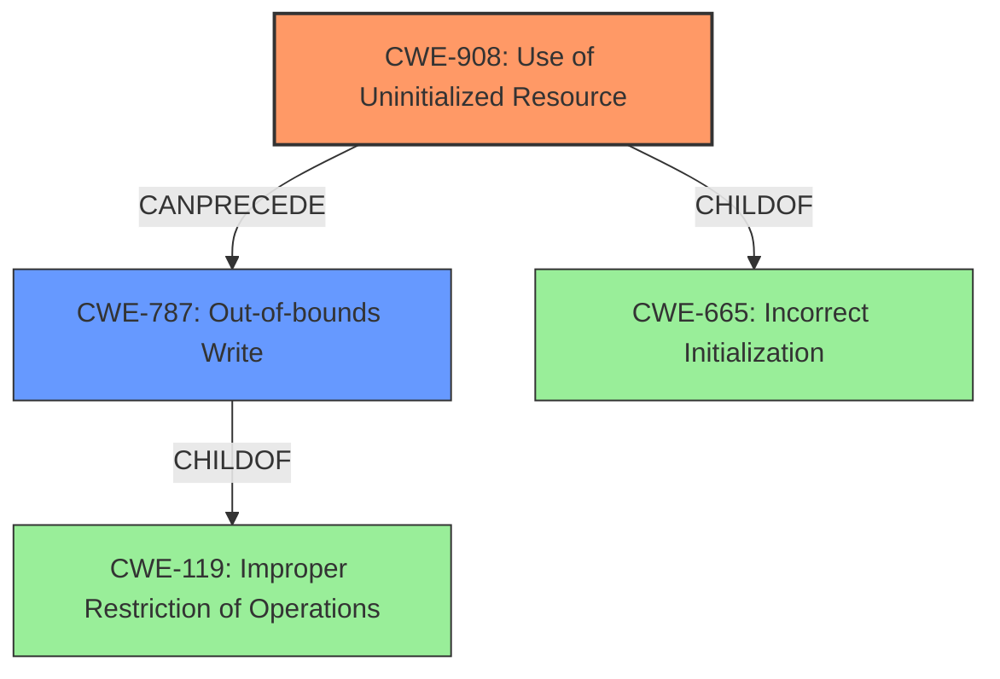

# Final Resolution for CVE-2022-2949

# Summary
| CWE ID  | CWE Name                        | Confidence | CWE Abstraction Level | CWE Vulnerability Mapping Label | CWE-Vulnerability Mapping Notes |
| :-------- | :------------------------------ | :--------- | :-------------------- | :------------------------------ | :------------------------------ |
| **CWE-908** | **Use of Uninitialized Resource** | 0.95      | Base                  | Allowed                         | Primary CWE                     |
| **CWE-787** | **Out-of-bounds Write**            | 0.75      | Base                  | Allowed                         | Secondary Candidate             |

## Evidence and Confidence

*   **Confidence Score:** 0.90
*   **Evidence Strength:** HIGH

## Relationship Analysis
The primary relationship is that **CWE-908 (Use of Uninitialized Resource)** leads directly to **CWE-787 (Out-of-bounds Write)**. The uninitialized DWORD is used as an index into a stack variable, causing a write beyond the intended boundaries. Both CWEs are at the Base level of abstraction, providing good specificity. The child-parent relationships of these CWEs to other Class and Pillar level CWEs were considered, but the base level provided the best fit.

## Vulnerability Chain
The vulnerability chain starts with the **ROOTCAUSE**: missing initialization of a memory buffer.
1.  **CWE-456 (Missing Initialization of a Variable)**: A memory buffer is not initialized.
2.  **CWE-908 (Use of Uninitialized Resource)**: A DWORD is extracted from this uninitialized buffer.
3.  **CWE-787 (Out-of-bounds Write)**: This DWORD, used as an index, causes an out-of-bounds write, leading to memory corruption.

## Summary of Analysis
The initial analysis and the criticism are both largely correct. The vulnerability description explicitly states the use of uninitialized memory, which aligns perfectly with **CWE-908 (Use of Uninitialized Resource)**. The criticism correctly points out that **CWE-787 (Out-of-bounds Write)** is a *consequence* of the **WEAKNESS**, stemming from the use of the uninitialized value as an index.

The graph relationships reinforced this decision. While CWE-456 and CWE-457 are related to initialization issues, **CWE-908** captures the direct act of *using* the uninitialized resource, which is the immediate cause of the subsequent out-of-bounds write. **CWE-787** appropriately describes the impact of the vulnerability.

The selected CWEs are at the optimal level of specificity because they directly address the core issues: the use of uninitialized data and the resulting out-of-bounds write. Using a Class-level CWE like CWE-665 (Incorrect Initialization) would be too general.