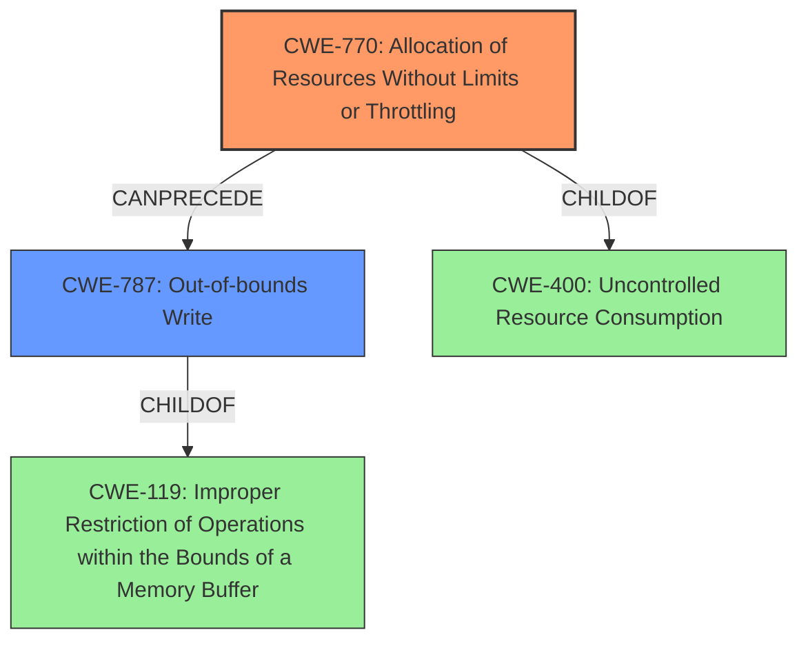

# Analysis Report for CVE-2022-29503

# Vulnerability Analysis Report: CVE-2022-29503

## Description

A memory corruption vulnerability exists in the libpthread linuxthreads functionality of uClibC 0.9.33.2 and uClibC-ng 1.0.40. Thread allocation can lead to memory corruption. An attacker can create threads to trigger this vulnerability.

## Vulnerability Description Key Phrases

**Rootcause:** improper memory management
**Weakness:** memory corruption
**Product:** uClibC
**Version:** ['0.9.33.2', '1.0.40']
**Component:** libpthread linuxthreads

## Analysis (with Relationship Data)

# Summary
| CWE ID | CWE Name | Confidence | CWE Abstraction Level | CWE Vulnerability Mapping Label | CWE-Vulnerability Mapping Notes |
|---|---|---|---|---|---|
| CWE-770 | Allocation of Resources Without Limits or Throttling | 0.85 | Base | Allowed | Primary CWE |
| CWE-119 | Improper Restriction of Operations within the Bounds of a Memory Buffer | 0.70 | Class | Allowed | Secondary Candidate CWE |

## Evidence and Confidence

*   **Confidence Score:** 0.80
*   **Evidence Strength:** HIGH

- **Analysis and Justification:**  
  - *Explanation:* The vulnerability description highlights a **memory corruption** issue in uClibC's libpthread due to thread allocation. The CVE reference summary explains that the root cause is the use of `mmap` with `MAP_FIXED` in `pthread_create`, which leads to overwriting existing memory mappings as threads are created without limits. This aligns with CWE-770 (Allocation of Resources Without Limits or Throttling), as the system allocates thread stacks without adequately restricting the size or number of allocations, violating intended security policies. The vulnerability description key phrases also point to **improper memory management**. While other CWEs like CWE-789 (Memory Allocation with Excessive Size Value) and CWE-190 (Integer Overflow or Wraparound) were considered based on retriever results, CWE-770 is the most accurate because it directly reflects the unlimited allocation of resources leading to the vulnerability. The fact that `MAP_FIXED` is used and the stacks can overwrite existing regions is also an important element.

  - *Relationship Analysis:* CWE-770 is a base-level CWE. It's related to CWE-400 (Uncontrolled Resource Consumption), but CWE-770 is more specific, focusing on the unlimited allocation aspect. CWE-770 can precede CWE-20 (Improper Input Validation) since the lack of limits on resource allocation can stem from improper input validation. Also CWE-770 is a parent of CWE-789 (Memory Allocation with Excessive Size Value).

- **Confidence Score:**
  - Confidence: 0.85 (High confidence due to clear technical details in the CVE reference summary and the alignment with CWE-770's characteristics.)

---

- **Analysis and Justification:**
  - *Explanation:* The CVE reference links content summary mentions "Improper Restriction of Operations within the Bounds of a Memory Buffer (CWE-119)". Since the **memory corruption** stems from overwriting memory regions, CWE-119 is applicable as a secondary weakness because the `mmap` operations are not properly restricted within the intended memory buffer bounds, leading to **memory corruption**. The allocation of thread stacks overwrites other memory regions, which directly violates the bounds of those regions.

  - *Relationship Analysis:* CWE-119 is a class-level CWE with many base and variant level CWEs. It's a parent of CWE-120 (Classic Buffer Overflow), CWE-121 (Stack-based Buffer Overflow), CWE-122 (Heap-based Buffer Overflow), and CWE-787 (Out-of-bounds Write). However, without specifics of stack or heap overflows a more specific variant cannot be assigned, thus the class level CWE-119 is assigned.

- **Confidence Score:**
  - Confidence: 0.70 (Moderate confidence as it is a consequence of improper resource allocation.)

## Criticism of Analysis

Okay, I've reviewed the provided analysis against the full CWE specifications for each referenced weakness. Here's my critique:

**Overall Assessment:**

The analysis is generally sound, and the primary CWE selection of CWE-770 is appropriate and well-justified. The secondary CWE of CWE-119 is also reasonable, although it could potentially be refined further to a more specific variant. The confidence levels assigned to each CWE seem appropriate given the information available.

**Detailed Critique:**

**1. CWE-770: Allocation of Resources Without Limits or Throttling (Primary CWE)**

*   **Assessment:** The selection of CWE-770 as the primary weakness is well-supported by the description. The CVE reference summary clearly indicates that the `pthread_create` function in uClibC and uClibC-ng allocates thread stacks using `mmap` with `MAP_FIXED` without imposing restrictions on the size or number of allocations. This directly aligns with the definition of CWE-770.
*   **Confidence Level:** The high confidence level (0.85) is justified.
*   **Justification:** The explanation provided in the analysis clearly articulates the relationship between the vulnerability's root cause (unlimited thread creation and stack allocation with `MAP_FIXED`) and the CWE-770 definition. It appropriately contrasts CWE-770 with other potential CWEs like CWE-789 and CWE-190, explaining why CWE-770 is more accurate in this case. The mention of `MAP_FIXED` usage emphasizes the significance of overwriting existing memory regions.
*   **Relationship Analysis:** The relationship analysis is accurate, pointing to CWE-400 as the parent of CWE-770.
*   **Mitigations:** The potential mitigations listed for CWE-770 are relevant. In this case, a throttling mechanism on thread creation would directly address the vulnerability.

**2. CWE-119: Improper Restriction of Operations within the Bounds of a Memory Buffer (Secondary CWE)**

*   **Assessment:** The selection of CWE-119 as a secondary weakness is appropriate because the core problem is that the stack allocations write *outside* the intended bounds of the memory region that *should* contain the stack. The use of `MAP_FIXED` forces the allocation to be at a specific address, bypassing any checks that would normally prevent an allocation from overwriting other memory regions. However, using the class-level CWE-119 is discouraged in the CWE documentation when a more specific child CWE is available.
*   **Confidence Level:** The moderate confidence level (0.70) is reasonable.
*   **Justification:** The explanation correctly identifies the relationship between the memory corruption and the overwriting of memory regions due to lack of bounds checking.
*   **Relationship Analysis:** The relationship analysis correctly identifies CWE-119 as a class-level CWE.

    *   **Refinement Possibility:** The root cause of the "memory corruption" is directly a write to an out-of-bounds address. This is a child of CWE-119 called **CWE-787: Out-of-bounds Write**. While it is true that heap or stack overflows might be present, the use of `MAP_FIXED` suggests the root cause is writing data past the *intended* region boundaries. The analysis should be updated to use CWE-787 instead of CWE-119 to provide better specificity. There is no information to support selection of the variant level CWE-121 (Stack Based Buffer Overflow) or CWE-122 (Heap Based Buffer Overflow).
*   **Mitigations:** The mitigations provided for CWE-119 are generally applicable (language selection, libraries, compiler extensions). However, more specific mitigations for out-of-bounds writes should be considered.

**3. Retriever Results**
The retriever results are mostly reasonable, but some require further explanation:

*   **CWE-190 (Integer Overflow or Wraparound):** The algorithm uses an integer value which is decremented for each thread creation. Although this algorithm itself is not validated to prevent integer overflow, the integer overflow isn't the reason the vulnerability is present. Thus it is not an accurate CWE for this vulnerability.
*   **CWE-789 (Memory Allocation with Excessive Size Value):**  This could be applicable as a consequence, in that the lack of throttling means an "excessive size value" is used for cumulative memory allocations, but CWE-770 is a more direct fit. This is especially true because thread stacks have a fixed size.
*   **CWE-787 (Out-of-bounds Write):** This is a child CWE of CWE-119 and I've recommended it be used instead of the class level CWE-119.
*   **CWE-366 (Race Condition within a Thread):** This is a multithreaded application, thus the retriever results are correct to report this candidate CWE. However, the race condition is not the root cause of the memory corruption. Thus this is not an accurate CWE for this vulnerability.
*    **CWE-415 (Double Free):** This CWE is not applicable because the vulnerability does not include freeing memory.
*    **CWE-416 (Use After Free):** This CWE is not applicable because the vulnerability does not include freeing memory.
*   **CWE-770 (Allocation of Resources Without Limits or Throttling):** The retriever result agrees with our selection of CWE-770 as the primary CWE.
*   **CWE-197 (Numeric Truncation Error):** This is not an accurate CWE for this vulnerability.
*   **CWE-134 (Use of Externally-Controlled Format String):** This is not an accurate CWE for this vulnerability.
*   **CWE-476 (NULL Pointer Dereference):** This is not an accurate CWE for this vulnerability.

**Recommendations:**

1.  **Replace CWE-119 with CWE-787:** Change the secondary CWE from CWE-119 to CWE-787 to provide a more specific mapping. This will also improve the accuracy of the analysis. The reason to use this CWE instead of the parent CWE-119 is that CWE-787 refers directly to writing past the end of a buffer.
2.  **Review Retriever Results:** While the automated analysis is helpful, it's essential to carefully evaluate each result to determine its relevance to the specific vulnerability. Don't blindly accept all top-ranked CWEs.
3.  **Expand Mitigation Discussion:** While the current mitigations are generally valid, consider adding more specific mitigations, particularly those related to limiting resource consumption and preventing out-of-bounds writes. Some system-level memory protection mechanisms (e.g., address space layout randomization, data execution prevention) could be mentioned as defense-in-depth measures.

By incorporating these suggestions, the analysis would be more precise and provide a more comprehensive understanding of the vulnerability.

## Final Resolution

# Summary
| CWE ID | CWE Name | Confidence | CWE Abstraction Level | CWE Vulnerability Mapping Label | CWE-Vulnerability Mapping Notes |
|---|---|---|---|---|---|
| **CWE-770** | Allocation of Resources Without Limits or Throttling | 0.90 | Base | Allowed | Primary CWE |
| **CWE-787** | Out-of-bounds Write | 0.80 | Base | Allowed | Secondary Candidate CWE |

## Evidence and Confidence

*   **Confidence Score:** 0.85
*   **Evidence Strength:** HIGH

## Relationship Analysis
The primary relationship impacting the decision was the parent-child relationship between **CWE-119** (Improper Restriction of Operations within the Bounds of a Memory Buffer) and **CWE-787** (Out-of-bounds Write). While **CWE-119** was initially selected, the criticism correctly identified that **CWE-787** is a more specific and accurate representation of the **memory corruption** occurring due to the uncontrolled resource allocation. **CWE-770** (Allocation of Resources Without Limits or Throttling) is the root cause, leading to the out-of-bounds write. **CWE-770** is a child of **CWE-400** (Uncontrolled Resource Consumption).

## Vulnerability Chain
The vulnerability chain starts with **CWE-770** (Allocation of Resources Without Limits or Throttling), where the system allocates thread stacks without any restrictions. This lack of control leads to **CWE-787** (Out-of-bounds Write) as the `mmap` with `MAP_FIXED` overwrites existing memory regions. The ultimate impact is **memory corruption**, leading to potential system instability or attacker-controlled code execution.

**CWE-770** (Root Cause) -> **CWE-787** (Direct Consequence and Write-what-where) -> **Memory Corruption** (Impact)

## Summary of Analysis
The initial analysis correctly identified **CWE-770** (Allocation of Resources Without Limits or Throttling) as the primary **weakness**, supported by the CVE reference summary mentioning the uncontrolled thread creation and stack allocation using `mmap` with `MAP_FIXED`. The criticism highlighted that **CWE-119** (Improper Restriction of Operations within the Bounds of a Memory Buffer) was too general and that **CWE-787** (Out-of-bounds Write) is a more specific and accurate representation of the **memory corruption** caused by overwriting memory regions.

The graph relationships influenced the final selection by emphasizing the importance of specificity. While **CWE-119** encompasses the general concept of memory boundary violations, **CWE-787** directly describes the act of writing beyond the intended buffer, which is the precise mechanism of the **memory corruption** in this vulnerability.

The selected CWEs are at the optimal level of specificity because they accurately reflect the root cause and the direct consequence of the vulnerability. **CWE-770** describes the uncontrolled resource allocation, and **CWE-787** describes the out-of-bounds write that leads to **memory corruption**.

*Report generated on 2025-03-18 12:44:44*
