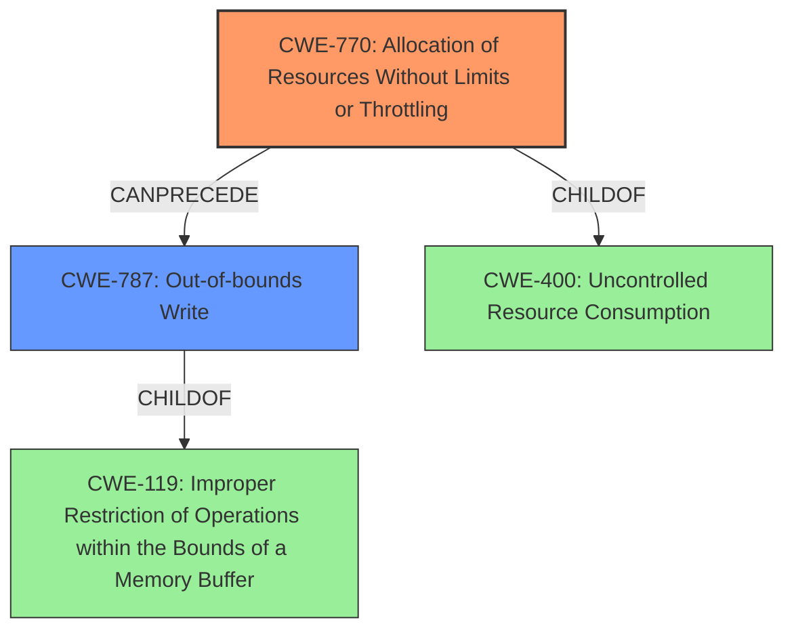

# Final Resolution for CVE-2022-29503

# Summary
| CWE ID | CWE Name | Confidence | CWE Abstraction Level | CWE Vulnerability Mapping Label | CWE-Vulnerability Mapping Notes |
|---|---|---|---|---|---|
| **CWE-770** | Allocation of Resources Without Limits or Throttling | 0.90 | Base | Allowed | Primary CWE |
| **CWE-787** | Out-of-bounds Write | 0.80 | Base | Allowed | Secondary Candidate CWE |

## Evidence and Confidence

*   **Confidence Score:** 0.85
*   **Evidence Strength:** HIGH

## Relationship Analysis
The primary relationship impacting the decision was the parent-child relationship between **CWE-119** (Improper Restriction of Operations within the Bounds of a Memory Buffer) and **CWE-787** (Out-of-bounds Write). While **CWE-119** was initially selected, the criticism correctly identified that **CWE-787** is a more specific and accurate representation of the **memory corruption** occurring due to the uncontrolled resource allocation. **CWE-770** (Allocation of Resources Without Limits or Throttling) is the root cause, leading to the out-of-bounds write. **CWE-770** is a child of **CWE-400** (Uncontrolled Resource Consumption).

## Vulnerability Chain
The vulnerability chain starts with **CWE-770** (Allocation of Resources Without Limits or Throttling), where the system allocates thread stacks without any restrictions. This lack of control leads to **CWE-787** (Out-of-bounds Write) as the `mmap` with `MAP_FIXED` overwrites existing memory regions. The ultimate impact is **memory corruption**, leading to potential system instability or attacker-controlled code execution.

**CWE-770** (Root Cause) -> **CWE-787** (Direct Consequence and Write-what-where) -> **Memory Corruption** (Impact)

## Summary of Analysis
The initial analysis correctly identified **CWE-770** (Allocation of Resources Without Limits or Throttling) as the primary **weakness**, supported by the CVE reference summary mentioning the uncontrolled thread creation and stack allocation using `mmap` with `MAP_FIXED`. The criticism highlighted that **CWE-119** (Improper Restriction of Operations within the Bounds of a Memory Buffer) was too general and that **CWE-787** (Out-of-bounds Write) is a more specific and accurate representation of the **memory corruption** caused by overwriting memory regions.

The graph relationships influenced the final selection by emphasizing the importance of specificity. While **CWE-119** encompasses the general concept of memory boundary violations, **CWE-787** directly describes the act of writing beyond the intended buffer, which is the precise mechanism of the **memory corruption** in this vulnerability.

The selected CWEs are at the optimal level of specificity because they accurately reflect the root cause and the direct consequence of the vulnerability. **CWE-770** describes the uncontrolled resource allocation, and **CWE-787** describes the out-of-bounds write that leads to **memory corruption**.