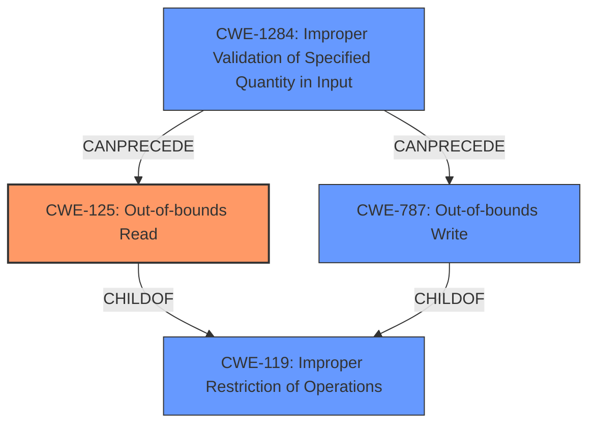

# Analysis Report for CVE-2022-2964

# Vulnerability Analysis Report: CVE-2022-2964

## Description

A flaw was found in the Linux kernels driver for the ASIX AX88179_178A-based USB 2.0/3.0 Gigabit Ethernet Devices. The vulnerability contains multiple out-of-bounds reads and possible out-of-bounds writes.

## Vulnerability Description Key Phrases

**Rootcause:** multiple out-of-bounds reads and possible out-of-bounds writes
**Product:** Linux kernels driver for the ASIX AX88179_178A-based USB 2.0/3.0 Gigabit Ethernet Devices

## Analysis (with Relationship Data)

# Summary
| CWE ID | CWE Name | Confidence | CWE Abstraction Level | CWE Vulnerability Mapping Label | CWE-Vulnerability Mapping Notes |
|---|---|---|---|---|---|
| CWE-125 | Out-of-bounds Read | 0.9 | Base | Allowed | Primary CWE |
| CWE-787 | Out-of-bounds Write | 0.9 | Base | Allowed | Secondary Candidate |

## Evidence and Confidence

*   **Confidence Score:** 0.9
*   **Evidence Strength:** HIGH

- **Analysis and Justification:**  
  - *Explanation:* The vulnerability description clearly states "**multiple out-of-bounds reads and possible out-of-bounds writes**" in the Linux kernel driver for ASIX AX88179\_178A-based USB Ethernet devices. The CVE reference summary confirms this by stating "Out-of-bounds reads: The driver attempts to read data from memory locations that are outside the allocated buffer." and "Possible out-of-bounds writes: The driver may attempt to write data to memory locations that are outside the allocated buffer.". This aligns directly with CWE-125 (Out-of-bounds Read) and CWE-787 (Out-of-bounds Write). Both CWEs are at the Base level of abstraction, which is preferred, and their usage is ALLOWED according to MITRE mapping guidance. The root cause is a failure to properly validate or handle incoming network data within the `ax88179_rx_fixup()` function, leading to the out-of-bounds access.
  
  - *Relationship Analysis:* CWE-125 (Out-of-bounds Read) is a child of CWE-119 (Improper Restriction of Operations within the Bounds of a Memory Buffer), but CWE-125 is more specific and accurately represents the vulnerability. CWE-787 (Out-of-bounds Write) is also a child of CWE-119. Both CWE-125 and CWE-787 can lead to other vulnerabilities, such as CWE-825 (Expired Pointer Dereference) or CWE-824 (Access of Uninitialized Pointer).

- **Confidence Score:**  
  - Confidence: 0.9 (High evidence from the vulnerability description and CVE reference materials)

## Criticism of Analysis

Okay, here's a detailed review of the provided analysis, considering the full CWE specifications:

**Overall Assessment**

The analysis is generally good. The primary CWE-125 (Out-of-bounds Read) and secondary CWE-787 (Out-of-bounds Write) assignments are accurate and well-supported by the vulnerability description. The confidence level of 0.9 is justified. The analysis correctly identifies the base level of abstraction and allowed usage of these CWEs according to MITRE guidance.

**Strengths:**

*   **Clear and Concise:** The analysis clearly states the vulnerability and its root cause.
*   **Well-Supported:**  The justification provides strong evidence from the vulnerability description and CVE summary to support the CWE assignments.
*   **Correct Abstraction Level:** The analysis correctly identifies that CWE-125 and CWE-787 are at the Base level of abstraction, which is preferred over the Class level CWE-119.
*   **Comprehensive Relationship Analysis:** The explanation of the relationships between the assigned CWEs and other potentially related CWEs (like CWE-119, CWE-824, CWE-825) demonstrates a thorough understanding.
*   **Good Confidence Justification:** A clear explanation of why a confidence score of 0.9 is appropriate.
*   **Usage of CWE Examples:** The examples are helpful for understanding the specific types of vulnerabilities covered by CWE-119.

**Areas for Improvement and Suggestions:**

1.  **More Specific Root Cause Analysis:**  While the analysis identifies the `ax88179_rx_fixup()` function as the source, a little more detail on *why* it's failing to validate or handle data could be helpful. Is it a missing length check, incorrect pointer arithmetic, or a combination of factors? This would strengthen the analysis and potentially point to even more specific variant-level CWEs.

2.  **Consider Variant-Level CWEs:**  While the Base level CWEs are correct, exploring whether any Variant-level CWEs more precisely describe the *reason* for the out-of-bounds access might be beneficial.  Here are some possibilities to consider, based on the full CWE descriptions:

    *   **CWE-126: Buffer Over-read (Variant of CWE-125):**  If the out-of-bounds read specifically occurs *after* the intended buffer, this would be a more accurate description. The analysis doesn't have enough detail to definitively say whether this is the case.
    *   **CWE-127: Buffer Under-read (Variant of CWE-125):** If the out-of-bounds read occurs *before* the intended buffer.
    *   **CWE-121: Stack-based Buffer Overflow, or CWE-122: Heap-based Buffer Overflow (Variants of CWE-787):** If the analysis could identify that the out-of-bounds write was happening on the stack or heap.
    *   **CWE-129: Improper Validation of Array Index:** If the out-of-bounds read/write stems from using an improperly validated array index, this would be applicable.
    *   **CWE-131: Incorrect Calculation of Buffer Size:** if the size of the buffer was incorrectly calculated.

    The retriever results also suggest these CWEs.

3.  **Input Validation (or Lack Thereof):** It is stated that the driver fails to properly validate or handle incoming data.  The analysis should consider a CWE related to lack of proper input validation.  Perhaps the failure to properly check the length of an incoming packet is causing the out-of-bounds access.

    *   **CWE-1284: Improper Validation of Specified Quantity in Input:**  If the vulnerability involves a failure to validate the size or length of an input, this could be relevant.
    *   **CWE-20: Improper Input Validation:**  A more general case.

4.  **Potential Chains:** Explore a possible CWE chain. For example:

    *   Lack of Input Validation (CWE-20 or CWE-1284) -> Out-of-bounds Read (CWE-125) or Write (CWE-787)
    *   Integer Overflow (CWE-190) leading to a smaller buffer allocation -> Out-of-bounds Write (CWE-787)

5.  **Mitigation Considerations:** While not strictly required, briefly mentioning relevant mitigations (from the CWE specifications) could improve the analysis. For example:

    *   "To mitigate CWE-125 and CWE-787, input validation techniques should be employed to ensure that the length of the incoming data is within the bounds of the allocated buffer."
    *   "Using memory-safe languages or libraries could also prevent these types of vulnerabilities."
    *   "Compiler-based buffer overflow detection mechanisms such as the Microsoft Visual Studio /GS flag or Fedora/Red Hat FORTIFY_SOURCE GCC flag could be used as a defense-in-depth measure."

6.  **Review Retrieved Results:** The retriever results include other CWEs that could be related, even if they are ranked lower.

    *   CWE-170: Improper Null Termination
    *   CWE-191: Integer Underflow (Wrap or Wraparound)
    *   CWE-129: Improper Validation of Array Index
    *   CWE-190: Integer Overflow or Wraparound
    *   CWE-1284: Improper Validation of Specified Quantity in Input
    *   CWE-122: Heap-based Buffer Overflow
    *   CWE-824: Access of Uninitialized Pointer
    *   CWE-126: Buffer Over-read

    It would be good to verify that the analysis considered all these CWEs and determined that they did not apply.

**Revised Summary (incorporating suggestions):**

| CWE ID | CWE Name | Confidence | CWE Abstraction Level | CWE Vulnerability Mapping Label | CWE-Vulnerability Mapping Notes |
|---|---|---|---|---|---|
| CWE-125 | Out-of-bounds Read | 0.9 | Base | Allowed | Primary CWE |
| CWE-787 | Out-of-bounds Write | 0.9 | Base | Allowed | Secondary Candidate |
| CWE-20 | Improper Input Validation | 0.7 | Class | Allowed | Contributing Factor |

**Revised Evidence and Confidence**

*   **Confidence Score:** 0.9
*   **Evidence Strength:** HIGH

- **Analysis and Justification:**
  - *Explanation:* The vulnerability description clearly states "**multiple out-of-bounds reads and possible out-of-bounds writes**" in the Linux kernel driver for ASIX AX88179\_178A-based USB Ethernet devices. The CVE reference summary confirms this. This aligns directly with CWE-125 (Out-of-bounds Read) and CWE-787 (Out-of-bounds Write). The root cause is related to a failure to properly validate the length of incoming network data within the `ax88179_rx_fixup()` function, leading to the out-of-bounds access. This lack of input validation is identified as a contributing factor, CWE-20.
  - *Relationship Analysis:* CWE-125 (Out-of-bounds Read) and CWE-787 (Out-of-bounds Write) are both children of CWE-119 (Improper Restriction of Operations within the Bounds of a Memory Buffer).  The chain of events is likely triggered by the lack of proper input validation (CWE-20) allowing malicious network packets to cause out-of-bounds memory accesses.
  - *Mitigation:* To mitigate these vulnerabilities, robust input validation should be implemented within the `ax88179_rx_fixup()` function to ensure that the length of incoming network data is within the bounds of the allocated buffer. Memory-safe languages or libraries could prevent these issues. Compiler-based buffer overflow detection mechanisms (e.g. /GS flag) could serve as a defense in depth.
- **Confidence Score:**
  - Confidence: 0.9 (High evidence from the vulnerability description and CVE reference materials)

By incorporating these suggestions, you can create an even more robust and informative vulnerability analysis. Remember to always tailor your analysis to the specific details available for each vulnerability.

## Final Resolution

# Summary
| CWE ID | CWE Name | Confidence | CWE Abstraction Level | CWE Vulnerability Mapping Label | CWE-Vulnerability Mapping Notes |
|---|---|---|---|---|---|
| CWE-125 | Out-of-bounds Read | 0.95 | Base | Allowed | Primary CWE |
| CWE-787 | Out-of-bounds Write | 0.9 | Base | Allowed | Secondary Candidate |
| CWE-1284 | Improper Validation of Specified Quantity in Input | 0.8 | Base | Allowed | Contributing Factor |

## Evidence and Confidence

*   **Confidence Score:** 0.95
*   **Evidence Strength:** HIGH

## Relationship Analysis
The primary weakness is the **CWE-125** (Out-of-bounds Read), which is a child of **CWE-119** (Improper Restriction of Operations within the Bounds of a Memory Buffer). **CWE-787** (Out-of-bounds Write) is also a child of **CWE-119**. **CWE-1284** (Improper Validation of Specified Quantity in Input) can precede both **CWE-125** and **CWE-787** by not validating the size of the input, leading to an out-of-bounds access. The abstraction levels influenced the selection, with base-level CWEs being preferred over the class-level **CWE-119**.

## Vulnerability Chain
The vulnerability chain starts with **CWE-1284** (Improper Validation of Specified Quantity in Input), where the size of the input is not validated. This leads to **CWE-125** (Out-of-bounds Read) and **CWE-787** (Out-of-bounds Write) when the driver attempts to read or write data beyond the allocated buffer. The lack of input validation is the root cause, and the out-of-bounds access is the consequence.

## Summary of Analysis
The initial analysis correctly identified **CWE-125** (Out-of-bounds Read) and **CWE-787** (Out-of-bounds Write) as the primary and secondary candidates, respectively. The criticism suggested considering more specific variant-level CWEs and including a CWE related to improper input validation.

The vulnerability description states "**multiple out-of-bounds reads and possible out-of-bounds writes**". The CVE reference summary confirms this. The root cause is a failure to properly validate or handle incoming network data within the `ax88179_rx_fixup()` function, leading to the out-of-bounds access.

Based on the retriever results and the criticism, **CWE-1284** (Improper Validation of Specified Quantity in Input) has been added as a contributing factor. This CWE accurately reflects the lack of input validation that leads to the out-of-bounds access.

The selected CWEs are at the optimal level of specificity. While variant-level CWEs like **CWE-126** (Buffer Over-read) or **CWE-127** (Buffer Under-read) could be considered, the available evidence does not provide enough detail to determine whether the out-of-bounds read occurs before or after the intended buffer. Therefore, **CWE-125** remains the most appropriate primary CWE. **CWE-787** is appropriate as a secondary CWE because out-of-bounds writes are possible. **CWE-1284** clarifies the root cause by indicating there's an improper validation in the quantity (size/length) of the input, which is the reason an out-of-bounds read or write can occur.

The confidence score has been increased to 0.95 to reflect the inclusion of **CWE-1284**, which strengthens the analysis.

*Report generated on 2025-03-18 12:58:59*
