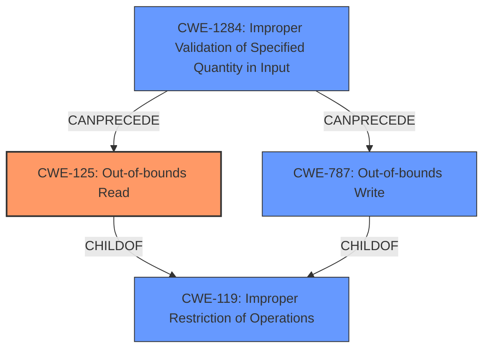

# Final Resolution for CVE-2022-2964

# Summary
| CWE ID | CWE Name | Confidence | CWE Abstraction Level | CWE Vulnerability Mapping Label | CWE-Vulnerability Mapping Notes |
|---|---|---|---|---|---|
| CWE-125 | Out-of-bounds Read | 0.95 | Base | Allowed | Primary CWE |
| CWE-787 | Out-of-bounds Write | 0.9 | Base | Allowed | Secondary Candidate |
| CWE-1284 | Improper Validation of Specified Quantity in Input | 0.8 | Base | Allowed | Contributing Factor |

## Evidence and Confidence

*   **Confidence Score:** 0.95
*   **Evidence Strength:** HIGH

## Relationship Analysis
The primary weakness is the **CWE-125** (Out-of-bounds Read), which is a child of **CWE-119** (Improper Restriction of Operations within the Bounds of a Memory Buffer). **CWE-787** (Out-of-bounds Write) is also a child of **CWE-119**. **CWE-1284** (Improper Validation of Specified Quantity in Input) can precede both **CWE-125** and **CWE-787** by not validating the size of the input, leading to an out-of-bounds access. The abstraction levels influenced the selection, with base-level CWEs being preferred over the class-level **CWE-119**.

## Vulnerability Chain
The vulnerability chain starts with **CWE-1284** (Improper Validation of Specified Quantity in Input), where the size of the input is not validated. This leads to **CWE-125** (Out-of-bounds Read) and **CWE-787** (Out-of-bounds Write) when the driver attempts to read or write data beyond the allocated buffer. The lack of input validation is the root cause, and the out-of-bounds access is the consequence.

## Summary of Analysis
The initial analysis correctly identified **CWE-125** (Out-of-bounds Read) and **CWE-787** (Out-of-bounds Write) as the primary and secondary candidates, respectively. The criticism suggested considering more specific variant-level CWEs and including a CWE related to improper input validation.

The vulnerability description states "**multiple out-of-bounds reads and possible out-of-bounds writes**". The CVE reference summary confirms this. The root cause is a failure to properly validate or handle incoming network data within the `ax88179_rx_fixup()` function, leading to the out-of-bounds access.

Based on the retriever results and the criticism, **CWE-1284** (Improper Validation of Specified Quantity in Input) has been added as a contributing factor. This CWE accurately reflects the lack of input validation that leads to the out-of-bounds access.

The selected CWEs are at the optimal level of specificity. While variant-level CWEs like **CWE-126** (Buffer Over-read) or **CWE-127** (Buffer Under-read) could be considered, the available evidence does not provide enough detail to determine whether the out-of-bounds read occurs before or after the intended buffer. Therefore, **CWE-125** remains the most appropriate primary CWE. **CWE-787** is appropriate as a secondary CWE because out-of-bounds writes are possible. **CWE-1284** clarifies the root cause by indicating there's an improper validation in the quantity (size/length) of the input, which is the reason an out-of-bounds read or write can occur.

The confidence score has been increased to 0.95 to reflect the inclusion of **CWE-1284**, which strengthens the analysis.