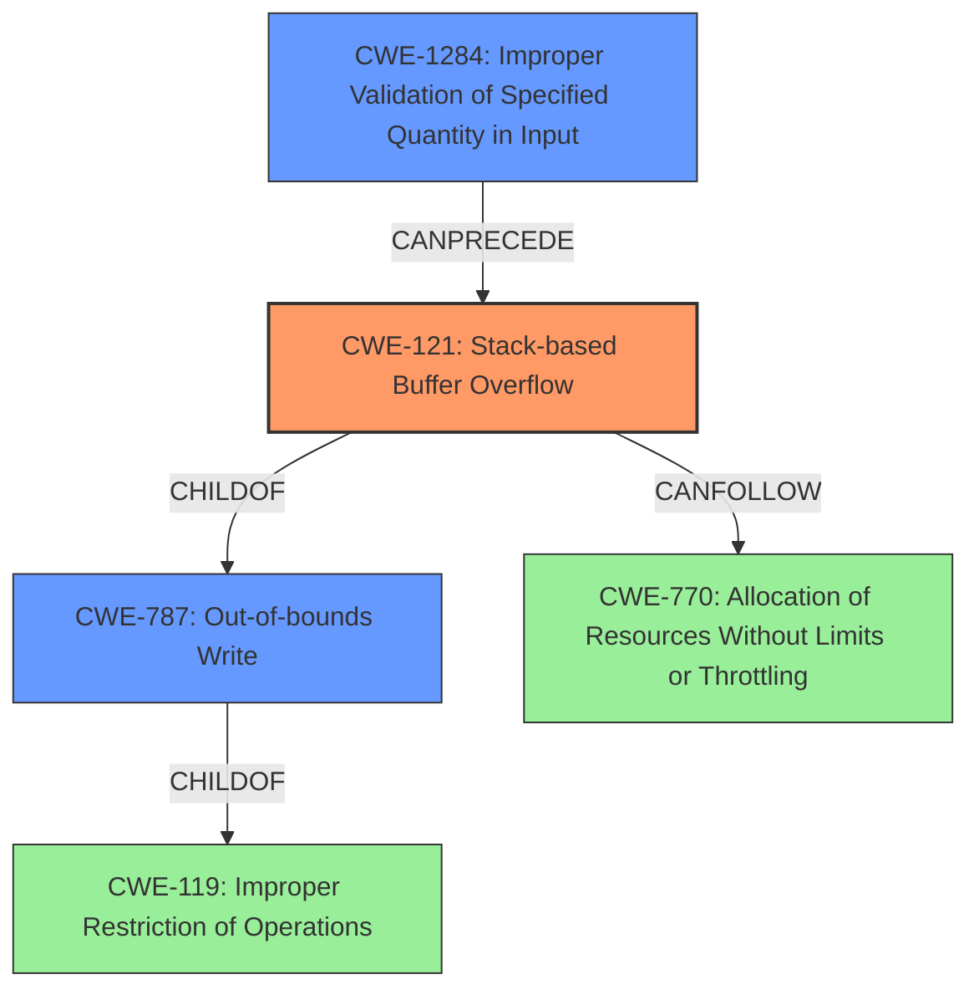

# Final Resolution for CVE-2022-29640

# Summary
| CWE ID | CWE Name | Confidence | CWE Abstraction Level | CWE Vulnerability Mapping Label | CWE-Vulnerability Mapping Notes |
|---|---|---|---|---|---|
| CWE-121 | Stack-based Buffer Overflow | 0.95 | Variant | Primary | The vulnerability is a classic **stack overflow** due to the use of `strcpy` without bounds checking. |
| CWE-1284 | Improper Validation of Specified Quantity in Input | 0.7 | Base | Secondary Candidate | The `comment` parameter's size is not properly validated, leading to the overflow. This is a base cause that enables the overflow and is a more specific form of improper input validation. |
| CWE-787 | Out-of-bounds Write | 0.7 | Base | Secondary Candidate | The **stack overflow** leads to an **out-of-bounds write**, however, CWE-121 is a more specific variant. |
| CWE-120 | Buffer Copy without Checking Size of Input ('Classic Buffer Overflow') | 0.6 | Base | Secondary Candidate | While related, CWE-121 is more specific to **stack-based overflows** and therefore a better fit than CWE-120, which is more general. |
| CWE-770 | Allocation of Resources Without Limits or Throttling | 0.2 | Base | Tertiary Candidate | An attacker could repeatedly send crafted POST requests leading to resource exhaustion and wider network DoS. |

## Evidence and Confidence

*   **Confidence Score:** 0.9
*   **Evidence Strength:** HIGH

## Relationship Analysis
The primary **weakness** is a **stack-based buffer overflow (CWE-121)**. This is caused by a missing size check on the input (`comment` parameter), which aligns with **CWE-1284 (Improper Validation of Specified Quantity in Input)**. **CWE-121** is a variant of **CWE-119 (Improper Restriction of Operations within the Bounds of a Memory Buffer)** and a child of **CWE-787 (Out-of-bounds Write)**, representing the actual **out-of-bounds write** that occurs. The improper input validation (**CWE-1284**) can precede the **stack overflow (CWE-121)**. Repeated exploitation could lead to **CWE-770 (Allocation of Resources Without Limits or Throttling)**.

## Vulnerability Chain
The vulnerability chain starts with **CWE-1284 (Improper Validation of Specified Quantity in Input)**, where the size of the `comment` parameter is not validated. This leads to **CWE-121 (Stack-based Buffer Overflow)** when `strcpy` is used without bounds checking. The **stack overflow** then results in **CWE-787 (Out-of-bounds Write)**, potentially causing a Denial of Service. A missing link in the chain, which is not fully evidenced, is **CWE-770 (Allocation of Resources Without Limits or Throttling)**, which could occur if an attacker repeatedly exploits the vulnerability.

## Summary of Analysis
The initial analysis identified **CWE-121 (Stack-based Buffer Overflow)** as the primary **weakness**, which is correct based on the vulnerability description: "TOTOLINK A3100R ... were discovered to contain a **stack overflow** via the comment parameter in the function setPortForwardRules." The criticism correctly pointed out that the **root cause** is the missing input validation on the size of the `comment` parameter, making **CWE-1284 (Improper Validation of Specified Quantity in Input)** a relevant secondary CWE.

The graph relationships support this analysis, showing that **CWE-1284** can precede **CWE-121**, and **CWE-121** is a more specific type of **out-of-bounds write (CWE-787)**. **CWE-121** is chosen as the primary because the vulnerability description explicitly states a **stack overflow**. The addition of **CWE-1284** improves the classification by addressing the **root cause** of the vulnerability.
The confidence score for **CWE-1284** is raised to 0.7, because the vulnerability description indicates that the `comment` parameter's size is not validated, resulting in the **stack overflow**.
**CWE-770** is kept as a tertiary candidate with low confidence, as it is a potential consequence of repeated exploitation, but there is no direct evidence to support it.
The selected CWEs are at the optimal level of specificity because **CWE-121** accurately describes the type of **buffer overflow**, while **CWE-1284** identifies the **root cause** of the vulnerability.