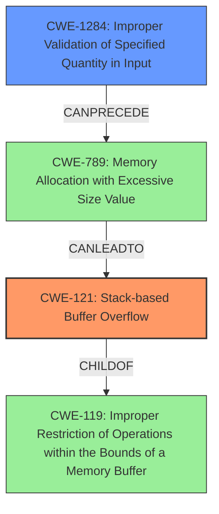

# Final Resolution for CVE-2022-29641

# Summary

| CWE ID   | CWE Name                                                        | Confidence | CWE Abstraction Level | CWE Vulnerability Mapping Label | CWE-Vulnerability Mapping Notes |
| :--------- | :-------------------------------------------------------------- | :--------- | :---------------------- | :------------------------------ | :------------------------------ |
| CWE-121    | Stack-based Buffer Overflow                                       | 0.9        | Variant               | Allowed                       | Primary CWE                     |
| CWE-1284   | Improper Validation of Specified Quantity in Input              | 0.5        | Base                  | Allowed                       | Secondary Candidate             |

## Evidence and Confidence

*   **Confidence Score:** 0.8
*   **Evidence Strength:** MEDIUM

## Relationship Analysis

The primary relationship is that CWE-121 (Stack-based Buffer Overflow) is a specific type of buffer overflow, making it a child of CWE-119 (Improper Restriction of Operations within the Bounds of a Memory Buffer). CWE-1284 (Improper Validation of Specified Quantity in Input) can precede CWE-789 (Memory Allocation with Excessive Size Value), which can lead to a buffer overflow (though not exclusively stack-based). This suggests a chain where improper input validation leads to an excessive memory allocation which then contributes to the stack overflow.

## Vulnerability Chain

The vulnerability chain starts with **CWE-1284 (Improper Validation of Specified Quantity in Input)** where the `startTime` and `endTime` parameters are not properly validated. This lack of validation then leads to a **buffer overflow on the stack**, specifically **CWE-121 (Stack-based Buffer Overflow)**, when the data from these parameters is written to a stack buffer. The consequence is a Denial of Service (DoS).

## Summary of Analysis

The initial analysis and criticism are both helpful. The initial analysis correctly identified **CWE-121 (Stack-based Buffer Overflow)** as the primary issue, and the criticism correctly pointed out the weaknesses in including **CWE-790 (Improper Filtering of Special Elements)** and **CWE-755 (Improper Handling of Exceptional Conditions)**. The criticism's suggestion to consider **CWE-1284 (Improper Validation of Specified Quantity in Input)** or **CWE-20 (Improper Input Validation)** is also valuable.

Based on the evidence, the vulnerability description mentions that the stack overflow occurs via the `startTime` and `endTime` parameters. This strongly suggests that the input is not being properly validated. Therefore, including **CWE-1284 (Improper Validation of Specified Quantity in Input)** as a secondary CWE is appropriate. While **CWE-20 (Improper Input Validation)** is also a valid candidate, **CWE-1284 (Improper Validation of Specified Quantity in Input)** is more specific, as it directly relates to the validation of quantity, size, or length which would be the expected type of input for `startTime` and `endTime` parameters.

The relationships between the CWEs also support this decision. **CWE-1284 (Improper Validation of Specified Quantity in Input)** can precede **CWE-789 (Memory Allocation with Excessive Size Value)**. Although **CWE-789 (Memory Allocation with Excessive Size Value)** is not directly present, the stack overflow indicates that an excessive amount of data is being written to the stack, suggesting a possible, but not confirmed, allocation issue driven by the unvalidated input.

The final classification includes **CWE-121 (Stack-based Buffer Overflow)** as the primary issue and **CWE-1284 (Improper Validation of Specified Quantity in Input)** as a contributing factor. These choices are at the optimal level of specificity, with **CWE-121 (Stack-based Buffer Overflow)** being a Variant and **CWE-1284 (Improper Validation of Specified Quantity in Input)** being a Base CWE.