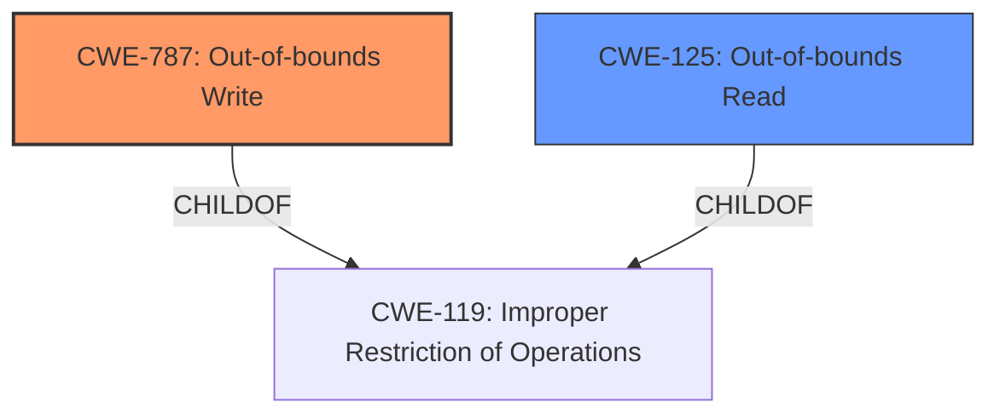

# Final Resolution for CVE-2022-29776

# Summary
| CWE ID | CWE Name | Confidence | CWE Abstraction Level | CWE Vulnerability Mapping Label | CWE-Vulnerability Mapping Notes |
|---|---|---|---|---|---|
| CWE-787 | Out-of-bounds Write | 0.90 | Base | Allowed | Primary CWE: The vulnerability leads to writing beyond buffer boundaries due to missing bounds checks. |
| CWE-125 | Out-of-bounds Read | 0.70 | Base | Allowed | Secondary CWE: Missing bounds checking also leads to reading beyond the buffer's boundaries. |

## Evidence and Confidence

*   **Confidence Score:** 0.85
*   **Evidence Strength:** HIGH

## Relationship Analysis
The decision was influenced by the following CWE relationships:
  - CWE-787 (Out-of-bounds Write) is a child of CWE-119 (Improper Restriction of Operations within the Bounds of a Memory Buffer).
  - CWE-125 (Out-of-bounds Read) is also related to CWE-119 as it can result from similar improper bounds checking.
  - The initial report mentioned CWE-121 (Stack-based Buffer Overflow), a variant of CWE-119, but the CVE details leaned towards a heap overflow.
  - CWE-787 was selected as the primary **WEAKNESS** because the root cause is a missing bounds check leading to the ability to write beyond buffer limits, regardless of whether it's on the stack or heap.
  - CWE-125 remains a secondary candidate because reading out of bounds can occur with missing bounds checking.

## Vulnerability Chain
The **ROOTCAUSE** is the missing bounds check, which leads to:
  1. **Missing Bounds Check:** The input is not validated for size or boundaries.
  2. **Out-of-bounds Write (CWE-787):** Data is written beyond the allocated buffer.
  3. **Out-of-bounds Read (CWE-125):** Data can be read beyond the allocated buffer.
  4. **Impact:** Potential code execution, denial of service, or information disclosure.

## Summary of Analysis
The initial analysis focused on CWE-121 (Stack-based Buffer Overflow) due to the initial vulnerability description. However, the CVE details and the criticism highlighted a potential heap overflow and the importance of identifying the **ROOTCAUSE**.

The evidence from the vulnerability description states: "Onlyoffice Document Server v6.0.0 and below and Core 6.1.0.26 and below were discovered to contain a stack overflow via the component DesktopEditor/common/File.cpp."

However, the criticism pointed out: "While the direct mention of "stack overflow" strongly supports CWE-121, the *content summary* of the CVE reference links points towards a "Heap buffer overflow." This raises a flag."

Based on this, the analysis shifted to focus on the **ROOTCAUSE**: missing bounds checking. This leads to out-of-bounds writes, regardless of stack or heap location. Therefore, CWE-787 (Out-of-bounds Write) was selected as the primary CWE because it directly represents the vulnerability's core issue: writing beyond the buffer limits due to inadequate bounds checking. CWE-125 (Out-of-bounds Read) is retained as a secondary CWE because the missing bounds check also allows for reading beyond the buffer. These CWEs are more specific than CWE-119 and more accurately reflect the **WEAKNESS**. The selection of CWE-787 and CWE-125 provides the optimal level of specificity.