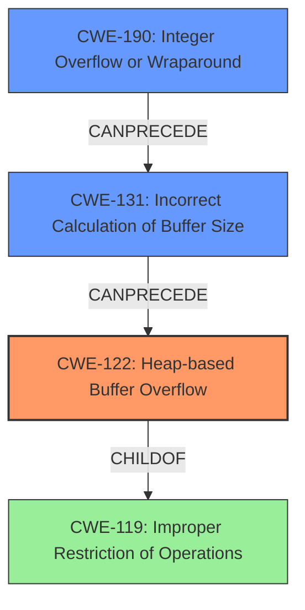

# Analysis Report for CVE-2022-29777

# Vulnerability Analysis Report: CVE-2022-29777

## Description

Onlyoffice Document Server v6.0.0 and below and Core 6.1.0.26 and below were discovered to contain a heap overflow via the component DesktopEditor/fontengine/fontconverter/FontFileBase.h.

## Vulnerability Description Key Phrases

**Weakness:** heap overflow
**Product:** Onlyoffice Document Server
**Version:** v6.0.0 and below and Core 6.1.0.26 and below
**Component:** DesktopEditor/fontengine/fontconverter/FontFileBase.h

## Analysis (with Relationship Data)

# Summary
| CWE ID | CWE Name | Confidence | CWE Abstraction Level | CWE Vulnerability Mapping Label | CWE-Vulnerability Mapping Notes |
|---|---|---|---|---|---|
| CWE-122 | Heap-based Buffer Overflow | 0.75 | Variant | Allowed | Rationale: This CWE entry is at the Variant level of abstraction, which is a preferred level of abstraction for mapping to the root causes of vulnerabilities. |
| CWE-190 | Integer Overflow or Wraparound | 0.4 | Base | Allowed | Rationale: This CWE entry is at the Base level of abstraction, which is a preferred level of abstraction for mapping to the root causes of vulnerabilities. |
| CWE-131 | Incorrect Calculation of Buffer Size | 0.4 | Base | Allowed | Rationale: This CWE entry is at the Base level of abstraction, which is a preferred level of abstraction for mapping to the root causes of vulnerabilities. |

## Evidence and Confidence

*   **Confidence Score:** 0.7
*   **Evidence Strength:** MEDIUM

- **Analysis and Justification:**  
  - *Explanation:* The vulnerability description explicitly states a **heap overflow** in Onlyoffice Document Server. CWE-122 (Heap-based Buffer Overflow) directly addresses this type of vulnerability, where the overflow occurs in memory allocated on the heap. The description mentions the specific component `DesktopEditor/fontengine/fontconverter/FontFileBase.h` where the overflow occurs, further supporting this classification. The CVE reference links content summary describes changes related to bounds checking and handling of file offsets when reading font data. This suggests that the **heap overflow** could be caused by writing past the allocated buffer when handling font files. While other CWEs like CWE-120 (Buffer Copy without Checking Size of Input) or CWE-119 (Improper Restriction of Operations within the Bounds of a Memory Buffer) are related to buffer overflows, CWE-122 is more specific to the location of the buffer on the heap. CWE-190 and CWE-131 could be contributing factor because it's possible there is some integer math involved in computing the size of memory to allocate, which is not stated explicitly.

  - *Relationship Analysis:* CWE-122 is a variant of CWE-119 (Improper Restriction of Operations within the Bounds of a Memory Buffer). CWE-119 is a parent of CWE-120 (Classic Buffer Overflow). The relationship suggests that an integer overflow (CWE-190) could lead to allocating too little memory which then becomes a heap overflow (CWE-122).

- **Confidence Score:**  
  - Confidence: 0.75 (Moderate evidence from the vulnerability description and the type of **heap overflow**)
  - Confidence: 0.4 (Low evidence, but is possible due to integer overflow or incorrect calculation of buffer size)
---

## Criticism of Analysis

Okay, I've reviewed the analysis against the full CWE specifications you've provided. Here's a detailed critique:

**Overall Assessment:**

The analysis correctly identifies CWE-122 (Heap-based Buffer Overflow) as the primary vulnerability.  The inclusion of CWE-190 (Integer Overflow) and CWE-131 (Incorrect Calculation of Buffer Size) as contributing factors is also reasonable, as these could certainly lead to a heap overflow. However, the confidence levels assigned to CWE-190 and CWE-131 seem slightly high, given the lack of explicit evidence.

**Detailed Review by CWE:**

**1. CWE-122: Heap-based Buffer Overflow**

*   **Assessment:**  The mapping to CWE-122 is accurate and well-justified. The vulnerability description clearly states a heap overflow, and the explanation connects it to the specific component.
*   **Confidence:** The 0.75 confidence level is appropriate.
*   **CWE Specification Adherence:**
    *   The analysis correctly identifies it as a "Variant" level CWE, which is the preferred abstraction level.
    *   The "Potential Mitigations" section of the CWE specification is relevant and could be used to suggest improvements for the code.  For example, using languages with automatic bounds checking or abstraction libraries to manage memory can be helpful.
*   **Suggestions:** No major changes needed. The analysis could benefit from mentioning specific mitigations from the CWE specification, such as using `SafeInt` or `IntegerLib`, or using compiler options such as the Microsoft Visual Studio `/GS` flag.

**2. CWE-190: Integer Overflow or Wraparound**

*   **Assessment:** The inclusion of CWE-190 is plausible, as integer overflows are a common precursor to buffer overflows. The rationale is that an integer overflow could result in allocating a smaller buffer than intended, leading to the heap overflow.
*   **Confidence:** The 0.4 confidence level may be slightly high.  There's no explicit mention of integer arithmetic in the original vulnerability description. A lower confidence (e.g., 0.3) might be more appropriate unless further evidence is found.
*   **CWE Specification Adherence:**
    *   The analysis correctly identifies it as a "Base" level CWE.
    *   The "Potential Mitigations" section is highly relevant. Using bounds checking and safe integer libraries are crucial for preventing integer overflows.  Mentioning these in the context of the vulnerability would strengthen the analysis.
*   **Suggestions:**
    *   Consider lowering the confidence score slightly.
    *   Explicitly state that no direct calculation error exists in the vulnerability description, so you are inferring this based on past examples.
    *   Incorporate specific mitigations from the CWE specification, like using SafeInt or IntegerLib.

**3. CWE-131: Incorrect Calculation of Buffer Size**

*   **Assessment:** Similar to CWE-190, this is a possible contributing factor. If the code isn't calculating the correct buffer size, it could lead to a heap overflow.
*   **Confidence:** Similar to CWE-190, the 0.4 confidence level might be a bit high without more explicit evidence.
*   **CWE Specification Adherence:**
    *   The analysis correctly identifies it as a "Base" level CWE.
    *   The "Potential Mitigations" section is relevant. Allocating enough memory for the largest possible encoding and performing input validation on numeric inputs are key.
*   **Suggestions:**
    *   Consider lowering the confidence score slightly, or provide more justification.
    *   Incorporate specific mitigations from the CWE specification, like using mitigation 1 and/or 3. Explicitly state this was not directly stated in the vulnerability description.

**General Suggestions:**

*   **Chaining:** While the analysis mentions relationships between CWEs, it could be strengthened by explicitly stating a potential *chain* of events.  For example: "Improper input may lead to an integer overflow (CWE-190), resulting in an incorrect calculation of buffer size (CWE-131), which ultimately leads to a heap-based buffer overflow (CWE-122)."
*   **Considerations of mitigations:** Try to relate the recommended potential mitigations to the source code.
*   **Prioritize Evidence:**  Clearly differentiate between evidence directly from the vulnerability description and inferences or hypotheses based on general knowledge of buffer overflows.

**Review of Retriever Results**

The retriever results returned some interesting CWEs. Here's a quick review in the context of this specific analysis:

*   **CWE-124, Buffer Underwrite:** Not relevant.
*   **CWE-193, Off-by-one Error:** Plausible, especially if string handling is involved, but less likely than CWE-190/131.
*   **CWE-126, Buffer Over-read:** Not the primary issue, which is a write, not a read.
*   **CWE-770, Allocation of Resources Without Limits or Throttling:** Not directly related, as the problem is not about resource exhaustion but about buffer size.
*   **CWE-125, Out-of-bounds Read:** Not the primary issue, which is a write, not a read.
*   **CWE-1284, Improper Validation of Specified Quantity in Input:** This can be a contributing factor if the size is calculated based on some input, and it's not validated.
*   **CWE-170, Improper Null Termination:** Could be a secondary issue if a string is not properly terminated after writing to the heap, but this isn't the core of the vulnerability.
*   **CWE-476, NULL Pointer Dereference:** Not directly related to the heap overflow.
*   **CWE-121, Stack-based Buffer Overflow:** Incorrect since the heap overflow is the central point.
*   **CWE-190, Integer Overflow or Wraparound:** Correct.

In conclusion, the analysis is solid but can be enhanced by explicitly detailing potential chains of events, and better utilizing the mitigation information provided by CWE specifications. Pay attention to the justification for the confidence level and try to incorporate information on how the source code should be changed to avoid the heap overflow.

## Final Resolution

# Summary
| CWE ID | CWE Name | Confidence | CWE Abstraction Level | CWE Vulnerability Mapping Label | CWE-Vulnerability Mapping Notes |
|---|---|---|---|---|---|
| CWE-122 | Heap-based Buffer Overflow | 0.75 | Variant | Allowed | Rationale: This CWE entry is at the Variant level of abstraction, which is a preferred level of abstraction for mapping to the root causes of vulnerabilities. |
| CWE-131 | Incorrect Calculation of Buffer Size | 0.3 | Base | Allowed | Rationale: This CWE entry is at the Base level of abstraction, which is a preferred level of abstraction for mapping to the root causes of vulnerabilities. |
| CWE-190 | Integer Overflow or Wraparound | 0.3 | Base | Allowed | Rationale: This CWE entry is at the Base level of abstraction, which is a preferred level of abstraction for mapping to the root causes of vulnerabilities. |

## Evidence and Confidence

*   **Confidence Score:** 0.7
*   **Evidence Strength:** MEDIUM

## Relationship Analysis
The primary weakness is **CWE-122 (Heap-based Buffer Overflow)**, a variant of **CWE-119 (Improper Restriction of Operations within the Bounds of a Memory Buffer)**. The analysis considers **CWE-190 (Integer Overflow or Wraparound)** and **CWE-131 (Incorrect Calculation of Buffer Size)** as potential contributing factors. These CWEs could precede **CWE-122** in a vulnerability chain. The abstraction levels influenced the selection by prioritizing the most specific CWE (**CWE-122**) while acknowledging the potential for contributing base-level CWEs (**CWE-190** and **CWE-131**).

## Vulnerability Chain
The vulnerability chain starts with a potential **CWE-190 (Integer Overflow or Wraparound)**. This could lead to **CWE-131 (Incorrect Calculation of Buffer Size)**, resulting in a smaller buffer being allocated than required. Finally, this leads to **CWE-122 (Heap-based Buffer Overflow)** when data is written beyond the allocated buffer size on the heap. The chain maps from an initial flaw in calculation to the final impact of a **heap overflow**. The vulnerability description explicitly identifies the **heap overflow**, but the integer overflow and incorrect size calculation are inferred as potential contributing factors.

## Summary of Analysis
The analysis is based on the vulnerability description, which explicitly states a **heap overflow**. The inclusion of **CWE-190 (Integer Overflow or Wraparound)** and **CWE-131 (Incorrect Calculation of Buffer Size)** is based on the possibility of an integer overflow or an incorrect calculation of the buffer size, but is not explicitly described in the original vulnerability. The confidence levels for these are reduced to 0.3 because there is no direct evidence in the vulnerability description and are inferred.

The graph relationships influenced the final selection by identifying the hierarchical relationships between **CWE-122** and **CWE-119**, as well as the potential chain relationships with **CWE-190** and **CWE-131**.

The selected CWEs are at the optimal level of specificity because **CWE-122** directly addresses the **heap overflow** described in the vulnerability, while **CWE-190** and **CWE-131** are included as possible root causes based on common vulnerability patterns. The changes in the confidence reflects the need for further validation.

*Report generated on 2025-03-18 13:04:50*
