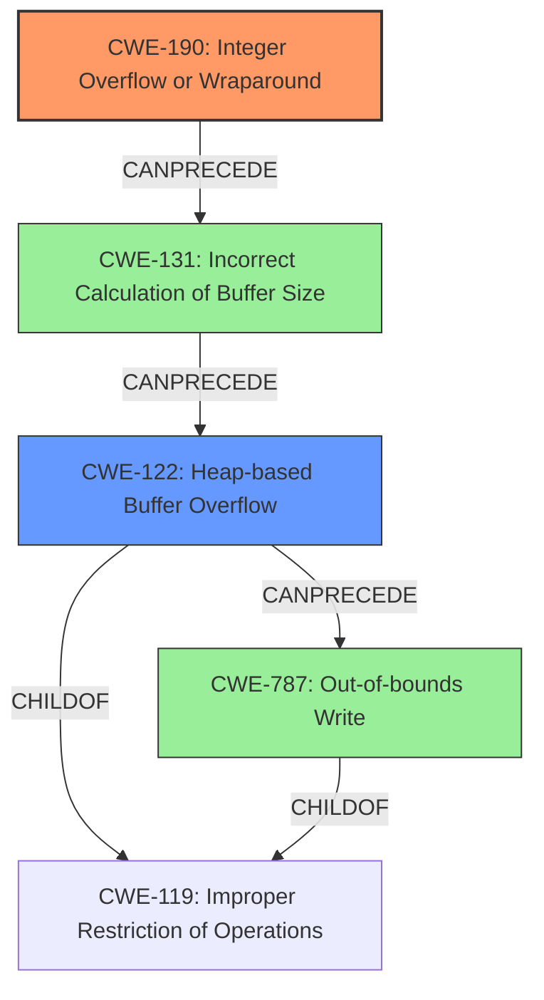

# Final Resolution for CVE-2022-29886

# Summary
| CWE ID | CWE Name | Confidence | CWE Abstraction Level | CWE Vulnerability Mapping Label | CWE-Vulnerability Mapping Notes |
|---|---|---|---|---|---|
| CWE-190 | Integer Overflow or Wraparound | 0.95 | Base | Allowed | Primary CWE |
| CWE-122 | Heap-based Buffer Overflow | 0.85 | Variant | Allowed | Secondary Candidate |

## Evidence and Confidence

*   **Confidence Score:** 0.93
*   **Evidence Strength:** HIGH

## Relationship Analysis
The primary weakness is **CWE-190 (Integer Overflow or Wraparound)**, a Base level CWE. It does not have explicit parent-child relationships in the provided data but serves as a common cause for buffer overflows. The integer overflow leads to an incorrect buffer size calculation, which is a prerequisite for **CWE-122 (Heap-based Buffer Overflow)**. **CWE-122** is a Variant of **CWE-119 (Improper Restriction of Operations within the Bounds of a Memory Buffer)**, indicating a hierarchical relationship. The chain relationship shows that the **integer overflow** leads to the **heap buffer overflow**.

## Vulnerability Chain
The vulnerability chain begins with **CWE-190 (Integer Overflow or Wraparound)** during the calculation of the buffer size. This leads to **CWE-131 (Incorrect Calculation of Buffer Size)**. The undersized buffer is then allocated on the heap, and subsequent copying of data into this buffer results in **CWE-122 (Heap-based Buffer Overflow)**. The out-of-bounds write during the heap buffer overflow can also be viewed as **CWE-787 (Out-of-bounds Write)**. The root cause is the integer overflow, and the impact is the heap buffer overflow leading to potential arbitrary code execution.

## Summary of Analysis
The initial analysis and criticism were both accurate and well-justified. The vulnerability description explicitly mentions an integer overflow leading to a heap buffer overflow. The "CVE Reference Links Content Summary" further clarifies that the **root cause** is an integer overflow during the calculation of the buffer size for Mini FAT sectors in an OLE file. The multiplication of "Number of Mini FAT sectors" and "sector size" using 32-bit integers can overflow, resulting in an undersized buffer allocation. Subsequent data copying into this buffer causes a heap buffer overflow.

The selection of **CWE-190 (Integer Overflow or Wraparound)** as the primary weakness is correct because the vulnerability description explicitly mentions the integer overflow. The description of **CWE-190** aligns with the observed behavior: "The product performs a calculation that can produce an integer overflow or wraparound...". The inclusion of **CWE-122 (Heap-based Buffer Overflow)** is also justified, as the integer overflow directly leads to a heap buffer overflow.

The analysis considered the relationships between CWEs. **CWE-122** is a variant of **CWE-119 (Improper Restriction of Operations within the Bounds of a Memory Buffer)**, indicating that the heap buffer overflow is a specific type of buffer overflow. **CWE-131 (Incorrect Calculation of Buffer Size)** describes *how* the integer overflow manifests. Finally, **CWE-787 (Out-of-bounds Write)** describes the *action* that causes the vulnerability.

The selected CWEs are at the optimal level of specificity. **CWE-190** captures the **root cause**, while **CWE-122** captures the **specific type of buffer overflow**.

Based on the evidence and the relationship analysis, the final determination is to classify the vulnerability as **CWE-190 (Integer Overflow or Wraparound)** as the primary weakness and **CWE-122 (Heap-based Buffer Overflow)** as a secondary weakness.