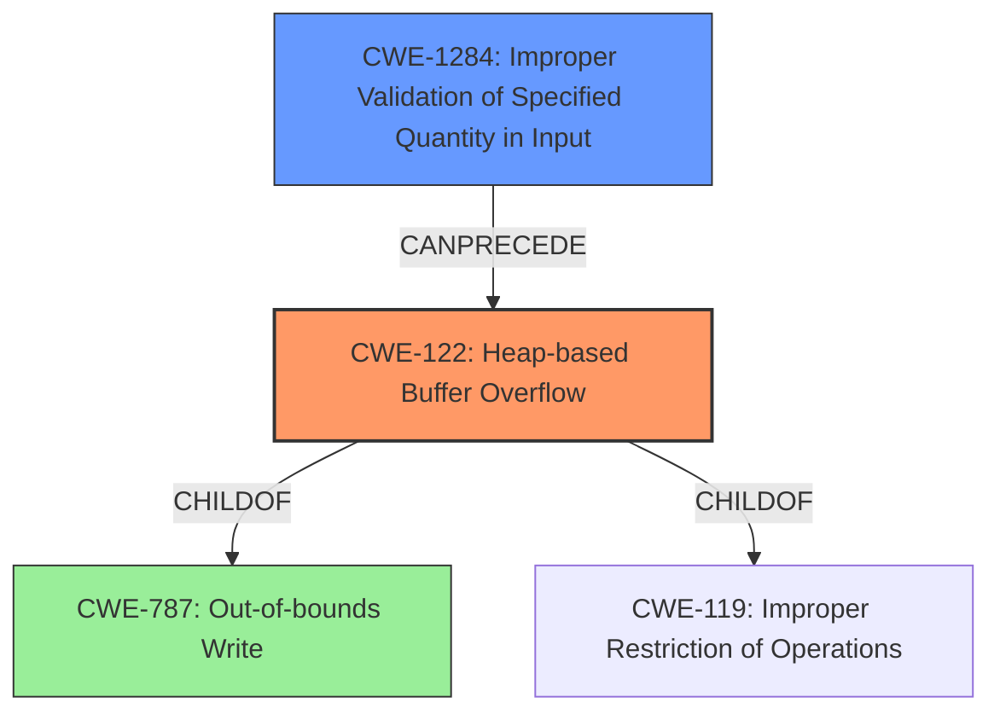

# Final Resolution for CVE-2022-2991

# Summary

| CWE ID    | CWE Name                                                         | Confidence | CWE Abstraction Level | CWE Vulnerability Mapping Label | CWE-Vulnerability Mapping Notes                                                                                                                                                                                                     |
| --------- | ---------------------------------------------------------------- | ---------- | --------------------- | ------------------------------- | ----------------------------------------------------------------------------------------------------------------------------------------------------------------------------------------------------------------------------------- |
| CWE-122   | Heap-based Buffer Overflow                                       | 0.95       | Variant               | Allowed                         | Primary CWE. The vulnerability description explicitly states a **heap-based buffer overflow**.                                                                                                                                    |
| CWE-1284  | Improper Validation of Specified Quantity in Input               | 0.85       | Base                  | Allowed                         | Secondary CWE. The vulnerability results from the **lack of proper validation of the length of user-supplied data**, which leads to the **buffer overflow**.                                                                             |
| CWE-787   | Out-of-bounds Write                                              | 0.70       | Base                  | Allowed                         | Tertiary CWE. CWE-122 is a variant of this. This helps understand the general nature of the **out-of-bounds write** error.                                                                                                           |

## Evidence and Confidence

*   **Confidence Score:** 0.92
*   **Evidence Strength:** HIGH

## Relationship Analysis

The decision was primarily influenced by the parent-child hierarchical relationships and the identification of the root cause.

*   **CWE-122 (Heap-based Buffer Overflow)** is a variant of **CWE-787 (Out-of-bounds Write)** and **CWE-119 (Improper Restriction of Operations within the Bounds of a Memory Buffer)**. Selecting CWE-122 provides a more specific classification than its parents.

*   **CWE-1284 (Improper Validation of Specified Quantity in Input)** describes the root cause of the vulnerability. The lack of validation allows a **buffer overflow** to occur.

*   The Mermaid diagram illustrates these relationships:

## Vulnerability Chain

The vulnerability chain starts with **CWE-1284 (Improper Validation of Specified Quantity in Input)**, where the length of user-supplied data is not properly validated. This leads to **CWE-122 (Heap-based Buffer Overflow)** when the unvalidated data is copied into a fixed-length heap-based buffer. The ultimate impact is a local attacker escalating privileges and executing arbitrary code in the context of the kernel.

## Summary of Analysis

The initial analysis correctly identified CWE-122 and CWE-1284. The criticism suggested additional CWEs to consider, focusing on potential consequences. While considering potential consequences such as **CWE-123 (Write-what-where Condition)** is valuable, the description provides a clear path from root cause to **heap-based buffer overflow**. A tertiary CWE of **CWE-787 (Out-of-bounds Write)** is added to show the general class of error.

*   **Evidence-Based Justification:**

    *   "A **heap-based buffer overflow** was found in the Linux kernels LightNVM subsystem." - Directly supports CWE-122.
    *   "The issue results from the **lack of proper validation of the length of user-supplied data** prior to copying it to a fixed-length heap-based buffer." - Directly supports CWE-1284.

*   **Relationship Influence:** The hierarchical relationship between CWE-122, CWE-787, and CWE-119 guided the selection to ensure the most specific CWE (CWE-122) was chosen.
*   **Optimal Specificity:** CWE-122 is at the Variant level, and CWE-1284 is at the Base level, providing a good balance between specificity and generality. Adding CWE-787 helps broaden the understanding of the **out-of-bounds write** problem.