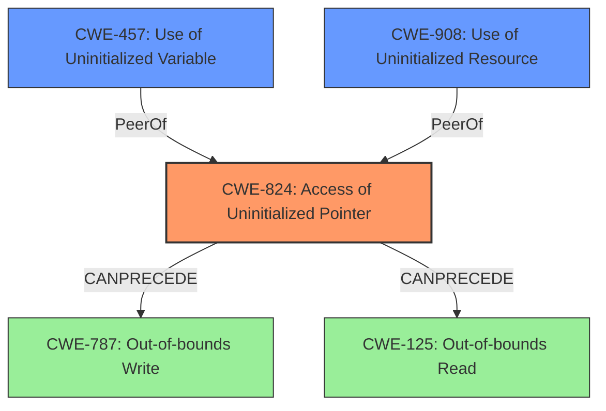

# Analysis Report for CVE-2022-29925

# Vulnerability Analysis Report: CVE-2022-29925

## Description

Access of uninitialized pointer vulnerability exists in the simulator module contained in the graphic editor V-SFT versions prior to v6.1.6.0, which may allow an attacker to obtain information and/or execute arbitrary code by having a user to open a specially crafted image file.

## Vulnerability Description Key Phrases

**Rootcause:** uninitialized pointer
**Impact:** information disclosure and execute arbitrary code
**Vector:** specially crafted image file
**Attacker:** attacker
**Product:** graphic editor V-SFT
**Version:** versions prior to v6.1.6.0
**Component:** simulator module

## Analysis (with Relationship Data)

# Summary
| CWE ID | CWE Name | Confidence | CWE Abstraction Level | CWE Vulnerability Mapping Label | CWE-Vulnerability Mapping Notes |
|---|---|---|---|---|---|
| CWE-824 | Access of Uninitialized Pointer | 1.0 | Base | Allowed | This is the Primary CWE. The vulnerability is due to an uninitialized pointer being accessed. |
| CWE-457 | Use of Uninitialized Variable | 0.7 | Variant | Allowed | This is a secondary candidate CWE because an uninitialized pointer is essentially an uninitialized variable. |
| CWE-908 | Use of Uninitialized Resource | 0.6 | Base | Allowed | This is a secondary candidate CWE because an uninitialized pointer can be considered an uninitialized resource. |

## Evidence and Confidence

*   **Confidence Score:** 0.9
*   **Evidence Strength:** HIGH

- **Analysis and Justification:**  
  - *Explanation:* The vulnerability description and the CVE Reference Links Content Summary both explicitly state that the vulnerability is due to an **"Access of Uninitialized Pointer."** This directly corresponds to CWE-824 (Access of Uninitialized Pointer). The CWE description states: "The product accesses or uses a pointer that has not been initialized." The vulnerability allows for information disclosure and arbitrary code execution, highlighting the severity of accessing an uninitialized pointer. The "Retriever Results" also list CWE-824 with the highest combined score, further supporting this classification. CWE-824 is a Base level CWE, which is the preferred level of abstraction. The MITRE mapping guidance for CWE-824 indicates that it is ALLOWED. CWE-457 is a possible candidate since an uninitialized pointer can be considered a type of uninitialized variable. However, CWE-824 is more specific, and therefore, a better choice.
  
  - *Relationship Analysis:* There are no direct relationships for CWE-824 in the provided documentation. However, the description notes close relationships between incorrect pointer dereferences and other weaknesses. CWE-824 can precede CWE-787 (Out-of-bounds Write) or CWE-125 (Out-of-bounds Read). CWE-908 (Use of Uninitialized Resource) is a parent of CWE-457 (Use of Uninitialized Variable).

- **Confidence Score:**  
  - Confidence: 1.0 (The description explicitly mentions the vulnerability as an access of an uninitialized pointer.)

---

## Criticism of Analysis

Okay, I've reviewed the provided analysis and the full CWE specifications. Here's my critique:

**Overall Assessment:**

The analysis is generally good and well-reasoned. The primary CWE mapping to CWE-824 (Access of Uninitialized Pointer) is correct and well-supported by the evidence. The consideration of secondary CWEs (CWE-457 and CWE-908) is also sound. However, there are a few areas where the analysis could be strengthened.

**Detailed Critique:**

1.  **CWE-824 (Access of Uninitialized Pointer) - Primary CWE:**

    *   **Strengths:** The justification for selecting CWE-824 is excellent. The analysis correctly points to the explicit mention of "Access of Uninitialized Pointer" in the vulnerability description and CVE summary. It also appropriately uses the CWE description to support the mapping. The confidence level of 1.0 is justified.
    *   **Improvements:** While the analysis mentions potential relationships with other CWEs (CWE-787, CWE-125), it could benefit from briefly explaining *how* those relationships might manifest in this specific case. For example: "If the uninitialized pointer is used in an out-of-bounds write operation, this could lead to CWE-787." Also, CVE-476 (NULL pointer dereference) is mentioned as a related CWE, while CWE-824 can lead to a crash or denial of service, it is worth mentioning.
    *   **Mitigations:** The analysis does not mention the mitigations provided in the CWE documentation. Adding a brief discussion of relevant mitigations (e.g., initializing pointers upon declaration, using compilers with warnings enabled) would add value. For example: *Potential mitigations include ensuring all pointers are initialized upon declaration. Static analysis tools and compilers can also be configured to produce warnings when an uninitialized variable is detected.*

2.  **CWE-457 (Use of Uninitialized Variable) - Secondary CWE:**

    *   **Strengths:** The reasoning for considering CWE-457 is logical, as an uninitialized pointer is technically an uninitialized variable.
    *   **Improvements:** The analysis correctly states that CWE-824 is more specific and therefore a better choice. This is correct. However, including a brief mention of potential mitigations for CWE-457 could still be beneficial. *For example, mitigating CWE-457 generally involves assigning all variables to initial values.*

3.  **CWE-908 (Use of Uninitialized Resource) - Secondary CWE:**

    *   **Strengths:** The justification for considering CWE-908 is also reasonable. An uninitialized pointer can be seen as an uninitialized resource.
    *   **Improvements:** As with CWE-457, acknowledging relevant mitigations from the CWE specification (e.g., explicitly initializing resources before use) could strengthen the analysis.

4.  **Retriever Results:**

    *   The Retriever Results are relevant but need further consideration. CWE-476 (NULL Pointer Dereference) has a high score. While not the primary cause, it is often a likely *outcome* of accessing an uninitialized pointer (especially if the pointer happens to contain a NULL value by chance). It *could* be considered as a *potential consequence,* but it should not be considered a primary or secondary mapping in this case.

5.  **General Improvements:**

    *   **Exploitation Details:** The "Attack Vectors" and "Required Attacker Capabilities/Position" sections are good, but they could be linked more explicitly to how the uninitialized pointer is exploited. For example, "By controlling the contents of the crafted image file, the attacker may be able to influence the value of the uninitialized pointer, potentially directing it to an attacker-controlled memory address."
    *   **Chaining:** While the analysis mentions potential chains involving buffer overflows, it could explore other potential chains. For example, unchecked input related to the image file format might *cause* the pointer to remain uninitialized (Input is not validated, leading to pointer not being intialized, leading to CWE-824). This would be speculative, of course, but it's worth considering.

**Revised Summary Table:**

| CWE ID | CWE Name | Confidence | CWE Abstraction Level | CWE Vulnerability Mapping Label | CWE-Vulnerability Mapping Notes |
|---|---|---|---|---|---|
| CWE-824 | Access of Uninitialized Pointer | 1.0 | Base | Allowed | This is the Primary CWE. The vulnerability is due to an uninitialized pointer being accessed. |
| CWE-457 | Use of Uninitialized Variable | 0.7 | Variant | Allowed | This is a secondary candidate CWE because an uninitialized pointer is essentially an uninitialized variable. |
| CWE-908 | Use of Uninitialized Resource | 0.6 | Base | Allowed | This is a secondary candidate CWE because an uninitialized pointer can be considered an uninitialized resource. |
| CWE-476 | NULL Pointer Dereference | 0.3 | Base | Allowed | Potential Consequence. Accessing an uninitialized pointer may result in a NULL pointer dereference, resulting in a crash. |

**In summary, the analysis is solid and the primary CWE mapping is accurate. The suggested improvements focus on adding more context, exploring potential relationships and mitigations from the full CWE specifications, and linking exploitation details more closely to the core weakness.**

## Final Resolution

# Summary
| CWE ID | CWE Name | Confidence | CWE Abstraction Level | CWE Vulnerability Mapping Label | CWE-Vulnerability Mapping Notes |
|---|---|---|---|---|---|
| CWE-824 | Access of Uninitialized Pointer | 1.0 | Base | Allowed | Primary CWE. The vulnerability is due to an uninitialized pointer being accessed. |
| CWE-457 | Use of Uninitialized Variable | 0.7 | Variant | Allowed | Secondary candidate. An uninitialized pointer can be considered a type of uninitialized variable. |
| CWE-908 | Use of Uninitialized Resource | 0.6 | Base | Allowed | Secondary candidate. An uninitialized pointer can be considered an uninitialized resource. |

## Evidence and Confidence

*   **Confidence Score:** 0.95
*   **Evidence Strength:** HIGH

## Relationship Analysis
The primary CWE is CWE-824 (**CWE-824: Access of Uninitialized Pointer**), which is a base level CWE. It's related to CWE-457 (**CWE-457: Use of Uninitialized Variable**) and CWE-908 (**CWE-908: Use of Uninitialized Resource**), as an uninitialized pointer can be considered both an uninitialized variable and an uninitialized resource. CWE-824 can precede **CWE-787 (Out-of-bounds Write)** and **CWE-125 (Out-of-bounds Read)** if the uninitialized pointer is used in a write or read operation. There is no parent-child relationship between the selected CWEs, but all are related to the concept of uninitialized data.

## Vulnerability Chain
The vulnerability chain starts with the program failing to initialize a pointer. This **WEAKNESS** (**ROOTCAUSE**) leads to CWE-824 (**CWE-824: Access of Uninitialized Pointer**). If the uninitialized pointer is subsequently used in a write operation, this could lead to CWE-787 (**CWE-787: Out-of-bounds Write**). If the uninitialized pointer is used in a read operation, this could lead to CWE-125 (**CWE-125: Out-of-bounds Read**). Accessing the uninitialized pointer can lead to information disclosure or arbitrary code execution.

## Summary of Analysis
The initial analysis correctly identified CWE-824 (**CWE-824: Access of Uninitialized Pointer**) as the primary **WEAKNESS** (**ROOTCAUSE**). The vulnerability description explicitly states that the issue is due to an "Access of Uninitialized Pointer," which directly maps to CWE-824. The criticism suggested improvements by explaining how the relationships between CWE-824 and other CWEs might manifest and by adding mitigations from the CWE documentation.

The relationship analysis confirmed that CWE-824 is a base level CWE and is related to CWE-457 (**CWE-457: Use of Uninitialized Variable**) and CWE-908 (**CWE-908: Use of Uninitialized Resource**). The vulnerability description "Access of uninitialized pointer vulnerability exists in the simulator module contained in the graphic editor V-SFT versions prior to v6.1.6.0, which may allow an attacker to obtain information and/or execute arbitrary code by having a user to open a specially crafted image file" provides strong evidence for this classification.

The selected CWEs are at the optimal level of specificity because CWE-824 directly describes the **WEAKNESS** (**ROOTCAUSE**), while CWE-457 and CWE-908 are related but less specific. The choice of CWE-824 is further supported by its base level abstraction and ALLOWED mapping guidance.

The confidence score remains high because the evidence directly supports the classification of CWE-824.

*Report generated on 2025-03-18 13:08:03*
