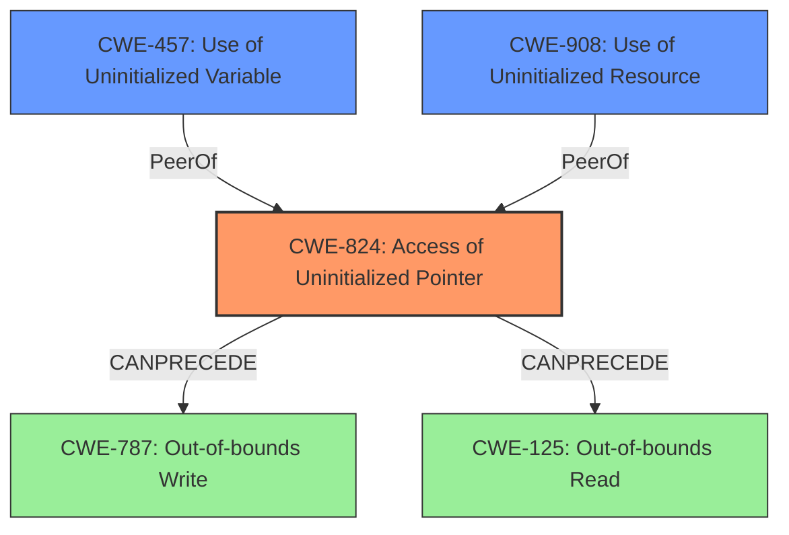

# Final Resolution for CVE-2022-29925

# Summary
| CWE ID | CWE Name | Confidence | CWE Abstraction Level | CWE Vulnerability Mapping Label | CWE-Vulnerability Mapping Notes |
|---|---|---|---|---|---|
| CWE-824 | Access of Uninitialized Pointer | 1.0 | Base | Allowed | Primary CWE. The vulnerability is due to an uninitialized pointer being accessed. |
| CWE-457 | Use of Uninitialized Variable | 0.7 | Variant | Allowed | Secondary candidate. An uninitialized pointer can be considered a type of uninitialized variable. |
| CWE-908 | Use of Uninitialized Resource | 0.6 | Base | Allowed | Secondary candidate. An uninitialized pointer can be considered an uninitialized resource. |

## Evidence and Confidence

*   **Confidence Score:** 0.95
*   **Evidence Strength:** HIGH

## Relationship Analysis
The primary CWE is CWE-824 (**CWE-824: Access of Uninitialized Pointer**), which is a base level CWE. It's related to CWE-457 (**CWE-457: Use of Uninitialized Variable**) and CWE-908 (**CWE-908: Use of Uninitialized Resource**), as an uninitialized pointer can be considered both an uninitialized variable and an uninitialized resource. CWE-824 can precede **CWE-787 (Out-of-bounds Write)** and **CWE-125 (Out-of-bounds Read)** if the uninitialized pointer is used in a write or read operation. There is no parent-child relationship between the selected CWEs, but all are related to the concept of uninitialized data.

## Vulnerability Chain
The vulnerability chain starts with the program failing to initialize a pointer. This **WEAKNESS** (**ROOTCAUSE**) leads to CWE-824 (**CWE-824: Access of Uninitialized Pointer**). If the uninitialized pointer is subsequently used in a write operation, this could lead to CWE-787 (**CWE-787: Out-of-bounds Write**). If the uninitialized pointer is used in a read operation, this could lead to CWE-125 (**CWE-125: Out-of-bounds Read**). Accessing the uninitialized pointer can lead to information disclosure or arbitrary code execution.

## Summary of Analysis
The initial analysis correctly identified CWE-824 (**CWE-824: Access of Uninitialized Pointer**) as the primary **WEAKNESS** (**ROOTCAUSE**). The vulnerability description explicitly states that the issue is due to an "Access of Uninitialized Pointer," which directly maps to CWE-824. The criticism suggested improvements by explaining how the relationships between CWE-824 and other CWEs might manifest and by adding mitigations from the CWE documentation.

The relationship analysis confirmed that CWE-824 is a base level CWE and is related to CWE-457 (**CWE-457: Use of Uninitialized Variable**) and CWE-908 (**CWE-908: Use of Uninitialized Resource**). The vulnerability description "Access of uninitialized pointer vulnerability exists in the simulator module contained in the graphic editor V-SFT versions prior to v6.1.6.0, which may allow an attacker to obtain information and/or execute arbitrary code by having a user to open a specially crafted image file" provides strong evidence for this classification.

The selected CWEs are at the optimal level of specificity because CWE-824 directly describes the **WEAKNESS** (**ROOTCAUSE**), while CWE-457 and CWE-908 are related but less specific. The choice of CWE-824 is further supported by its base level abstraction and ALLOWED mapping guidance.

The confidence score remains high because the evidence directly supports the classification of CWE-824.