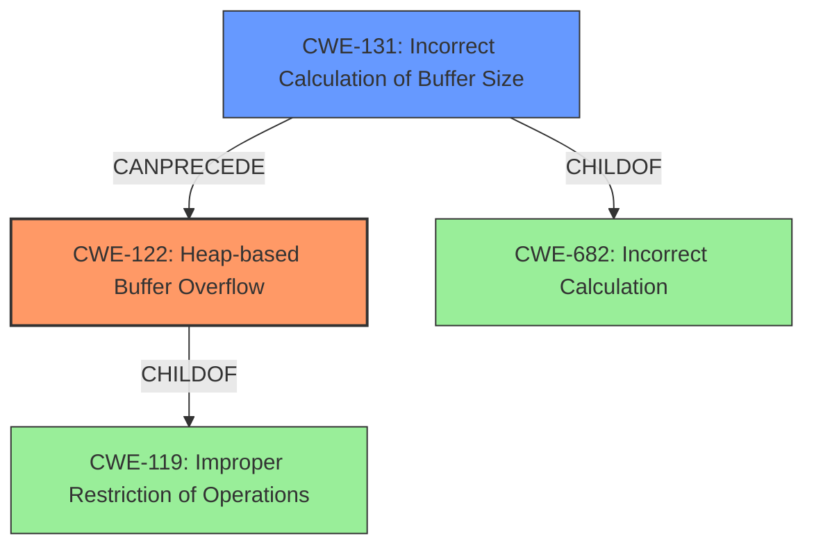

# Analysis Report for CVE-2022-30292

# Vulnerability Analysis Report: CVE-2022-30292

## Description

Heap-based buffer overflow in sqbaselib.cpp in SQUIRREL 3.2 due to lack of a certain sq_reservestack call.

## Vulnerability Description Key Phrases

**Rootcause:** lack of a certain sq_reservestack call
**Weakness:** Heap-based buffer overflow
**Product:** SQUIRREL
**Version:** 3.2
**Component:** sqbaselib.cpp

## Analysis (with Relationship Data)

# Summary
| CWE ID | CWE Name | Confidence | CWE Abstraction Level | CWE Vulnerability Mapping Label | CWE-Vulnerability Mapping Notes |
|---|---|---|---|---|---|
| CWE-122 | Heap-based Buffer Overflow | 0.95 | Variant | Allowed | The vulnerability is explicitly described as a heap-based buffer overflow. |
| CWE-131 | Incorrect Calculation of Buffer Size | 0.75 | Base | Allowed | Secondary: The root cause involves a missing `sq_reservestack` call, which could lead to an incorrect calculation of the buffer size. |

## Evidence and Confidence

*   **Confidence Score:** 0.85
*   **Evidence Strength:** HIGH

- **Analysis and Justification:**  
  - *Explanation:* "The vulnerability is explicitly described as a **heap-based buffer overflow** due to the **lack of a certain sq_reservestack call**. This perfectly matches the description of CWE-122 (Heap-based Buffer Overflow), a Variant-level CWE. The CVE Reference Links Content Summary further reinforces this by stating that the lack of stack reservation via `sq_reservestack` before manipulating the stack can lead to a heap-based buffer overflow. While CWE-119 (Improper Restriction of Operations within the Bounds of a Memory Buffer) is a broader Class-level CWE, CWE-122 provides a more specific classification. The "Retriever Results" also lists CWE-122. The MITRE mapping guidance for CWE-122 indicates this is ALLOWED for heap-based buffer overflow vulnerabilities."
  
  - *Relationship Analysis:* "CWE-122 is a variant of CWE-119 (Improper Restriction of Operations within the Bounds of a Memory Buffer). The root cause, a missing `sq_reservestack` call, relates to CWE-131 (Incorrect Calculation of Buffer Size), as reserving the stack involves calculating the required buffer size. CWE-122 can lead to impacts such as Denial of Service (DoS) and potential arbitrary code execution, as stated in the CVE Reference Links Content Summary."

- **Confidence Score:**  
  - *Example:* Confidence: 0.95 (Strong evidence from the vulnerability description and CVE reference materials)

---

- **Analysis and Justification:**  
  - *Explanation:* "The vulnerability description mentions that the root cause is a **lack of a certain sq_reservestack call**. This suggests that the buffer size calculation is either missing or incorrect, which falls under CWE-131 (Incorrect Calculation of Buffer Size). This weakness is a contributing factor that leads to the heap-based buffer overflow. CWE-131 is a Base-level CWE and the MITRE mapping guidance states that it is ALLOWED. This explains why the heap is too small."
  
  - *Relationship Analysis:* "CWE-131 (Incorrect Calculation of Buffer Size) CanPrecede CWE-119 (Improper Restriction of Operations within the Bounds of a Memory Buffer) and is a ChildOf CWE-682 (Incorrect Calculation). It directly contributes to the primary weakness, CWE-122 (Heap-based Buffer Overflow), by leading to insufficient memory allocation on the heap."

- **Confidence Score:**  
  - *Example:* Confidence: 0.75 (Sufficient evidence from the vulnerability description and CVE reference materials)

---

## Criticism of Analysis

Okay, here's a detailed review of the provided CWE analysis, incorporating the full CWE specifications:

**Overall Assessment**

The analysis is generally strong, well-reasoned, and uses appropriate CWEs. The confidence scores are justified, and the relationships between the CWEs are well explained. The inclusion of specific examples from the CWE database and the consideration of mapping guidance enhances the quality of the analysis.

**Detailed Review**

**1. CWE-122: Heap-based Buffer Overflow**

*   **CWE Mapping:** Correct. The primary vulnerability is explicitly described as a heap-based buffer overflow. This aligns perfectly with the CWE-122 description.

*   **Confidence:** 0.95 - Justified. The evidence is strong (direct statement in the vulnerability description).

*   **Abstraction Level:** Correct (Variant).

*   **Rationale:** The rationale is excellent. It directly connects the vulnerability description to the CWE description. It also correctly addresses why CWE-119 is *not* a better fit (it's too broad). The provided examples (e.g., CVE-2021-43537, CVE-2007-4268, CVE-2009-2523) from the CWE database also support this classification, as they represent real-world cases of heap-based buffer overflows often linked to other weaknesses.

*   **CWE Specification Review:** The Potential Mitigations listed in the CWE spec are appropriate:
    *   *Language Selection:* Languages with automatic bounds checking would indeed prevent this.
    *   *Abstraction Libraries:* Safe string libraries would abstract away risky APIs.
    *   *Compiler Extensions:* Using /GS, FORTIFY_SOURCE, StackGuard, etc. would provide detection mechanisms.

**2. CWE-131: Incorrect Calculation of Buffer Size**

*   **CWE Mapping:** Correct. A missing `sq_reservestack` call *directly* relates to the incorrect calculation of the buffer size. If the stack isn't reserved, the code won't know how much space it has available.

*   **Confidence:** 0.75 - Justified. While the heap overflow is the direct result, the missing `sq_reservestack` is the *cause* of the incorrect size, so the lower confidence is appropriate.

*   **Abstraction Level:** Correct (Base).

*   **Rationale:** The rationale accurately explains the relationship. It highlights that a missing `sq_reservestack` call means the buffer size is *not* correctly calculated. The relationships described are also accurate,  CWE-131 (Incorrect Calculation of Buffer Size) CanPrecede CWE-119 (Improper Restriction of Operations within the Bounds of a Memory Buffer) and is a ChildOf CWE-682 (Incorrect Calculation). It directly contributes to the primary weakness, CWE-122 (Heap-based Buffer Overflow), by leading to insufficient memory allocation on the heap.

*   **CWE Specification Review:** The Potential Mitigations are relevant:
    *   *Implementation (Encoding):* Not directly applicable, but in principle, if the stack reservation is for encoding, this could be relevant.
    *   *Implementation (Language Representation):*  This is important, understanding the language's memory management is essential.
    *   *Implementation (Input Validation):* While not direct input validation, you could argue that checking the available stack space *before* attempting to use it is a form of validation.

**General Comments & Suggestions:**

*   **Explicitly State Relationship:** Be even more explicit in the relationship between CWE-131 and CWE-122.  "The incorrect buffer size calculation (CWE-131) *causes* the heap-based buffer overflow (CWE-122)."
*   **Consider CWE-682, but Discourage:** The analysis correctly doesn't prioritize it, but mentioning CWE-682, "Incorrect Calculation," (Parent of CWE-131) and explicitly stating why a more specific CWE is preferred, is good practice. As the mapping guidance of CWE-682 notes, it should be used with caution and more precise CWEs are generally preferred.
*  **Relationship to CWE-119:** It might be valuable to note the relationship to CWE-119 explicitly, even though CWE-122 is a better fit. A sentence like, "While this vulnerability is a heap-based buffer overflow (CWE-122), it also represents an Improper Restriction of Operations within the Bounds of a Memory Buffer (CWE-119)." can be added.
*  **Use of `sizeof()`:** While probably not applicable here, if the `sq_reservestack` function made use of the `sizeof` function to determine the size of a pointer, then CWE-467 might be relevant, but this is probably not the case, since the root cause is the absence of the call, rather than an error in its implementation.

**Conclusion**

This is a high-quality CWE analysis. The chosen CWEs are accurate, the rationales are well-explained, and the confidence scores are justified by the evidence. The attention to the CWE specifications makes the analysis even stronger. Addressing the minor suggestions above would only further improve the already strong assessment.

## Final Resolution

# Summary
| CWE ID | CWE Name | Confidence | CWE Abstraction Level | CWE Vulnerability Mapping Label | CWE-Vulnerability Mapping Notes |
|---|---|---|---|---|---|
| CWE-122 | Heap-based Buffer Overflow | 0.95 | Variant | Allowed | Primary CWE. The vulnerability is explicitly described as a heap-based buffer overflow. |
| CWE-131 | Incorrect Calculation of Buffer Size | 0.75 | Base | Allowed | Secondary CWE. The missing `sq_reservestack` call leads to an incorrect buffer size calculation. |

## Evidence and Confidence

*   **Confidence Score:** 0.90
*   **Evidence Strength:** HIGH

## Relationship Analysis
The primary relationship is that **CWE-131** (**Incorrect Calculation of Buffer Size**) *causes* **CWE-122** (**Heap-based Buffer Overflow**). **CWE-131** is a child of **CWE-682** (**Incorrect Calculation**), but **CWE-131** is more specific. **CWE-122** is a variant of **CWE-119** (**Improper Restriction of Operations within the Bounds of a Memory Buffer**). The abstraction levels influenced the selection by prioritizing the most specific CWE available, while still remaining accurate.

## Vulnerability Chain
The vulnerability chain starts with the **ROOTCAUSE** of a missing `sq_reservestack` call, leading to **CWE-131** (**Incorrect Calculation of Buffer Size**). This then leads to **CWE-122** (**Heap-based Buffer Overflow**), resulting in a denial of service and potential arbitrary code execution.

## Summary of Analysis
The initial analysis and criticism both correctly identify **CWE-122** (**Heap-based Buffer Overflow**) as the primary weakness due to the explicit description of the vulnerability. They also correctly identify **CWE-131** (**Incorrect Calculation of Buffer Size**) as a contributing factor.

The graph relationships reinforce this by showing that **CWE-131** can precede **CWE-122**, with **CWE-131** representing the root cause. The selection of these CWEs is at the optimal level of specificity, as they accurately describe the vulnerability and its cause, while avoiding overly broad classifications like **CWE-119** or higher-level abstractions like **CWE-682**.

The evidence supporting this decision comes directly from the vulnerability description, which states that the heap-based buffer overflow is due to the lack of a `sq_reservestack` call. This directly implies an incorrect calculation of the buffer size.

*Report generated on 2025-03-18 13:10:48*
