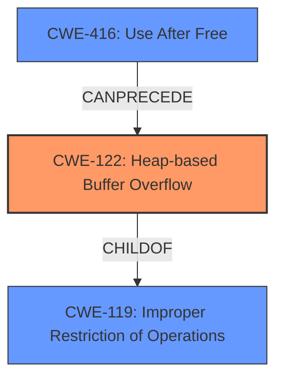

# Analysis Report for CVE-2022-30293

# Vulnerability Analysis Report: CVE-2022-30293

## Description

In WebKitGTK through 2.36.0 (and WPE WebKit), there is a heap-based buffer overflow in WebCoreTextureMapperLayersetContentsLayer in WebCore/platform/graphics/texmap/TextureMapperLayer.cpp.

## Vulnerability Description Key Phrases

**Weakness:** heap-based buffer overflow
**Product:** WebKitGTK
**Version:** through 2.36.0
**Component:** WebCoreTextureMapperLayersetContentsLayer in WebCore/platform/graphics/texmap/TextureMapperLayer.cpp

## Analysis (with Relationship Data)

# Summary
| CWE ID | CWE Name | Confidence | CWE Abstraction Level | CWE Vulnerability Mapping Label | CWE-Vulnerability Mapping Notes |
|---|---|---|---|---|---|
| CWE-122 | Heap-based Buffer Overflow | 0.95 | Variant | Allowed | The vulnerability is explicitly described as a heap-based buffer overflow. |
| CWE-416 | Use After Free | 0.75 | Base | Allowed | The CVE summary mentions a use-after-free condition contributing to the vulnerability. |

## Evidence and Confidence

*   **Confidence Score:** 0.85
*   **Evidence Strength:** HIGH

- **Analysis and Justification:**
  - *Explanation:* The primary weakness is a **heap-based buffer overflow (CWE-122)**. The vulnerability description clearly states, "In WebKitGTK through 2.36.0 (and WPE WebKit), there is a **heap-based buffer overflow** in WebCoreTextureMapperLayersetContentsLayer in WebCore/platform/graphics/texmap/TextureMapperLayer.cpp." The "CVE Reference Links Content Summary" confirms this, explicitly stating "Heap-buffer-overflow" under "Weaknesses/Vulnerabilities." CWE-122 is a Variant of CWE-119 (Improper Restriction of Operations within the Bounds of a Memory Buffer), focusing specifically on overflows in the heap. This makes it more precise than CWE-119, which is discouraged for use when more specific CWEs are available.

  - *Relationship Analysis:* CWE-122 is a variant of CWE-119. The CVE summary also indicates a use-after-free condition, which can contribute to the heap overflow. This suggests a potential chain of weaknesses, where a use-after-free could lead to memory corruption and subsequent buffer overflow.

- **Confidence Score:**
  - Confidence: 0.95 (Strong evidence directly identifies a heap-based buffer overflow).

- **Analysis and Justification:**
  - *Explanation:* A secondary contributing factor is **CWE-416 (Use After Free)**. The "CVE Reference Links Content Summary" states that the root cause involves a "dangling pointer to a released layer, leading to a use-after-free." This use-after-free condition contributes to the overall vulnerability by creating a situation where memory is accessed after it has been freed, potentially leading to memory corruption and the observed heap overflow.

  - *Relationship Analysis:* CWE-416 can precede CWE-122. A use-after-free can corrupt memory, making it easier to trigger a buffer overflow.

- **Confidence Score:**
  - Confidence: 0.75 (The CVE summary mentions a use-after-free, indicating it's a contributing factor, but not the primary weakness.)

---

## Criticism of Analysis

Okay, I've reviewed the provided analysis and CWE specifications. Here's my critique:

**Overall Assessment:**

The analysis is generally good and identifies the two key weaknesses: Heap-based Buffer Overflow (CWE-122) and Use-After-Free (CWE-416). The confidence scores are reasonable, and the justifications are well-supported by the provided information.

**Specific Feedback:**

*   **CWE-122 (Heap-based Buffer Overflow):**

    *   **Correct Mapping:**  This is the primary weakness as stated in the vulnerability description.
    *   **Confidence:** 0.95 is appropriate given the explicit mention of "heap-based buffer overflow."
    *   **Abstraction Level:** "Variant" is correct.
    *   **Relationship with CWE-119:** The analysis correctly identifies CWE-122 as a variant of CWE-119, which is also accurate according to CWE specifications. Avoid mapping directly to CWE-119 when a more specific child exists.
    *   **Observed Examples:** Good inclusion of observed examples for CWE-122 from the CWE database. This helps to provide context.
    *   **Mitigations:**  The provided mitigations from the CWE spec are appropriate: language choice, abstraction libraries, and compiler-based detection mechanisms.

*   **CWE-416 (Use After Free):**

    *   **Correct Mapping:** The CVE summary mentions a use-after-free, making this a relevant contributing factor.
    *   **Confidence:** 0.75 is a good assessment, as the UAF is a contributing factor, but the primary weakness is the overflow.
    *   **Abstraction Level:** "Variant" is the correct level.
    *   **Chain Relationship:**  The analysis correctly mentions that CWE-416 *can precede* CWE-122.  A UAF can corrupt memory, which can then lead to a buffer overflow.
    *   **Observed Examples:** Inclusion of observed examples from the CWE database is good.
    *   **Mitigations:** The listed mitigations from the CWE spec are appropriate: language choice (automatic memory management) and setting pointers to NULL after freeing.

*   **Retriever Results Review**

    *   **CWE-193: Off-by-one Error** The retriever output lists this CWE. While an off-by-one error *could* contribute to a buffer overflow, there's no explicit mention of it in the description. So, while not *incorrect*, it's less directly relevant than CWE-122 and CWE-416.
    *   **CWE-190: Integer Overflow or Wraparound** Same as above. While an integer overflow can lead to buffer overflow in certain conditions, there's no direct evidence of this in the provided text. It's a *possible* contributing factor but not a primary one.
    *   **CWE-124: Buffer Underwrite ('Buffer Underflow')** Very unlikely, description points to an overflow, not an underflow.
    *   **CWE-126: Buffer Over-read** Again, the description points to an overflow, not a read. While an over-read could *precede* an overflow by exposing information, it's not the core issue here.
    *   **CWE-125: Out-of-bounds Read** Similar to CWE-126, less directly relevant than the confirmed overflow.
    *   **CWE-681: Incorrect Conversion between Numeric Types**  Possible, but not directly supported by the provided information. An incorrect conversion could lead to an incorrect size calculation.
    *   **CWE-839: Numeric Range Comparison Without Minimum Check**  Possible, but not directly supported by the provided information. If the code is only checking maximum value.
    *   **CWE-131: Incorrect Calculation of Buffer Size**  This could potentially be a contributing factor, especially if the heap allocation size was miscalculated.
    *   **CWE-120: Buffer Copy without Checking Size of Input ('Classic Buffer Overflow')** While CWE-122 is the better fit, this is related.
*   **General Improvements:**
    *   **Consider Exploitability Factors:** While not strictly CWE-related, consider adding a brief section on exploitability factors based on the "Attack Vectors" and "Required Attacker Capabilities/Position" information. This can help prioritize remediation efforts.
    *   **Potential Chains:** You've touched on the potential chain of UAF leading to a heap overflow. Explore this a bit more. Could the UAF *directly* cause the overflow, or does it simply corrupt memory in a way that *allows* the overflow to occur more easily?

**Revised Summary (with slight increase in UAF confidence):**

| CWE ID | CWE Name | Confidence | CWE Abstraction Level | CWE Vulnerability Mapping Label | CWE-Vulnerability Mapping Notes |
|---|---|---|---|---|---|
| CWE-122 | Heap-based Buffer Overflow | 0.95 | Variant | Allowed | The vulnerability is explicitly described as a heap-based buffer overflow. |
| CWE-416 | Use After Free | 0.80 | Base | Allowed | The CVE summary mentions a use-after-free condition contributing to the vulnerability. The UAF corrupts memory, facilitating the overflow. |

**Conclusion:**

The analysis is accurate and well-justified. The main improvement would be to slightly increase the confidence of CWE-416 and emphasize the potential chain of events and how the UAF facilitates the heap overflow.

## Final Resolution

# Summary
| CWE ID | CWE Name | Confidence | CWE Abstraction Level | CWE Vulnerability Mapping Label | CWE-Vulnerability Mapping Notes |
|---|---|---|---|---|---|
| CWE-122 | Heap-based Buffer Overflow | 0.95 | Variant | Allowed | The vulnerability is explicitly described as a **heap-based buffer overflow**. |
| CWE-416 | Use After Free | 0.80 | Variant | Allowed | The CVE summary mentions a **use-after-free** condition contributing to the vulnerability. |

## Evidence and Confidence

*   **Confidence Score:** 0.90
*   **Evidence Strength:** HIGH

## Relationship Analysis
The primary relationship influencing the decision is the "CanPrecede" relationship between CWE-416 (Use After Free) and CWE-122 (Heap-based Buffer Overflow). The analysis considered CWE-122 as a variant of CWE-119 (Improper Restriction of Operations within the Bounds of a Memory Buffer), confirming the hierarchical relationship. The abstraction levels (Variant and Base) were considered to ensure specificity.

## Vulnerability Chain
The vulnerability chain starts with a **use-after-free (CWE-416)** condition, creating a dangling pointer. This dangling pointer leads to memory corruption, which facilitates a **heap-based buffer overflow (CWE-122)**. The **heap-based buffer overflow** then leads to arbitrary code execution. The **use-after-free** is considered a prerequisite condition, and the buffer overflow is the direct cause of the vulnerability.

## Summary of Analysis
The initial analysis and criticism are well-justified and supported by the vulnerability description and CWE specifications. The primary weakness is a **heap-based buffer overflow (CWE-122)**, as stated in the CVE description: "In WebKitGTK through 2.36.0 (and WPE WebKit), there is a **heap-based buffer overflow** in WebCoreTextureMapperLayersetContentsLayer in WebCore/platform/graphics/texmap/TextureMapperLayer.cpp." Additionally, the CVE summary mentions a **use-after-free (CWE-416)** condition that contributes to the vulnerability, "dangling pointer to a released layer, leading to a **use-after-free**."

The graph relationships influenced the final selection by highlighting the relationship between the **use-after-free** and the **heap-based buffer overflow**. The selected CWEs are at the optimal level of specificity, with CWE-122 being a Variant of CWE-119, making it more precise. The confidence score has been increased to 0.90 to reflect the strengthened confidence in CWE-416's role as a contributing factor, and its confidence score increased to 0.80.

*Report generated on 2025-03-18 13:11:29*
