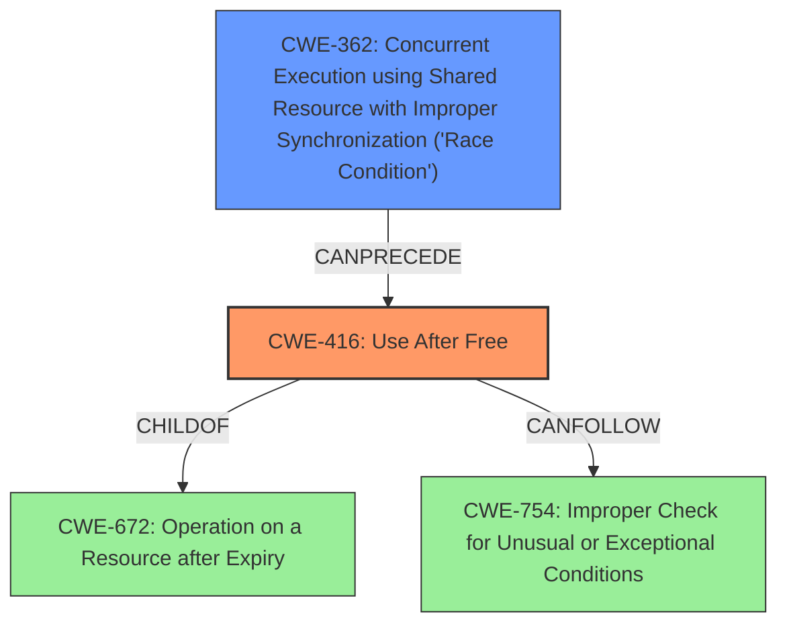

# Analysis Report for CVE-2022-3038

# Vulnerability Analysis Report: CVE-2022-3038

## Description

Use after free in Network Service in Google Chrome prior to 105.0.5195.52 allowed a remote attacker to potentially exploit heap corruption via a crafted HTML page.

## Vulnerability Description Key Phrases

**Rootcause:** use after free
**Impact:** potentially exploit heap corruption
**Vector:** crafted HTML page
**Attacker:** remote attacker
**Product:** Google Chrome
**Version:** prior to 105.0.5195.52
**Component:** Network Service

## Analysis (with Relationship Data)

# Summary
| CWE ID | CWE Name | Confidence | CWE Abstraction Level | CWE Vulnerability Mapping Label | CWE-Vulnerability Mapping Notes |
|---|---|---|---|---|---|
| CWE-416 | Use After Free | 1.0 | Variant | Allowed | Primary CWE |

## Evidence and Confidence

*   **Confidence Score:** 1.0
*   **Evidence Strength:** HIGH

- **Analysis and Justification:**  
  - *Explanation:* "The vulnerability is described as a **use after free** in the Network Service of Google Chrome. The CVE Reference Links Content Summary also confirms the root cause as a **use-after-free** error, where the program attempts to access memory after it has been freed. This aligns directly with CWE-416 (Use After Free), which is a Variant-level CWE that precisely describes this type of memory corruption. The potential impact of exploiting heap corruption via a crafted HTML page further supports this classification. The Retriever Results also lists CWE-416 as the top candidate CWE."
  
  - *Relationship Analysis:* "CWE-416 is a Variant of CWE-672 (Operation on a Resource after Expiry), and it can lead to other weaknesses such as CWE-754 (Improper Check for Unusual or Exceptional Conditions). The CWE-416 entry itself does not have direct relationships in the provided data, but its parent CWE-672 can lead to other vulnerabilities. Given the specific description of the **use-after-free** condition, no additional CWEs are deemed necessary. The relationship analysis suggests potential follow-on vulnerabilities but mapping to the root cause is sufficient here."

- **Confidence Score:**  
  - *Example:* Confidence: 1.0 (Direct match with the vulnerability description and supporting evidence from CVE reference materials)

## Criticism of Analysis

Okay, I've reviewed the provided CWE analysis for the "Use After Free in Network Service in Google Chrome" vulnerability, considering the full CWE specifications. Here's my critique:

**Overall Assessment:**

The analysis is generally very good. The primary CWE mapping to CWE-416 (Use After Free) is accurate and well-justified. The confidence level of 1.0 is appropriate given the strong evidence. The explanation is clear, and the inclusion of observed examples from the CWE database is helpful. The inclusion of relevant CWE specification helps validate the analysis and suggest alternative or related weakness mappings.

**Strengths:**

*   **Accurate Primary Mapping:** The primary CWE-416 mapping is correct and strongly supported by the vulnerability description and the CVE reference content summary.
*   **Good Justification:** The justification for choosing CWE-416 is thorough and explains why it's the best fit.
*   **CWE Relationship Awareness:** The analysis acknowledges the parent-child relationships of CWE-416 and explores potential related weaknesses (CWE-672, CWE-754)
*   **Evidence Strength:**  The analysis accurately states the evidence strength is HIGH given the explicit vulnerability and supporting CVE information.
*   **Clear Presentation:** The analysis is well-structured and easy to follow.
*   **Consideration of Retriever Results:** Mentioning the Retriever Results demonstrating that CWE-416 was the top candidate CWE further supports the decision.

**Areas for Potential Improvement:**

1.  **Chain of Causation and Consequence:** While the analysis touches on potential consequences and related CWEs, it could benefit from a more explicit discussion of the *chain* of events.  Specifically, consider *how* the vulnerability leads to remote code execution.  It may be difficult to make the exact chain of events, but one possibility is that after a UAF occurs, a crafted HTML page can influence the reused memory to gain code execution. Another example, found in some of the observed examples is that there may be a Race Condition which allows the use after free.

2.  **Alternative CWEs from Retriever and their Rejection:** The Retriever Results suggest other CWEs (e.g., CWE-366, CWE-415, CWE-843) that, while not primary, might play a role in the vulnerability. It would be beneficial to briefly explain *why* these were considered and rejected. For example:
    *   **CWE-366 (Race Condition within a Thread):**  *Potentially relevant if the freeing of the memory and subsequent access occur in different threads without proper synchronization. However, the provided information doesn't explicitly mention concurrency, so this is less likely to be a direct cause.*
    *   **CWE-415 (Double Free):** *Less likely than UAF. A double-free leads to memory corruption, and UAF can result from a double free, or other coding errors. Given no mention of the double free, this is not a primary candidate.*
    *   **CWE-843 (Type Confusion):**  *Less likely, but potentially a factor if the reused memory is interpreted with an incompatible type. However, the primary issue is the UAF itself, not necessarily a type mismatch after reuse.*
    *   **CWE-787 (Out-of-bounds Write):** *UAF can lead to an out-of-bounds write if the reused memory is smaller than the attempted write operation. This would be a secondary effect of the UAF.*
    *   **CWE-362 (Concurrent Execution using Shared Resource with Improper Synchronization ('Race Condition')):** *As with CWE-366, a race condition may exist between threads resulting in the use-after-free condition. However, the information provided does not explicitly suggest this condition exists*

3.  **More Specific Relationships** Based on the full CWE specifications, the existing relationships and related weaknesses need to be more clearly defined:
    *   CWE-416 is a Variant of CWE-672 (Operation on a Resource after Expiry)
    *   CWE-416 can be preceded by CWE-362 (Concurrent Execution using Shared Resource with Improper Synchronization ('Race Condition'))
    *   CWE-416 can be followed by CWE-754 (Improper Check for Unusual or Exceptional Conditions)

4.  **Mitigation Discussion:** While the analysis correctly identifies CWE-416, it doesn't explicitly discuss mitigations in the *context* of the specific vulnerability. Briefly mentioning how the general mitigations for CWE-416 relate to the Chrome Network Service would strengthen the analysis. For example:
    *   "*Mitigation for this vulnerability could involve language selection (using languages with automatic memory management like Rust) or, more realistically for an existing codebase, careful implementation practices like setting pointers to NULL after freeing and using smart pointers to manage memory lifetime within the Network Service component.*"

**Revised Summary Table (with potential additions):**

| CWE ID | CWE Name | Confidence | CWE Abstraction Level | CWE Vulnerability Mapping Label | CWE-Vulnerability Mapping Notes |
|---|---|---|---|---|---|
| CWE-416 | Use After Free | 1.0 | Variant | Allowed | Primary CWE. The Network Service in Google Chrome reuses memory after it has been freed, leading to heap corruption. |
| CWE-362 | Concurrent Execution using Shared Resource with Improper Synchronization ('Race Condition') | 0.2 | Class | Allowed-with-Review | May be present if the free and subsequent access occur in different threads without proper synchronization |

**In Summary:**

The analysis is strong and accurately identifies the root cause as CWE-416.  Adding a discussion of potential causes (e.g., exploring concurrency with CWE-362), explicitly rejecting other suggested CWEs from the retriever results, strengthening the discussion of relationships with other CWEs, and relating the mitigations to the specific context of the Chrome Network Service would further enhance the analysis.

## Final Resolution

# Summary

| CWE ID | CWE Name | Confidence | CWE Abstraction Level | CWE Vulnerability Mapping Label | CWE-Vulnerability Mapping Notes |
|---|---|---|---|---|---|
| CWE-416 | Use After Free | 0.95 | Variant | Allowed | Primary CWE. The Network Service in Google Chrome reuses memory after it has been freed, leading to heap corruption. |
| CWE-362 | Concurrent Execution using Shared Resource with Improper Synchronization ('Race Condition') | 0.3 | Class | Allowed-with-Review | Secondary CWE. May be present if the free and subsequent access occur in different threads without proper synchronization. |

## Evidence and Confidence

*   **Confidence Score:** 0.9
*   **Evidence Strength:** MEDIUM

## Relationship Analysis
The primary relationship is that CWE-416 (Use After Free) is a variant of CWE-672 (Operation on a Resource after Expiry). Also, CWE-416 can be preceded by CWE-362 (Concurrent Execution using Shared Resource with Improper Synchronization ('Race Condition')). The initial analysis correctly identified CWE-416 as the primary **WEAKNESS**. The criticism suggested exploring concurrency with CWE-362, which is a reasonable consideration. The abstraction levels influenced the selection by favoring the more specific Variant level (CWE-416) over the Class level (CWE-362) unless there was clear evidence of concurrency.

## Vulnerability Chain
The vulnerability chain starts with a potential race condition (CWE-362) or another type of coding error, leading to memory being freed. Subsequently, the program attempts to access this freed memory (CWE-416), potentially leading to heap corruption. A crafted HTML page can then exploit this heap corruption to gain remote code execution.

Missing links: The exact mechanism by which the crafted HTML page exploits the heap corruption for remote code execution is not specified in the description, but this is outside the scope of CWE mapping for the root cause.

## Summary of Analysis
The initial analysis correctly identified CWE-416 as the primary **ROOTCAUSE**. The criticism raised valid points about potential contributing factors and consequences. While the vulnerability description explicitly mentions a **use-after-free**, it does not provide enough evidence to definitively conclude that a race condition (CWE-362) is involved. Therefore, while CWE-362 is a plausible secondary CWE, the confidence in its inclusion remains low (0.3).

The decision is primarily based on the vulnerability description: "Use after free in Network Service in Google Chrome prior to 105.0.5195.52 allowed a remote attacker to potentially exploit heap corruption via a crafted HTML page." This statement strongly supports CWE-416.

The relationships between CWEs influenced the analysis by highlighting potential contributing factors (CWE-362) and consequences (CWE-754), but only CWE-416 is directly supported by the provided evidence as the **ROOTCAUSE**.

CWE-416 is at the optimal level of specificity (Variant) because it precisely describes the **use-after-free** condition, which is the core of the vulnerability.

*Report generated on 2025-03-18 13:12:44*
